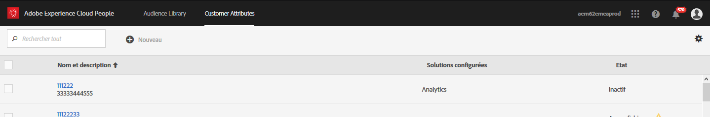
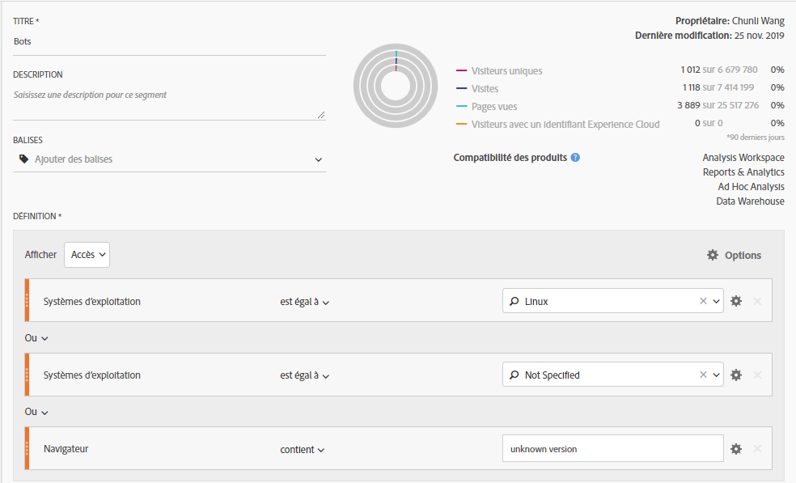
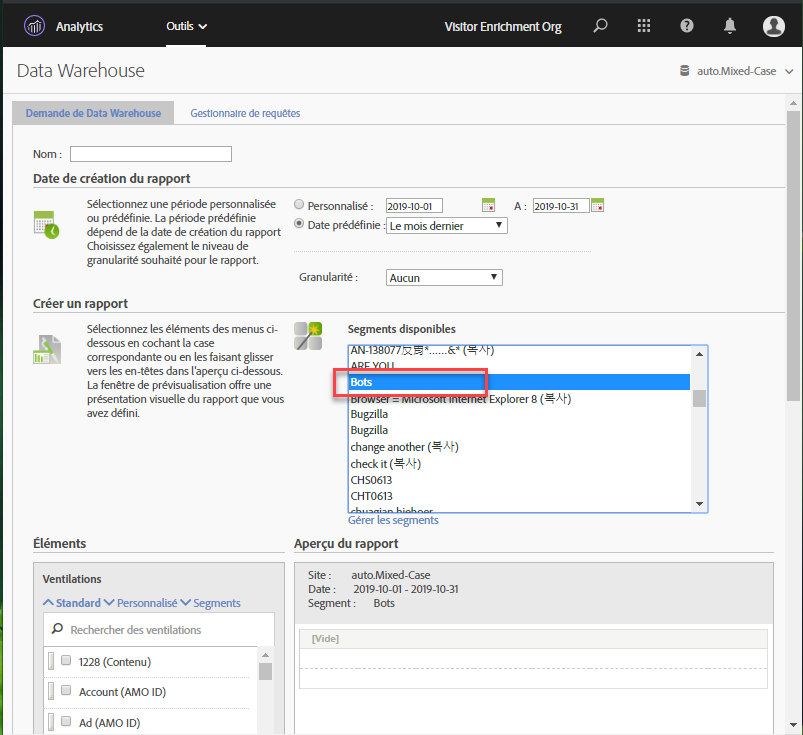
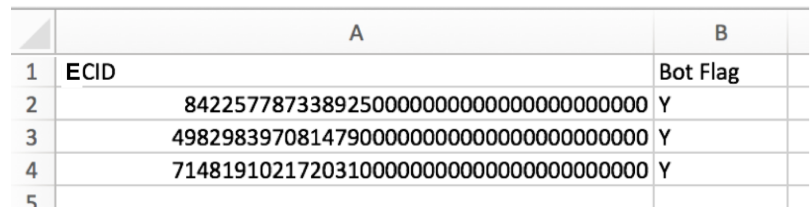
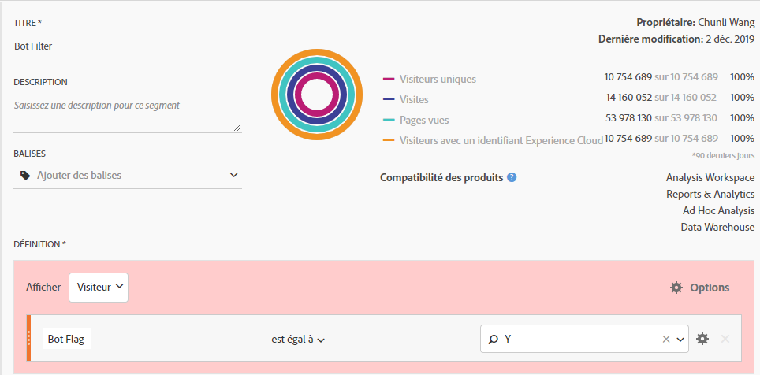
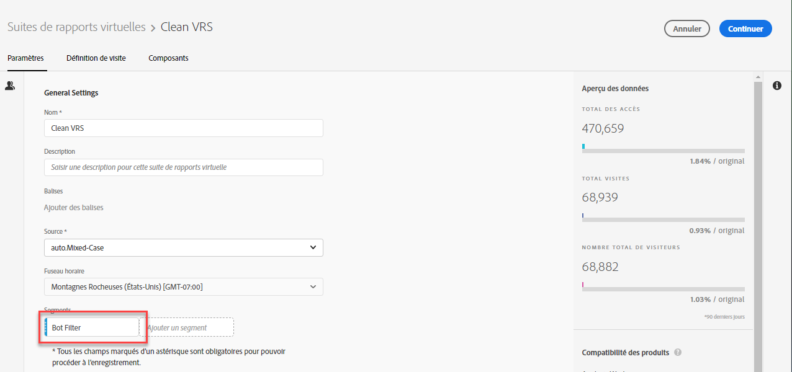

# Suppression de robots dans Adobe Analytics

Dans Adobe Analytics, vous disposez de plusieurs options pour supprimer le trafic des robots des rapports :

## Utiliser des règles de robots

Both standard and custom bot filtering methods are supported in **[!UICONTROL Analytics]**>**[!UICONTROL  Admin]** > **[!UICONTROL Report Suites]**>**[!UICONTROL  Edit Settings]** > **[!UICONTROL General]**>**[!UICONTROL  Bot Rules]**:

| Type de règle | Description |
|--- |--- |
| Règles de robots IAB standard | En sélectionnant l’option **[!UICONTROL Activer les règles de filtrage de robots IAB]**, vous utilisez la liste internationale des robots (International Spiders &amp; Robots List) fournie par l’[IAB](https://www.iab.com/)(Bureau international de la publicité) pour supprimer le trafic de robots. La plupart des clients sélectionnent au moins cette option. |
| Règles de robots personnalisées | Vous pouvez définir et ajouter des règles de robots personnalisées basées sur des agents utilisateurs, des adresses IP ou des plages d’adresses IP. |

Pour plus d’informations, voir [Présentation des règles de robots](/help/admin/admin/bot-removal/bot-rules.md).

## Utiliser une combinaison d’outils Adobe

En outre, comme les robots se transforment rapidement, Adobe propose plusieurs autres fonctionnalités performantes qui, lorsqu’elles sont combinées correctement et régulièrement, peuvent contribuer à venir à bout de ces ennemis de la qualité des données. Ces fonctionnalités sont les suivantes : le service Experience Cloud ID, la segmentation, Data Warehouse, les attributs du client et les suites de rapports virtuelles. Voici un aperçu de la manière dont vous pouvez tirer parti de ces outils.

### Étape 1 : transférer l’Experience Cloud ID de vos visiteurs dans un nouvel ID déclaré

Pour commencer, vous souhaiterez créer un ID déclaré dans le [service clé People](https://docs.adobe.com/content/help/en/core-services/interface/audiences/audience-library.html). Vous devrez transmettre l’Experience Cloud ID de votre visiteur à ce nouvel ID déclaré, ce qui peut être effectué rapidement et facilement à l’aide d’[Adobe Experience Platform Launch](https://docs.adobe.com/content/help/en/launch/using/implement/solutions/idservice-save.html). Utilisons le nom « ECID » pour l’ID déclaré.



Voici la manière de capturer cet ID via l’élément de données. Veillez à renseigner correctement votre ID d’organisation Experience Cloud dans l’élément de données.

```return Visitor.getInstance("REPLACE_WITH_YOUR_ECORG_ID@AdobeOrg").getExperienceCloudVisitorID();```

Une fois cet élément de données configuré, suivez [ces instructions](https://docs.adobe.com/content/help/en/launch/using/implement/solutions/idservice-save.html) pour transmettre les ID déclarés à l’outil ECID dans Launch.

### Étape 2 : utiliser la segmentation pour identifier les robots

Maintenant que l’ECID de votre visiteur est transmis dans un ID déclaré, vous pouvez utiliser la [segmentation dans Analysis Workspace](https://docs.adobe.com/content/help/en/analytics/analyze/analysis-workspace/components/t-freeform-project-segment.html) pour identifier les visiteurs qui se comportent comme des robots. Les robots sont souvent définis par leur comportement : visites à accès unique, agents utilisateurs inhabituels, informations inconnues de l’appareil ou du navigateur, aucun référent, nouveaux visiteurs, pages d’entrée inhabituelles, etc. Utilisez les fonctions d’exploration et de segmentation de Workspace pour identifier les robots qui ont échappé au filtrage IAB et les règles de robots de votre suite de rapports. Par exemple, voici une capture d’écran d’un segment que vous pouvez utiliser :



### Étape 3 : exporter tous les [!DNL Experience Cloud IDs] du segment via Data Warehouse

Maintenant que vous avez identifié les robots à l’aide de segments, l’étape suivante consiste à tirer parti de Data Warehouse pour extraire tous les Experience Cloud ID associés à ce segment. Voici comment configurer votre demande [Data Warehouse](https://docs.adobe.com/content/help/en/analytics/export/data-warehouse/data-warehouse.html) :



N’oubliez pas d’utiliser l’identifiant visiteur Experience Cloud comme dimension et d’appliquer le segment Robots.

### Étape 4 : Renvoyer cette liste à Adobe en tant qu’attribut du client

Une fois le rapport Data Warehouse généré, vous disposez d’une liste des ECID qui doivent être filtrés à partir des données historiques. Copiez et collez ces ECID dans un fichier .CSV vide avec seulement deux colonnes, ECID et Indicateur de robot.

* **ECID** : assurez-vous que cet en-tête de colonne correspond au nom que vous avez donné au nouvel ID déclaré ci-dessus.
* **Indicateur de robot** : ajoutez-le en tant que dimension de schéma d’attribut du client.

Utilisez ce fichier .CSV comme fichier d’importation d’attribut du client, puis abonnez vos suites de rapports à l’attribut du client, comme décrit dans cet [article de blog](https://theblog.adobe.com/link-digital-behavior-customers).



### Étape 5 : Créer un segment qui tire parti du nouvel attribut du client

Une fois votre jeu de données traité et intégré dans Analysis Workspace, créez un segment supplémentaire qui tire parti de votre nouvelle dimension d’attribut client « Indicateur de robot » et un conteneur [!UICONTROL Exclure] :



### Étape 6 : Utiliser ce segment comme filtre de suite de rapports virtuelle

Enfin, vous devez créer une [suite de rapports virtuelle](/help/components/vrs/vrs-about.md) qui tire parti de ce segment pour filtrer les robots identifiés :



Cette suite de rapports virtuelle récemment segmentée se caractérise désormais par un ensemble de données significativement plus propre, les robots identifiés étant complètement supprimés.

### Étape 7 : Répéter régulièrement les étapes 2, 3 et 4

Définissez au moins un rappel mensuel pour identifier et filtrer les nouveaux robots, peut-être avant l’analyse régulièrement programmée.
