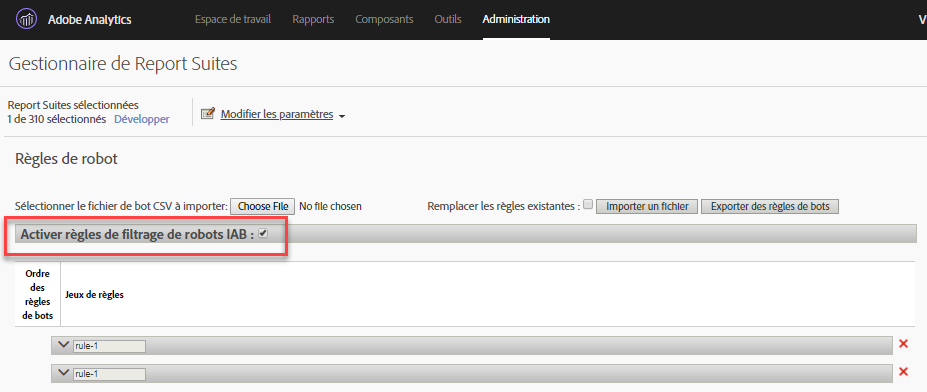

# Règles de robots - Aperçu

Les règles de robots vous permettent de supprimer du trafic de votre suite de rapports généré par des araignées et des robots connus. La suppression du trafic de robots permet d’obtenir une mesure plus précise de l’activité des utilisateurs sur votre site web.

Une fois les règles de robots définies, elles servent de critères de comparaison pour tout le trafic entrant. Le trafic qui correspond à l’une de ces règles n’est ni collecté dans la suite de rapports, ni inclus dans les mesures de trafic.

Pour mettre à jour ou télécharger des règles de robots, accédez à **[!UICONTROL Analytics]** &gt; **[!UICONTROL Admin]** &gt; **[!UICONTROL Suites de rapports]**. Sélectionnez la suite de rapports correcte, puis accédez à **[!UICONTROL Modifier les paramètres]** &gt; **[!UICONTROL Général]** &gt; **[!UICONTROL Règles de robots]**.

En règle générale, la suppression du trafic de robots réduit le volume des mesures de trafic et de conversion. Pour de nombreux utilisateurs, la suppression du trafic de robots se traduit par une augmentation des taux de conversion et d’autres mesures d’utilisation. Avant de supprimer le trafic de robots, contactez les parties intéressées afin de vous assurer qu’elles sont en mesure d’apporter les modifications nécessaires aux indicateurs de performance clés à la suite de ce changement. Si possible, nous vous conseillons d’abord de supprimer le trafic de robots d’une petite suite de rapports afin d’évaluer l’impact potentiel.

Les données de trafic de robots sont stockées dans un référentiel distinct en vue d’être affichées dans les rapports Robots et Pages de robots. Il existe deux options pour activer le filtrage des robots :

| Type de règle | Description |
|--- |--- |
| Règles de robots IAB standard | En sélectionnant l’option [!UICONTROL Activer les règles de filtrage de robots IAB], vous utilisez la liste internationale des robots (International Spiders &amp; Robots List) fournie par l’[IAB](https://www.iab.com) (Bureau international de la publicité) pour supprimer le trafic de robots. La plupart des clients sélectionnent au moins cette option. |
| Règles de robots personnalisées | Vous pouvez définir et ajouter des règles de robots personnalisées basées sur des agents utilisateurs, des adresses IP ou des plages d’adresses IP. |

## Règles de robots IAB standard

Activez les règles de robots IAB standard en cochant la case [!UICONTROL Activer les règles de filtrage de robots IAB]. Cette sélection va supprimer les robots de la liste internationale des robots (International Spiders &amp; Robots List) fournie par l’IAB (Bureau international de la publicité) pour supprimer le trafic de robots. L’IAB met cette liste à jour tous les mois.



Adobe n’est pas en mesure de fournir la liste des robots IAB détaillée aux clients.Vous pouvez cependant utiliser le rapport Robots pour consulter la liste des robots qui ont accédé à votre site. Pour soumettre un robot à la liste de l’IAB, consultez l’[IAB](https://www.iab.com).

## Règles de robots personnalisées

>[!Note] : il est possible de définir manuellement 500 règles dans l’interface utilisateur. Au-delà de cette limite, les règles doivent être gérées en bloc au moyen des options Importer un fichier et Exporter des règles de robots.

Les règles de robots personnalisées vous permettent de filtrer le trafic sur la base des conditions que vous avez définies.

Les règles de robots personnalisées sont définies à l’aide des types de conditions suivants :

* Agent utilisateur
* Adresse IP
* Plage IP

Plusieurs conditions peuvent être définies pour une seule règle. Dans le cas de conditions multiples, une correspondance est établie à l’aide de l’opérateur « OU ». Si vous indiquez, par exemple, une valeur pour Agent utilisateur et Adresse IP, le trafic est considéré comme du trafic de robots si l’une des conditions est remplie.

### Agent utilisateur

Une condition Agent utilisateur vérifie la valeur correspondante afin de déterminer si elle **[!UICONTROL contient]** ou **[!UICONTROL commence par]** la chaîne spécifiée. En cas de sélection de l’option **[!UICONTROL contient]**, une correspondance est établie avec la sous-chaîne si elle est présente dans l’agent utilisateur.

Des valeurs facultatives peuvent être incluses dans la liste **[!UICONTROL ne contient pas]** afin de définir les valeurs qui ne peuvent pas se trouver dans l’agent utilisateur pour qu’une correspondance soit établie. Vous pouvez inclure plusieurs valeurs, à raison d’une valeur par ligne. Si l’agent utilisateur répond aux critères spécifiés dans la chaîne de correspondance, mais contient également une chaîne reprise dans la liste « ne contient pas », il n’est pas considéré comme une correspondance.

Le champ **[!UICONTROL contient]** est limité à 100 caractères. La liste « ne contient pas » est limitée à 255 caractères, moins un caractère de séparation pour chaque nouvelle ligne. (Cela équivaut au nombre de chaînes - 1. Si vous indiquez 4 chaînes *ne contient pas*, 3 caractères de séparation sont obligatoires.) Les correspondances de chaînes ne sont pas sensibles à la casse.

### Adresse IP (avec correspondances de caractères génériques)

Établit une correspondance avec une ou plusieurs adresses IP dans le même bloc à l’aide de caractères génériques (*). Indiquez les valeurs numériques de l’adresse IP avec laquelle vous souhaitez établir une correspondance. Remplacez par * toute valeur que vous souhaitez faire correspondre à l’aide d’un caractère générique. La liste suivante contient des exemples de chaînes de correspondance d’adresses IP :

```
10.10.10.1
10.10.10.*
```

### Plage d’adresses IP

Indiquez les plages de début et de fin des adresses IP avec lesquelles vous souhaitez établir une correspondance. Remplacez par * toute valeur que vous souhaitez faire correspondre à l’aide d’un caractère générique.

### Définir une règle de robot personnalisée

1. Accédez à **[!UICONTROL Analytics]** &gt; **[!UICONTROL Admin]**, sélectionnez une ou plusieurs suites de rapports, puis cliquez sur **[!UICONTROL Général]** &gt; **[!UICONTROL Règles de robots]**.
1. Cliquez sur **[!UICONTROL Ajouter une règle]** et définissez ensuite une ou plusieurs conditions de correspondance.
1. Cliquez sur **[!UICONTROL Enregistrer]**. La modification doit normalement être prise en compte dans les 30 minutes.

## Télécharger des règles de robots

Pour importer des règles de robots en vrac, vous pouvez télécharger un fichier CSV qui les définit.

Créez un fichier CSV avec les colonnes suivantes, en respectant l’ordre indiqué :

| Colonne 1 | Colonne 2 | Colonne 3 | Colonne 4 | Colonne 5 |
|--- |--- |---|---|---|
| Nom du robot | Début IP | Fin IP | Règle de correspondance de l’agent<br>(contient ou commence par)</br> | Agent - Exclure<br>(255 caractères max.)</br> |

Vous pouvez définir trois types de règles de robots :

* L’agent utilisateur contient ou commence par
* Correspondance d’une seule adresse IP ou d’un seul caractère générique
* Correspondance d’une plage d’adresses IP

Chaque ligne du fichier d’importation ne peut contenir que l’une des définitions de robot suivantes :

* **L’agent utilisateur contient ou commence par** : indiquez une seule chaîne d’agent utilisateur avec laquelle établir une correspondance dans la colonne Agent - Inclure. Indiquez le type de correspondance à effectuer en indiquant *contient* ou *commence par* dans le champ Règle de correspondance de l’agent. Vous pouvez inclure une valeur facultative dans la colonne Agent - Exclure pour définir une ou plusieurs chaînes délimitées par une barre verticale (`|`) que l’agent ne contient pas. Les correspondances de chaînes ne sont pas sensibles à la casse. Les colonnes Début IP et Fin IP doivent, toutes deux, être vides.

* **Correspondance d’une seule adresse IP ou d’un seul caractère générique** : pour établir une correspondance avec une seule adresse IP (`10.10.10.1`) ou une adresse IP avec un caractère générique (`10.10.*.*`), indiquez la même valeur dans les colonnes Début IP et Fin IP. Règle de correspondance de l’agent, Agent - Inclure et Agent - Exclure doivent être vides.

* **Correspondance de plage IP** : définissez une plage d’adresses IP à l’aide des colonnes Début IP et Fin IP. Vous pouvez utiliser des caractères génériques pour faire correspondre des plages d’adresses IP ; par exemple `10.10.10.*` avec `10.10.20.*`. Règle de correspondance de l’agent, Agent - Inclure et Agent - Exclure doivent être vides.

### Combinaison de plusieurs règles avec l’opérateur « OU »

Pour établir une correspondance avec un robot à l’aide d’une combinaison de règles associées par un opérateur « OU » (par exemple, agent utilisateur OU adresse IP), indiquez un nom identique pour toutes les règles à combiner dans le champ du nom de robot. Les correspondances « ET » ne sont pas prises en charge.

### Remplacer toutes les règles par un fichier de téléchargement

Cochez la case **[!UICONTROL Remplacer les règles existantes]** pour supprimer toutes les règles existantes et les remplacer par celles définies dans le fichier de téléchargement.

### Exporter des règles

Le bouton **[!UICONTROL Exporter le fichier de robot téléchargé]** exporte toutes les règles définies dans l’interface utilisateur au format CSV.


## Incidence des règles de robots sur la collecte de données {#section_F01A3130E7A04A9993371CF26F6586F2}

Les règles de robots s’appliquent à toutes les données d’analyse. Les données supprimées par les règles de robots ne sont visibles que dans les rapports Robots et Pages de robots.

Les règles VISTA sont appliquées après les règles de robots (voir [Ordre de traitement).](/help/admin/admin/c-processing-rules/c-processing-rules-configuration/processing-rule-order.md)

**Traitement de visites enregistrant de nombreux accès** : si plus de 100 accès se produisent au cours d’une visite, la fonction de création de rapports détermine si la durée de la visite (en secondes) est inférieure ou égale au nombre d’accès. Dans ce cas, compte tenu des coûts de traitement des visites longues et intensives, la création de rapports recommence avec une nouvelle visite. Les visites qui enregistrent de nombreux accès sont généralement causées par des attaques de robots et ne sont pas considérées comme ses sessions de navigation normales effectuées par des visiteurs.

> [!NOTE] Les accès marqués comme *`bots`* sont facturés comme des [appels au serveur.](/help/admin/c-server-call-usage/overage-overview.md)

## Impact de l’obscurcissement des adresses IP sur le filtrage des robots {#section_92E60B95BE8940D983F28C79E0CD6B12}

La liste des robots IAB est basée uniquement sur l’agent-utilisateur. De ce fait, le filtrage basé sur cette liste n’est pas affecté par les paramètres d’obscurcissement d’IP. Pour le filtrage des robots non IAB (règles personnalisées), l’IP peut faire partie des critères de filtrage. Si vous filtrez des robots à l’aide de l’IP, le filtrage se produit une fois que le dernier octet a été supprimé, si ce paramètre est activé, mais avant les autres options d’obscurcissement d’IP, par exemple la suppression de l’ensemble de l’IP ou son remplacement par un identifiant unique.

Si l’obscurcissement d’IP est activé, l’exclusion de l’adresse IP survient avant l’obscurcissement ; ainsi, les clients n’ont rien à changer lorsqu’ils activent cette option.

Si le dernier octet est supprimé, ceci a lieu avant le filtrage IP. Par conséquent, le dernier octet est remplacé par un 0 et les règles d’exclusion IP doivent être mises à jour afin de correspondre aux adresses IP avec un zéro à la fin. Le * correspondant doit correspondre à 0.
