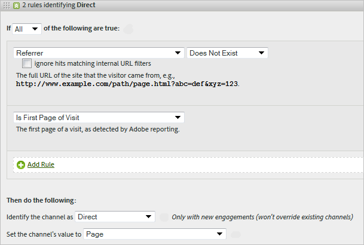

# Règles de traitement des canaux marketing

Les règles de traitement des canaux marketing déterminent si un accès visiteur satisfait les critères affectés à un canal en traitant chaque accès visiteur sur votre site. Les règles sont traitées dans l’ordre indiqué. Lorsqu’une règle est respectée, le système cesse de traiter les règles restantes.

**[!UICONTROL Analytics]** > **[!UICONTROL Admin]** > **[!UICONTROL Suites de rapports]** > **[!UICONTROL Modifier les paramètres]** > **[!UICONTROL Canaux marketing]** > **[!UICONTROL Règles de traitement des canaux marketing]**.

Remarques supplémentaires sur le traitement :

* Les données collectées avec ces règles sont permanentes. Les règles modifiées après la collecte des données ne sont pas rétroactives. Adobe recommande vivement de vérifier et de prendre en compte toutes les circonstances avant d’enregistrer [!UICONTROL Règles de traitement des canaux marketing] pour limiter la collecte des données dans des canaux incorrects.
* Vous pouvez configurer jusqu’à 25 canaux marketing distincts.
* Les règles peuvent accéder aux variables que VISTA a définies, mais pas aux données que VISTA a supprimées.
* Un même événement (tel qu’un achat ou un clic) n’est jamais porté au crédit de deux canaux marketing. En cela, les canaux marketing diffèrent des eVars (car deux eVars peuvent recevoir le crédit d’un seul et même événement).
* En cas de manque de couverture de vos règles, il est possible qu’[aucun canal ne soit identifié](/help/components/c-marketing-channels/c-faq.md).

## Conditions préalables

* Consultez les informations conceptuelles dans la section [Prise en main des Canaux marketing](/help/components/c-marketing-channels/c-getting-started-mchannel.md).
* Créez un ou plusieurs canaux auxquels attribuer des règles. Voir [Ajout de canaux marketing](/help/admin/admin/c-manage-report-suites/c-edit-report-suites/marketing-channels/c-channels.md).
* Examinez les bonnes pratiques d’utilisation [!UICONTROL Canaux marketing] avec [!UICONTROL Attribution].

## Création de règles de traitement des canaux marketing

Créez des règles de traitement des canaux marketing qui déterminent si l’accès d’un visiteur satisfait aux critères affectés à un canal.

1. Cliquez sur **[!UICONTROL Analytics]** > **[!UICONTROL Admin]** > **[!UICONTROL Suites de rapports]**.
2. Sélectionnez une suite de rapports.

   La page [!UICONTROL Canaux marketing : Configuration automatique] s’affiche si aucun canal n’est défini dans votre suite de rapports.

   Voir [Exécution de la configuration automatique](/help/components/c-marketing-channels/c-getting-started-mchannel.md).

3. Cliquez sur **[!UICONTROL Modifier les paramètres]** > **[!UICONTROL Canaux marketing]** > **[!UICONTROL Règles de traitement des canaux marketing]**. Si vous avez exécuté la configuration automatique, un ensemble de canaux et de règles a été automatiquement défini pour vous.

   

4. Si vous souhaitez ajouter une règle, sélectionnez dans la **[!UICONTROL Ajouter un nouveau jeu de règles]** . Si vous sélectionnez un canal, un modèle de règle vous est attribué et si vous sélectionnez Personnalisé, vous démarrez à partir d’une ardoise vide. Les deux options vous permettent de modifier le jeu de règles selon vos besoins.

   

5. Pour continuer à créer des règles, cliquez sur **[!UICONTROL Ajouter un nouveau jeu de règles]**.
6. Pour classer les règles par priorité, faites-les glisser à l’emplacement souhaité.
7. Cliquez sur **[!UICONTROL Enregistrer]**.

### Définition de la valeur d’un canal marketing

**[!UICONTROL Définir la valeur du canal]** définit la dimension détaillée du canal marketing disponible pour ce canal.

### Critères de règle

Ce tableau de référence définit les champs, options et attributs d’accès que vous pouvez utiliser pour définir les règles de traitement des canaux marketing.

>[!NOTE]
>
>Tout champ de texte que vous définissez, tel que le paramètre de chaîne de requête ou les listes de valeurs à rechercher, est évalué comme **non-respect de la casse** valeurs. Par exemple, si vous avez une règle où le paramètre de chaîne de requête `cmp = abc123`, toutes les variantes majuscules et minuscules des deux `cmp` et `abc123` correspond à .

| Terme | Définition |
|--- |--- |
| Tous | N’active ce canal que lorsque tous les critères de la règle sont vrais. |
| Tous | Active ce canal lorsque l’un des critères de la règle est vrai. Cette option n’est disponible que s’il existe plusieurs critères dans la règle. |
| ID AMO | Code de suivi principal utilisé par les intégrations Advertising Cloud et Advertising Analytics. Lorsque l’une de ces intégrations est activée, le préfixe du code de suivi peut être utilisé pour identifier les canaux spécifiques à Advertising Cloud. Utilisez « AMO ID » en commençant par « AL » pour Rechercher, « AC » pour Afficher ou « AO » pour Social. Lorsque l’AMO ID est utilisé dans les canaux marketing, les mesures de clic/coût/impression peuvent être attribuées au canal approprié (lorsqu’elles ne sont pas configurées, elles sont alors associées à Direct ou Aucun). |
| AMO ED ID | Code de suivi secondaire utilisé par Advertising Cloud. Le principal objectif de ce code de suivi est de servir de clé pour renvoyer les données vers Advertising Cloud. Il peut toutefois également être utilisé pour identifier les clics publicitaires par rapport aux affichages publicitaires si vous souhaitez les voir comme deux canaux marketing distincts. Pour ce faire, définissez la logique du canal marketing pour la fin &quot;AMO EF ID&quot; avec `:d` pour les clics publicitaires ou &quot;AMO EF ID&quot; se terminent par `:i` pour les affichages publicitaires. Si vous ne souhaitez pas diviser Affichage en deux canaux, utilisez plutôt la dimension AMO ID. |
| Variables de conversion | Comprend des variables eVar activées pour cette suite de rapports et ne s’applique que lorsque ces variables sont définies au moyen du code Adobe sur la page. |
| Existe | Plusieurs sélections sont disponibles, notamment :<ul><li>**N’existe pas** : indique que l’attribut de visite n’existe pas pour la demande. Dans un domaine référent par exemple, si l’utilisateur saisit une URL ou clique sur un signet, l’attribut de domaine référent n’existe pas.</li><li>**Est vide** : indique que l’attribut de visite existe, généralement sous la forme d’un paramètre de chaîne de requête ou eVar, mais qu’aucune valeur associée à l’attribut de visite n’est attribuée.</li><li>**Ne contient pas**: vous permet d’indiquer, par exemple, qu’un domaine référent ne contient pas de valeur spécifique (contrairement à l’utilisation de la sélection &quot;Contient&quot;.)</li></ul> |
| Identifier le canal comme | Associe la règle à un canal marketing ajouté à la page Gestionnaire de canaux marketing . |
| Fait correspondre les règles de détection des recherches payées | Une recherche payante détectée par Adobe. Lors des recherches payantes, les sociétés paient une somme au moteur de recherche pour répertorier leur site. Les recherches payantes figurent habituellement en haut ou à droite des résultats de la recherche. |
| Fait correspondre les règles de détection des recherches naturelles | Une recherche non payante détectée par Adobe. |
| Le référent correspond aux filtres d’URL internes | Une visite dont l’URL de page correspond à un filtre d’URL interne, tel qu’il est défini pour la suite de rapports dans les Outils d’administration. |
| Le référent ne correspond pas aux filtres d’URL internes | L’URL référente ne correspond pas à un filtre d’URL interne, tel qu’il est défini pour la suite de rapports dans les Outils d’administration. Vous pouvez utiliser ce paramètre avec URL de page et Existe pour configurer une règle fourre-tout, de sorte qu’aucune visite ne figure dans la section Aucun canal identifié du rapport. |
| Ignorer les visites correspondant aux filtres URL internes | (Pour les référents) Effectue uniquement le suivi des visites provenant de sites externes. En règle générale, ce paramètre doit rester activé, à moins que vous ne souhaitiez inclure le trafic interne. |
| Est la première page de la visite | La première page d’une visite détectée par Adobe. |
| Page | La dimension [Page](/help/components/dimensions/page.md). |
| Domaine de page | Le domaine de la page à laquelle accède le visiteur, tel que `products.example.com`. |
| Domaine et chemin de page | Domaine et chemin d’accès, comme par exemple `products.example.com/mens/pants/overview.html`. |
| Domaine racine de page (TLD+1) | Domaine racine de la page à laquelle accède le visiteur, tel que exemple.co.uk . |
| URL de la page | L’URL d’une page Web de votre site. |
| Domaine référent | La variable [Domaine référent](/help/components/dimensions/referring-domain.md) dimension |
| Paramètre de chaîne de requête | Utilisez un paramètre de chaîne de requête individuel. Vous ne pouvez spécifier qu’un seul paramètre de chaîne de requête par critère. Pour ajouter des paramètres de chaîne de requête supplémentaires, utilisez `ANY` comme opérateur, puis ajoutez des paramètres de chaîne de requête à la règle. |
| Référent | L’emplacement de la page Web (adresse URL complète) sur laquelle vos visiteurs se trouvaient avant de consulter votre site. Il existe un référent en dehors de votre domaine défini. |
| Domaine et chemin référents | Une concaténation de « Domaine référent » et « Chemin d’accès à l’URL ». Voici quelques exemples :    `www.example.com/products/id/12345` ou `ad.example.com/foo` |
| Paramètre de référent | Un paramètre de chaîne de requête sur l’URL de renvoi. Par exemple, si vos visiteurs proviennent de `example.com/?page=12345&cat=1`, alors « page » et « chat » sont les paramètres référents. |
| Domaine racine référent | Le domaine racine du référent. Il existe un référent en dehors de votre domaine défini. |
| Moteur de recherche | Moteur de recherche, tel que Google ou Yahoo!, qui a dirigé les visiteurs sur votre site. |
| Mots-clés de recherche | Mot utilisé dans une recherche en utilisant un moteur de recherche. |
| Moteur de recherche - Mots-clés | Une concaténation de « Mot-clé de recherche » et de « Moteur de recherche » pour identifier avec exactitude le moteur de recherche. Par exemple, si vous recherchez le mot machine, le moteur de recherche et le mot-clé sont identifiés comme suit : `Search Tracking Code = "<search_type>:<search engine>:<search keyword>" where    search_type = "n" or "p", search_engine = "Google", and search_keyword = "computer"`**Remarque :** n = naturelle ; p = payante |
| Définir la valeur du canal comme | Définit la variable [Détails du canal marketing](/help/components/dimensions/marketing-detail.md) dimension. Vous déterminez la valeur la mieux adaptée au contexte de la règle. Par exemple, l’identifiant de bannière publicitaire, le mot-clé de recherche ou la campagne par courrier électronique. |

## Définitions et ordre des règles de canal marketing {#channel-rules}

Les règles de canal sont traitées dans l’ordre indiqué. Adobe recommande de placer les canaux payants ou gérés en premier (tels que le référencement payant, la recherche naturelle, l’affichage ou le courrier électronique) afin qu’ils reçoivent du crédit sur des canaux organiques (tels que les domaines directs, internes, référents).

Vous trouverez ci-dessous l’ordre recommandé pour les règles de canal et les exemples de définitions :

### Référencement payant {#paid-search}

Une recherche payante est un mot ou une expression pour lequel ou laquelle vous payez un moteur de recherche pour apparaître dans les résultats de la recherche. Ce canal est généralement défini en fonction du paramètre de chaîne de requête (voir l’exemple Affichage du canal ) ou des règles de détection de référencement payant.

#### Détection de recherche payante

Pour créer une correspondance avec les règles de détection de recherche payante, le canal marketing utilise les paramètres configurés sur la page [!UICONTROL Détection de recherche payante]. ( **[!UICONTROL Admin]** > **[!UICONTROL Suites de rapports]** > **[!UICONTROL Modifier les paramètres]** > **[!UICONTROL Général]** > **[!UICONTROL Détection de recherche payée]**). L’URL de destination correspond à la règle de détection de la recherche payante existante pour ce moteur de recherche.

Pour la règle du canal marketing, les paramètres de la [!UICONTROL recherche payante] sont les suivants :

Voir [Détection de recherche payante](../general/paid-search-detection/paid-search-detection.md) pour plus d’informations.

### Recherche naturelle   {#natural-search}

La recherche naturelle est le moment où les visiteurs trouvent votre site web par l’intermédiaire d’un moteur de recherche et où le moteur de recherche classait votre site sans que vous ayez à payer pour figurer dans la liste.

L’Adobe détermine le trafic de recherche en fonction d’une recherche interne des moteurs de recherche. Si un référent correspond aux critères d’un moteur de recherche, il détermine s’il est payant ou naturel en utilisant [Détection de recherche payante](../general/paid-search-detection/paid-search-detection.md) règles que vous avez configurées. Un accès est considéré comme une recherche naturelle lorsqu’il ne correspond à aucune règle de détection de référencement payant.

Pour la règle du canal marketing, les paramètres de la recherche naturelle sont les suivants :

### Afficher  {#display}

Cette règle identifie les visiteurs provenant de bannières publicitaires. Il est identifié par un paramètre de chaîne de requête dans l’URL de destination, dans ce cas *`Ad_01`*. Le paramètre de chaîne de requête et les valeurs recherchées sont évalués en tant que valeurs insensibles à la casse.

### Courriel  {#email}

Cette règle identifie les visiteurs provenant de campagnes par e-mail. Elle est identifiée par un paramètre de chaîne de requête dans l’URL de destination, dans ce cas *`eml`* :

### Affilié  {#afilliates}

Cette règle identifie les visiteurs envoyés par un ensemble donné de domaines référents. Faites figurer dans la règle la liste des domaines d’affiliés dont vous souhaitez effectuer le suivi, de la manière suivante :

### Autres campagnes {#other-campaigns}

Une bonne pratique consiste à inclure un canal « Autres campagnes » qui suit toutes les règles de canal payant. Ce canal sert de fourre-tout pour le trafic payant non classé.

### Réseaux sociaux   {#social-networks}

Cette règle identifie les visiteurs provenant d’un réseau social, tel que Facebook. Le canal est souvent renommé Social organique. Les paramètres peuvent être les suivants :

### Canal interne (Actualisation de session) {#internal}

Cette règle s’applique aux visiteurs dont l’URL de référence correspond aux filtres d’URL internes configurés dans l’Admin Console, ce qui signifie que la visite a commencé depuis ce même site. Ce canal est souvent renommé Actualisation de session.

Pour plus d’informations sur ce canal, consultez [Raisons d’utiliser le canal interne (actualisation de session)](https://experienceleague.adobe.com/docs/analytics/components/marketing-channels/c-faq.html?lang=fr#internal).

### Direct  {#direct}

Cette règle identifie les visiteurs sans domaine référent, dont les visiteurs venus sur votre site directement, depuis un lien Favoris ou en collant un lien dans leur navigateur, par exemple. Ce canal est souvent renommé Tapé/marqué directement.

### Canal de domaine référent {#referring-domains}

Le canal de domaine référent identifie les visiteurs avec domaine référent. Ensemble, les canaux internes, directs et de domaine référent agissent comme un fourre-tout pour tous les accès qui n’ont pas encore été classés dans un canal.

