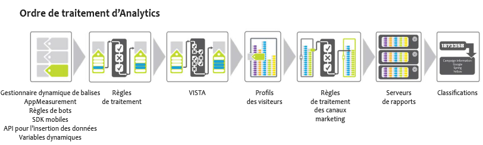

# Ordre de traitement

Pour utiliser efficacement les règles de traitement, il est essentiel de comprendre à quel moment elles sont appliquées dans le cadre d’une collecte de données.

Les tableaux suivants répertorient les données qui sont généralement disponibles avant et après l’application de règles de traitement :

## Avant l’application de règles de traitement

| Dimension | Description |
|--- |--- |
| Recherche de variable dynamique | Les variables sont renseignées dynamiquement en extrayant des informations des en-têtes HTTP ou d’autres variables. Par exemple, `s.eVar5="D=c1"` insère la valeur de prop1 dans eVar5. |
| AppMeasurement | Les fonctions et modules complémentaires utilisés dans AppMeasurement sont exécutés dans le navigateur ou dans l’application cliente. |
| Dynamic Tag Management | Les règles définies dans la Dynamic Tag Management sont exécutées comme définies. |
| Règles de robots | [Les règles de robots](/help/admin/admin/bot-removal/bot-rules.md) vous permettent de supprimer de votre suite de rapports le trafic généré par des araignées et des robots (bots) connus. |

## Après l’application de règles de traitement

| Dimension | Description |
|--- |--- |
| Données ajoutées par VISTA | Les règles de traitement sont appliquées avant VISTA. |
| Numéro de page de la visite | Généralement, les règles de traitement ne sont informées que des données contenues dans l’accès actuel. Le numéro de page de la visite est compilé après l’application des règles de traitement. |
| Une URL propre est ajoutée comme nom de page si aucun nom n’est défini | Après l’application des règles de traitement et VISTA, l’URL propre est ajoutée comme nom de page si aucun nom n’est défini. Dans la mesure où cela se produit après l’application des règles, il est conseillé d’ajouter une condition afin de vérifier si le nom de page est vide.  Si, après l’exécution de Contenu du site &gt; Rapport Pages, des valeurs https:// sont présentées pour les noms de pages, il est probable que le nom de page soit vide et que l’URL soit en cours d’utilisation.  Vous pouvez configurer une condition afin de rechercher un nom de page vide ou de vérifier si le nom de page ou l’URL de la page contient une valeur spécifique. Le nom de la page peut alors être défini selon vos besoins. |
| Règles de traitement des canaux marketing | Vous pouvez utiliser des règles de traitement afin de préparer les données en vue de leur traitement par des [règles Canaux marketing](https://marketing.adobe.com/resources/help/en_US/mchannel/c_rules.html). |
| Recherche GEO | Inclut les valeurs État du visiteur et Code postal du visiteur. |
| Persistance des variables eVar | Les variables eVar qui étaient contenues dans un accès précédent ne sont pas conservées dans chacun des accès au cours du traitement des règles. Seules les variables eVar qui sont définies sur l’accès en cours de traitement sont disponibles. |

## Méthode d’application des règles de traitement lors de la copie d’accès à l’aide de VISTA {#section_576EE8C240A24CBA979BD614E8D5338D}

Si une règle VISTA est configurée pour copier des accès vers une autre suite de rapports, les accès sont envoyés via toute règle de traitement définie sur l’autre suite.

Si des règles de traitement sont définies sur la suite de rapports d’origine, leur application dépend de la manière dont la règle VISTA a été configurée par les services d’ingénierie. Pour le savoir, vous pouvez demander à votre spécialiste de la mise en œuvre si la règle VISTA copie les valeurs « pré » ou « post » dans la suite de rapports supplémentaire. Si la valeur « pré » est copiée, les règles de traitement définies sur la suite de rapport d’origine ne sont pas appliquées. Si la valeur « post » est copiée, les règles de traitement sont appliquées avant la copie de l’accès.
