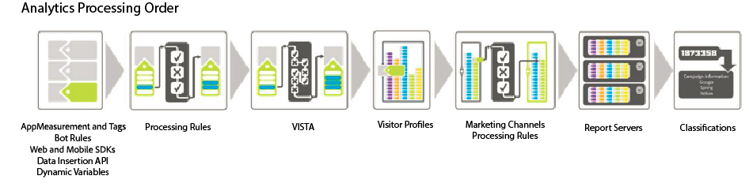

# Ordre de traitement

Pour utiliser efficacement les règles de traitement, il est essentiel de comprendre quand elles sont appliquées pendant la collecte des données.

Les tableaux suivants répertorient les données généralement disponibles avant et après l’application des règles de traitement.

## Avant l’application de règles de traitement

| Dimension | Description |
|--- |--- |
| [Variables dynamiques](/help/implement/vars/page-vars/dynamic-variables.md) | Variables renseignées dynamiquement en extrayant des informations des en-têtes HTTP ou d’autres variables. |
| [AppMeasurement](/help/implement/home.md) | Les fonctions et modules externes utilisés dans les bibliothèques AppMeasurement sont exécutés dans le navigateur ou l’application cliente. |
| [Implémentation des balises](/help/implement/launch/overview.md) | Règles définies dans l’interface utilisateur de la collecte de données. |
| [SDK web Adobe Experience Platform](https://experienceleague.adobe.com/docs/experience-platform/edge/data-collection/adobe-analytics/analytics-overview.html) | Les données collectées par le biais du SDK Web sont envoyées à Adobe Experience Edge, puis transférées à la suite de rapports souhaitée. |
| [Règles de robots](/help/admin/admin/bot-removal/bot-rules.md) | Permet de supprimer le trafic généré par des araignées et des robots connus. |

## Après l’application de règles de traitement

| Dimension | Description |
|--- |--- |
| Données ajoutées par VISTA | Les règles de traitement sont appliquées avant VISTA. |
| Numéro de page de la visite | Les règles de traitement ne prennent en compte que les données contenues dans l’accès actif. Le numéro de page de la visite est compilé après l’application des règles de traitement. |
| Une URL propre est ajoutée comme nom de page si aucun nom n’est défini | Après l’application des règles de traitement et VISTA, l’URL propre est ajoutée comme nom de page si aucun nom n’est défini. Cette logique survenant après l’application des règles de traitement, Adobe recommande d’ajouter une condition afin de vérifier si le nom de la page est vide.  Si vous exécutez le **[!UICONTROL Contenu du site]** > **[!UICONTROL Pages]** Si le rapport indique les valeurs d’URL des noms de page, il est probable que la variable de nom de page soit vide.  Vous pouvez configurer une condition afin de rechercher un nom de page vide ou de vérifier si le nom de page ou l’URL de la page contient une valeur spécifique. Le nom de la page peut alors être défini selon vos besoins. |
| Règles de traitement des canaux marketing | Vous pouvez utiliser des règles de traitement afin de préparer les données en vue de leur traitement par des [règles Canaux marketing](https://experienceleague.adobe.com/docs/analytics/components/marketing-channels/c-rules.html?lang=fr). |
| Recherche GEO | Inclut les valeurs État du visiteur et Code postal du visiteur. |
| Persistance des variables eVar | Les variables eVar qui étaient contenues dans un accès précédent ne sont pas conservées dans chacun des accès au cours du traitement des règles. Seules les variables eVar qui sont définies sur l’accès en cours de traitement sont disponibles. |

## Méthode d’application des règles de traitement lors de la copie d’accès à l’aide de VISTA

Si une règle VISTA est configurée pour copier des accès vers une autre suite de rapports, les accès sont envoyés via toute règle de traitement définie sur l’autre suite de rapports.

Si des règles de traitement sont définies sur la suite de rapports d’origine, elles peuvent être ou non appliquées en fonction de la configuration de la règle VISTA par les services d’ingénierie. Pour le savoir, vous pouvez demander à votre spécialiste de la mise en œuvre si la règle VISTA copie les valeurs « pré » ou « post » dans la suite de rapports supplémentaire. Si la valeur « pré » est copiée, les règles de traitement définies sur la suite de rapport d’origine ne sont pas appliquées. Si la valeur « post » est copiée, les règles de traitement sont appliquées avant la copie de l’accès.
