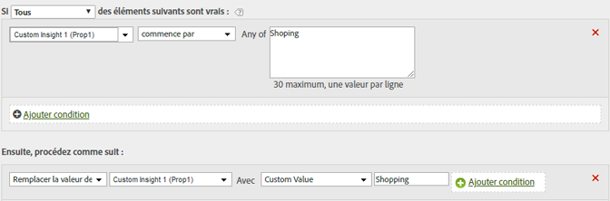

# Nettoyer les valeurs d’un rapport

Vous pouvez rechercher les fautes d’orthographe courantes dans les valeurs et les mettre à jour afin qu’elles s’affichent correctement dans les rapports.

Pour éviter toute correspondance accidentelle avec d’autres valeurs, utilisez l’option de correspondance la plus restrictive possible. Vous pouvez exécuter un rapport sur la variable (prop1 dans l’exemple ci-dessous) et rechercher les candidats au remplacement pour être sûr d’éviter toute correspondance avec des valeurs non voulues. Les comparaisons de chaînes ne sont pas sensibles à la casse.

| Jeu de règles | Valeur |
|---|---|
| Condition | Si prop1 commence par Shopping |
| Action | Remplacer la valeur de prop1 par la valeur personnalisée Shopping |

Par exemple :

