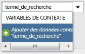
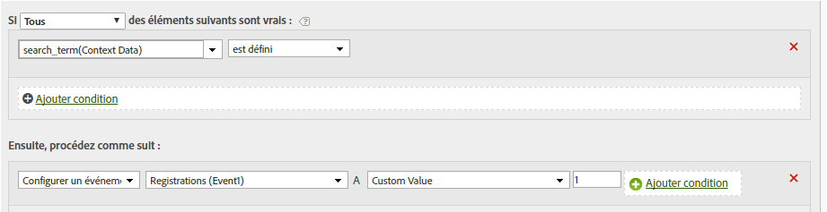

# Définir un événement à l’aide d’une variable de données contextuelles

Les règles de traitement peuvent déclencher des événements sur la base de variables Données contextuelles.

Les variables de données contextuelles sont spécifiées dans AppMeasurement au format suivant :

```
 s.contextData['search_term']
```

La liste [!UICONTROL Variables contextuelles] contient toutes les variables qui ont été envoyées à la suite de rapports au cours des 30 derniers jours. Si vous connaissez le nom de la variable de données contextuelles, mais ne l’avez pas envoyée dans la suite de rapports actuelle, vous pouvez ajouter une valeur en entrant le nom de la variable et en cliquant sur **[!UICONTROL Ajouter les données contextuelles nom de la variable]** :



La définition de règle suivante s’étend à la règle [Copier une variable de données contextuelles dans une eVar](/help/admin/admin/c-processing-rules/processing-rules-examples/processing-rules-copy-context-data.md) pour créer également un événement sur chaque accès contenant une variable de données contextuelles spécifique :

| Jeu de règles | Valeur |
|---|---|
| Condition | Si les données contextuelles « terme_recherché » sont définies |
| Action | Définir l’événement « recherches » |

Par exemple :



Reportez-vous à la rubrique [Variables Données contextuelles](https://marketing.adobe.com/resources/help/fr_FR/sc/implement/context_data_variables.html) dans l’aide d’implémentation.
