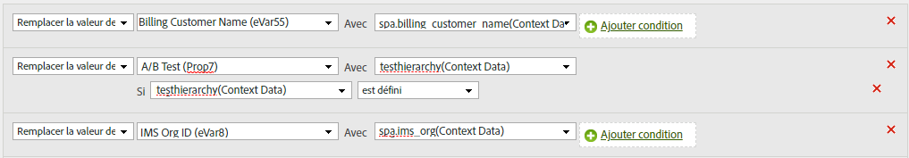

# Copier une variable de données contextuelles dans une eVar

Les règles de traitement permettent de déplacer des valeurs des variables de données contextuelles vers des props et des eVars. Sans règles de traitement, les variables de données contextuelles n’ont aucun sens et ne renseignez aucun rapport dans Analytics.

La liste [!UICONTROL Variables contextuelles] contient toutes les variables qui ont été envoyées à la suite de rapports au cours des 30 derniers jours. If you know the context data variable name but have not sent it into the current report suite, you can add a value by typing the variable name and clicking **[!UICONTROL Add variable name context data]**:

L’exemple suivant utilise la variable de données `search_term` contextuelles et place sa valeur dans `eVar3`:

L’exemple ci-dessus fonctionne bien lorsqu’il n’y a que quelques eVars à renseigner. Si votre entreprise dispose de centaines de variables de données contextuelles qui nécessitent chacune leur propre eVar, vous pouvez utiliser des instructions conditionnelles. Des dizaines d’instructions conditionnelles peuvent s’intégrer à une règle de traitement unique, ce qui permet à votre entreprise de renseigner toutes les eVars d’une suite de rapports sans avoir à respecter la limite de 150 règles de traitement.

L’exemple suivant est renseigné `prop7` avec la variable de données contextuelles `testhierarchy`, mais uniquement si `testhierarchy` est défini :

Pour plus d’informations sur l’implémentation des variables de données contextuelles, voir Variables  de données contextuelles dans le guide de l’utilisateur Mise en oeuvre.
