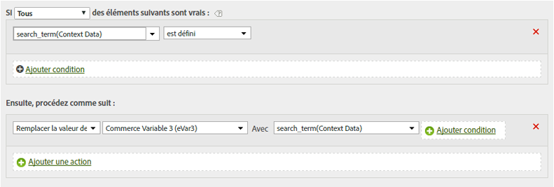

# Copier une variable de données contextuelles dans une eVar

Les règles de traitement servent à déplacer des valeurs des variables Données contextuelles vers des props et des eVars.

Les variables de données contextuelles sont spécifiées dans AppMeasurement au format suivant :

```
 s.contextData['search_term']
```

La liste [!UICONTROL Variables contextuelles] contient toutes les variables qui ont été envoyées à la suite de rapports au cours des 30 derniers jours. If you know the context data variable name but have not sent it into the current report suite, you can add a value by typing the variable name and clicking **[!UICONTROL Add variable name context data]**:


La définition de règle suivante renseigne une eVar sur chaque accès contenant une variable de données contextuelles spécifique :

| Jeu de règles | Valeur |
|---|---|
| Condition | Si les données contextuelles « terme_recherché » sont définies |
| Action | Remplacer la valeur d’eVar3 par « terme_recherché » |

Par exemple :



Reportez-vous à la rubrique [Variables Données contextuelles](https://marketing.adobe.com/resources/help/en_US/sc/implement/context_data_variables.html) dans l’aide d’implémentation.
