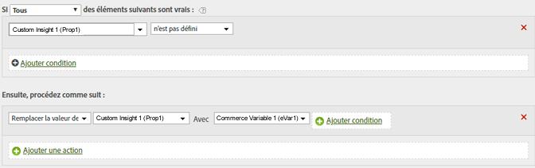

# Déterminer un chemin en copiant une valeur eVar sur une valeur prop

Vous pouvez copier la valeur d’une variable eVar sur une valeur Prop pour activer le cheminement.

Lors de la définition de valeurs, la variable de gauche reçoit la valeur (même si elle est vide) de la variable de droite.

| Jeu de règles | Valeur |
|---|---|
| Condition | Aucun (toujours exécuter) |
| Action | Remplacer la valeur de Prop1 par eVar1 |

Vous ne pouvez modifier cette règle pour définir la valeur de Prop1 que si elle ne contient pas encore de valeur, comme indiqué ci-dessous :

| Jeu de règles | Valeur |
|---|---|
| Condition | Si Prop1 n’est pas défini |
| Action | Remplacer la valeur de Prop1 par eVar1 |

Par exemple :

