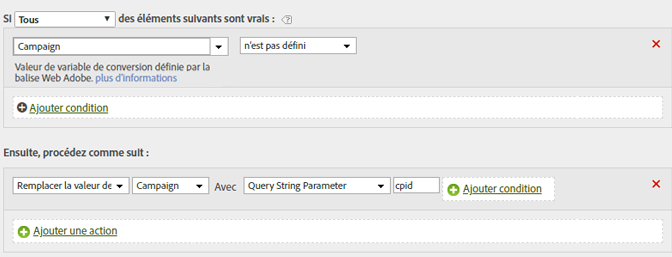

# Renseigner un identifiant de campagne à partir d'un paramètre de chaîne de requête

Vous pouvez renseigner une variable à l’aide d’un paramètre de chaîne de requête.

Dans la plupart des cas, vous utilisez un module pour compléter les variables de la chaîne de requête. Si une faute de frappe ou un problème similaire vous empêche d’indiquer la valeur, vous pouvez renseigner la variable à l’aide de règles de traitement.

Avant d’écraser une valeur, vérifiez toujours si elle est vide ou si elle contient la valeur souhaitée.

| Jeu de règles | Valeur |
|---|---|
| Condition | La campagne n’est pas définie |
| Action | Remplacer la valeur de la campagne par le paramètre de chaîne de requête cpid |

Par exemple :

