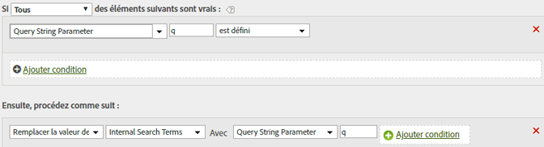

# Renseigner les termes de recherche interne à l’aide d’un paramètre de chaîne de requête

Si vous utilisez une variable courante, telle que q, pour renseigner des termes de recherche, vous pouvez utiliser des règles de traitement pour remplir la variable eVar Termes de recherche internes avec ces valeurs.

Les valeurs de chaîne de requête doivent être codées au format Unicode ou UTF-8 pour être lues par des règles de traitement.

| Jeu de règles | Valeur |
|---|---|
| Condition | Si le Paramètre de chaîne de requête q est défini |
| Action | Remplacer la valeur des termes de recherche interne par le paramètre de chaîne de requête q |

Par exemple :

