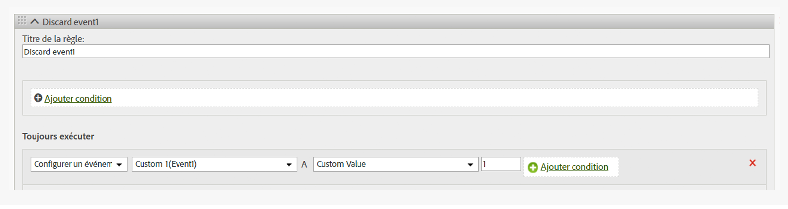

# Supprimer un événement d’un accès

Indique comment supprimer/ignorer un événement d’un accès en utilisant la règle de traitement, sans implémenter de changement sur la page.

## Supprimer un événement d’un accès {#topic_9548385BFE344FC08CA99718A24FC093}

Indique comment supprimer/ignorer un événement d’un accès en utilisant la règle de traitement, sans implémenter de changement sur la page.

Configurez une règle de traitement pour définir l’événement sur une valeur personnalisée = 0, comme indiqué dans l’image ci-dessous :

