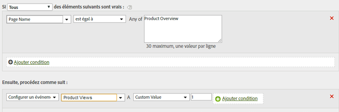

# Définir l’événement d’affichage de produit à partir de la page d’aperçu des produits

Les événements peuvent être définis sur la base des valeurs de page ou des valeurs spécifiques d’une variable.

| Jeu de règles | Valeur |
|---|---|
| Condition | Si le nom de la page correspond à l’aperçu du produit |
| Action | Définir l’événement Vues de produits d’événement sur la valeur personnalisée 1 |

Par exemple :

