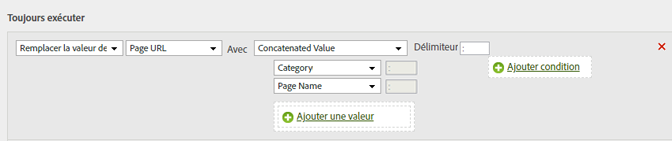

# Ajouter une sous-catégorie en concaténant le nom de page et de catégorie

Vous pouvez utiliser l’option de concaténation pour renseigner des valeurs en en combinant d’autres.

<table id="table_FF761C2011CD456B9A466C054A54FC30"> 
 <thead> 
  <tr> 
   <th colname="col1" class="entry"> Jeu de règles </th> 
   <th colname="col2" class="entry"> Valeur </th> 
  </tr> 
 </thead>
 <tbody> 
  <tr> 
   <td colname="col1"> Condition </td> 
   <td colname="col2"> Aucun (toujours exécuter) </td> 
  </tr> 
  <tr> 
   <td colname="col1"> Action </td> 
   <td colname="col2">Remplacer la valeur de sous-catégorie par une valeur concaténée 
Catégorie 
 
Nom de page 
 </td> 
  </tr> 
 </tbody> 
</table>

Par exemple :

