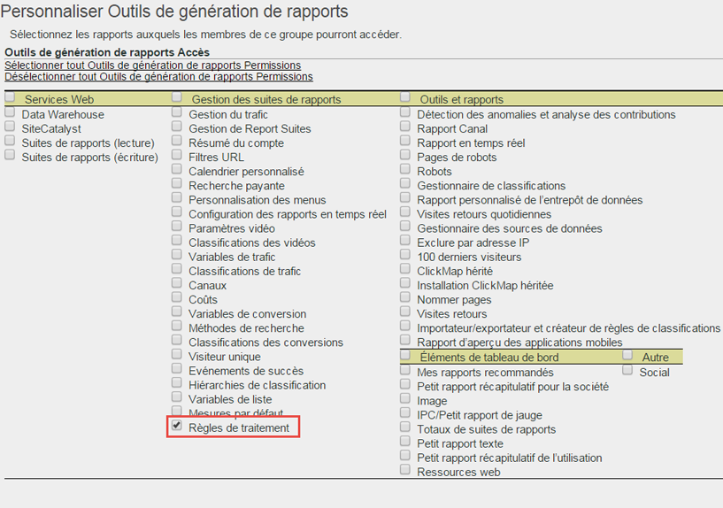
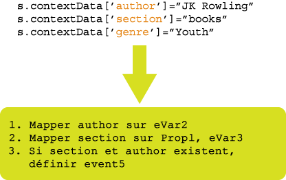

# Règles de traitement - Aperçu

Les règles de traitement simplifient la collecte de données et gèrent le contenu lorsqu’il est envoyé pour la création de rapports. Ces règles fournissent une interface pour effectuer les opérations suivantes, ce qui se traduit par une interaction plus aisée avec les groupes informatiques et les développeurs Web :

* Définir un événement sur la page d’aperçu du produit.
* Renseigner un paramètre de chaîne de requête dans une campagne.
* Concaténer une catégorie et un nom de page dans une variable prop afin de faciliter la création de rapports.
* Copier une variable eVar dans une variable prop pour visualiser les chemins.
* Corriger les sections de site mal orthographiées.
* Extraire des termes de recherche internes ou un identifiant de campagne d’une requête de chaîne pour les placer dans une variable eVar.

>[!VIDEO](https://tv.adobe.com/embed/1181/16506/)

*Regardez l’aperçu des règles de traitement et la formation proposée par Adobe Summit pour découvrir pour quelles raisons vous devriez utiliser des règles de traitement.*

## Obtention de l’autorisation d’utiliser des règles de traitement {#section_8A4846688050453784DAE4D89355169A}

Avant le 20 avril 2017, tous les utilisateurs (y compris les administrateurs) devaient réussir un examen et obtenir une autorisation de l’Assistance clientèle Adobe pour utiliser les règles de traitement.

Désormais, les administrateurs disposent des droits d’utiliser les règles de traitement **par défaut**. L’examen n’est plus nécessaire. Les administrateurs peuvent également octroyer ces droits à des utilisateurs qui ne sont pas administrateurs à l’aide de l’interface des outils d’administration. Procédez comme suit :

1. Si vous ne l’avez pas déjà fait, [créez un groupe](/help/admin/user-management2/c-user-groups/groups.md) qui inclut seulement les non-administrateurs qui doivent disposer de l’autorisation d’utiliser les règles de traitement.
1. [Ajoutez les non-administrateurs à ce groupe](/help/admin/user-management2/c-user-management/t-add-user-to-group.md).
1. Ensuite, sélectionnez **[!UICONTROL Analytics]** &gt; **[!UICONTROL Admin]** &gt; **[!UICONTROL Gestion des utilisateurs]** &gt; **[!UICONTROL Groupes]** &gt; **[!UICONTROL [nom du groupe]]** &gt; **[!UICONTROL Modifier]** &gt; **[!UICONTROL Accès aux rapports]** &gt; **[!UICONTROL Outils de suites de rapports]** &gt; **[!UICONTROL Personnaliser]** &gt; **[!UICONTROL Gestion des suites de rapports]**.
1. Cochez la case en regard de [!UICONTROL Règles de traitement] et cliquez sur **[!UICONTROL OK]**.

>[!IMPORTANT]
>
>Les règles de traitement affectant en permanence les données d’Analytics, nous recommandons vivement que leurs administrateurs soient parfaitement formés à Adobe Analytics et connaissent toutes les sources de données de vos suites de rapports (sites web normalisés, sites mobiles, applications mobiles, API pour l’insertion de données, etc.). La connaissance des variables de données contextuelles et des variables standard renseignées sur différentes plateformes permettra de prévenir la suppression ou la modification accidentelle des données.

## Utilisation de données contextuelles afin de simplifier la collecte des données {#section_09EEA03612D24C15839631AA9E9668D8}

Les variables de données contextuelles sont un nouveau type de variable, disponibles uniquement pour les règles de traitement. Pour utiliser les variables de données contextuelles, des paires de données clé/valeur sont envoyées par votre implémentation et les règles de traitement sont utilisées pour capturer ces valeurs dans des variables Analytics standard. De ce fait, les programmeurs ne doivent plus obligatoirement connaître la valeur contenue dans une variable prop et/ou eVar.

Reportez-vous à la rubrique [Variables Données contextuelles](https://marketing.adobe.com/resources/help/en_US/sc/implement/context_data_variables.html) dans l’aide d’implémentation.

## Utiliser des règles de traitement pour transformer des données d’accès et des événements de déclenchement {#section_8284E72E999244E091CD7FB1A22342B6}

Les règles de traitement peuvent contrôler les valeurs entrantes afin de transformer les fautes de frappe courantes et définir des événements sur la base de données reprises dans un rapport. Les variables prop peuvent être copiées sur des eVars. Les valeurs peuvent être concaténées et des événements peuvent être définis.

## Utilisation des variables de données contextuelles dans les rapports {#section_BD098BC503024A0B8703596628071134}

Lorsque les variables de données contextuelles ont été définies dans votre implémentation, elles doivent être copiées dans des variables telles que des eVar pour être utilisées dans les rapports.

Pour plus d’informations, accédez [ici](/help/admin/admin/c-processing-rules/processing-rules-examples/processing-rules-copy-context-data.md) et [ici](/help/admin/admin/c-processing-rules/processing-rules-examples/processing-rules-copy-context-data-event.md).
