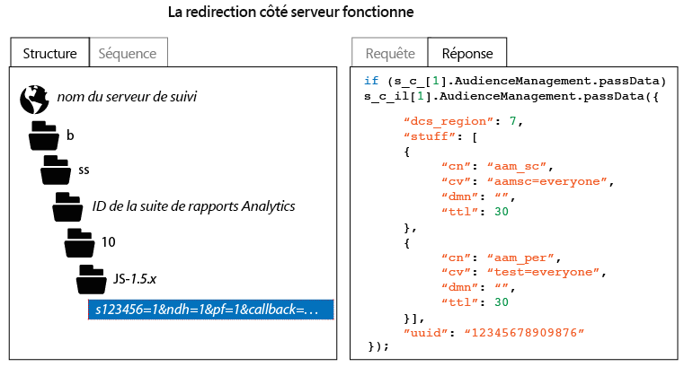

# Comment vérifier l’implémentation du transfert côté serveur

Pour vérifier que le transfert côté serveur est correctement activé, vous devez examiner la réponse HTTP provenant de la demande de suivi Analytics. Pour ce faire, utilisez les outils de développement d’un navigateur ou un outil de proxy tel que Charles Web Debugger. Les instructions suivantes illustrent les indicateurs qui doivent être présents pour garantir que le transfert côté serveur est correctement activé.

Pour vérifier l’état du transfert côté serveur :

1. Chargez une page de test contenant le code AppMeasurement mis à jour.
1. Dans les outils de débogage de votre navigateur ou en utilisant un logiciel de proxy, examinez la réponse HTTP provenant de la demande de suivi d’Analytics (vous pouvez facilement la filtrer en sélectionnant un chemin d’accès contenant &quot;b/ss&quot;).
1. Examinez la réponse HTTP. Si la réponse contient des données Audience Manager (comme illustré ci-dessous), le transfert côté serveur fonctionne.

>[!CAUTION]
>
>Si la réponse contient la paire valeur/clé `"status":"SUCCESS"` ou une image 2 x 2, le transfert côté serveur * n’est pas* configuré correctement. Assurez-vous que le service d’identité est correctement déployé, que vous avez déployé le module App Measurement, que la suite de rapports applicable a été mappée à l’organisation IMS appropriée et que le transfert côté serveur a été activé dans l’Admin Console d’Analytics.

>[!MORELIKETHIS]
>
>* [Charles Web Debugger](https://www.charlesproxy.com/)

