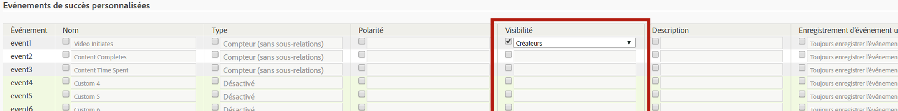

# Configurer des événements de succès

Cette procédure décrit la configuration d’événements de succès.

1. Cliquez sur **[!UICONTROL Analytics]** > **[!UICONTROL Admin]** > **[!UICONTROL Suites de rapports]**.
1. Sélectionnez une suite de rapports.
1. Cliquez sur **[!UICONTROL Modifier les paramètres]** > **[!UICONTROL Conversion]** > **[!UICONTROL Événements de succès]**.

   

1. Dans la colonne **[!UICONTROL Nom]**, cochez la case en regard de chaque élément pour activer l’édition, puis indiquez le nom de votre choix.
1. Dans la colonne **[!UICONTROL Type]**, cochez la case en regard de chaque élément pour activer la liste déroulante, puis sélectionnez le type de votre choix.

   >[!NOTE] Avant de modifier un type d’événement, voir [Modifier le type d’événement](/help/admin/admin/c-success-events/event-type.md).

   Pour plus d’informations sur ces éléments, reportez-vous à la section [Page Événements de succès – Descriptions](/help/admin/admin/c-success-events/success-event.md).

1. Dans la colonne **[!UICONTROL Polarité]**, indiquez si une tendance à la hausse pour cette mesure est bénéfique ou mauvais signe.
1. Dans la colonne **[!UICONTROL Visibilité]**, vous pouvez masquer les mesures (intégrées) standard, les événements personnalisés et les événements intégrés dans le menu, les sélecteurs de mesure, le créateur de mesures calculées et le créateur de segments.

   Ce paramètre n’a aucun impact sur la collecte des données pour cette mesure ou cet événement ; il affecte uniquement sa visibilité dans l’interface utilisateur. [Plus...](/help/admin/admin/metric-visibility.md)
1. Fournissez une description.
1. Vérifiez si l’événement doit être toujours enregistré.
1. Activez ou désactivez les mesures de participation.

   >[!NOTE] Vous pouvez activer la participation pour 100 événements personnalisés au maximum. De plus, vous pouvez créer des mesures de participation dans le créateur de [mesures calculées](/help/components/c-calcmetrics/c-workflow/cm-workflow/c-build-metrics/participation-metric.md).

1. Cliquez sur **[!UICONTROL Enregistrer]**.

