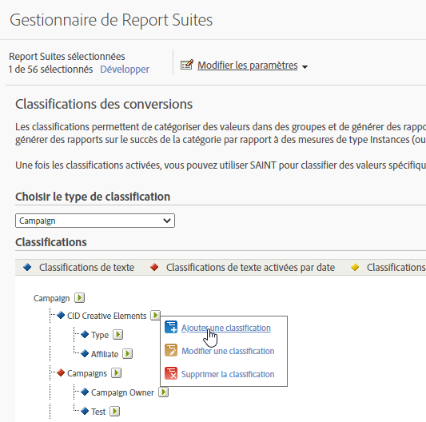

# Classifications des conversions

Les classifications permettent de catégoriser des valeurs dans des groupes et de générer des rapports au niveau d’un groupe. Vous pouvez, par exemple, classifier toutes les campagnes de recherche payante dans une catégorie comme *termes de pop music* et générer des rapports sur le succès de la catégorie par rapport à des mesures de type Instances (ou clics publicitaires), ainsi que la conversion en événements de succès.

Les classifications de conversion vous permettent de classer des variables de conversion. Une fois classé, tout rapport pouvant être généré en utilisant les données clés peut également l’être à l’aide des propriétés de données associées.

Après avoir activé les classifications, utilisez [l’importateur de classifications](/help/components/classifications/importer/c-working-with-saint.md) pour affecter des valeurs spécifiques à la classification appropriée.

>[!WARNING]
>
>Le changement de nom d’une classification peut provoquer des problèmes avec les règles existantes créées dans le [créateur de règles de classification](/help/components/classifications/crb/classification-rule-builder.md). Si vous renommez une classification qui comporte des règles de classification, veillez à corriger chaque règle afin qu’elle pointe vers la classification renommée.

## Descriptions des classifications de conversion

| Élément | Description |
| --- | --- |
| Nom | Nom de la classification |
| Date d’activation (Texte uniquement) | Indique si la classification de texte est une plage de dates pour les variables Campagne. |
| Options (Texte uniquement) | Crée une liste de valeurs de classification disponibles pour cette classification. Utilisez Options avec des variables de campagne afin de fournir aux utilisateurs la liste des valeurs prises en charge pour leur classification dans le Gestionnaire de campagnes. |
| Type de nombre (Numérique uniquement) | Indique le type de nombre dans la classification numérique. Les options comprennent Numérique, Pourcentage et Devise. |

## Ajout de classifications de conversion

Description de la procédure d’ajout de classifications de conversion dans Admin.

1. Cliquez sur **[!UICONTROL Admin]** > **[!UICONTROL Report Suites]**.
1. Sélectionnez une suite de rapports.
1. Cliquez sur **[!UICONTROL Modifier les paramètres]** > **[!UICONTROL Conversion]** > **[!UICONTROL Classifications des conversions]**.
1. Dans la liste déroulante **[!UICONTROL Choisir le type de classification]**, sélectionnez la variable qui doit contenir une classification.

   

1. Placez le pointeur de la souris sur l’icône **[!UICONTROL Modifier la classification]**, puis sélectionnez **[!UICONTROL Ajouter une classification]**.
1. Dans le champ **[!UICONTROL Sélectionner un type]**, choisissez le type de classification à ajouter à la variable.

   Les options comprennent **[!UICONTROL Texte]** et **[!UICONTROL Numérique]**. Pour plus d’informations sur les types de classification, voir [À propos des classifications](/help/components/classifications/c-classifications.md).
1. Dans la boîte de dialogue **[!UICONTROL Classifications de texte]**, configurez la classification selon vos besoins.

1. Dans la boîte de dialogue **[!UICONTROL Liste déroulante]**, ajoutez ou supprimez des options.

   L’ajout d’options crée une liste de valeurs de classification disponibles pour cette classification. Vous pouvez utiliser cette option avec des variables de campagne afin de fournir aux utilisateurs la liste des valeurs prises en charge pour leur classification dans le gestionnaire de campagnes. Utilisez cette option pour les dimensions des classifications pour lesquelles vous avez un faible nombre de valeurs autorisées qui ne changent jamais ou rarement. Par exemple, vous pouvez exécuter différentes campagnes visant différents niveaux de fidélité des clients : Argent, Or et Platine. Vous pouvez alors utiliser la liste déroulante pour garantir que les seules valeurs qui sont acceptées sont celles qui correspondent aux trois niveaux. Si un utilisateur tente d’utiliser une valeur différente, elle est ignorée.

1. Cliquez sur **[!UICONTROL Enregistrer]**.

## Suppression d’une classification de conversion

Vous pouvez supprimer une classification de conversion devenue inutile.

1. Ouvrez le Gestionnaire de Report Suites en cliquant sur **[!UICONTROL Admin]** > **[!UICONTROL Report Suites]** dans l’en-tête de la suite.
1. Sélectionnez une suite de rapports.
1. Cliquez sur **[!UICONTROL Modifier les paramètres]** > **[!UICONTROL Conversion]** > **[!UICONTROL Classifications des conversions]**.
1. Dans la liste déroulante **[!UICONTROL Choisir le type de classification]**, sélectionnez la variable dans laquelle vous souhaitez supprimer une classification.
1. Placez le pointeur de la souris sur l’icône **[!UICONTROL Modifier une classification]**, puis sélectionnez **[!UICONTROL Supprimer la classification]**.
1. Dans la boîte de dialogue Supprimer la classification, cliquez sur **[!UICONTROL Supprimer]**.
