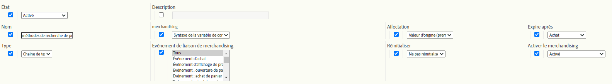

# eVars de marchandisage et méthodes de recherche de produits

Ce document explique les concepts sous-jacents aux eVars de marchandisage, qui traitent et allouent les données différemment des eVars standard. Il explique également comment les eVars de marchandisage se rapportent aux méthodes de recherche de produits.

Bien que la plupart des sites web de vente au détail disposent de plusieurs moyens de rechercher des produits, Adobe considère que les méthodes suivantes sont les méthodes de recherche de produits fondamentales dont chaque client de vente au détail doit effectuer le suivi dans Adobe Analytics :

* Mots-clés de recherche interne
* Codes de suivi de campagne internes
* Catégories de marchandisage/navigation
* Liens de vente croisée

Pour les besoins de ce document, associons quelques eVars aux solutions comme suit :

* eVar2 : Mots-clés de recherche interne
* eVar3 : Codes de suivi de campagne internes
* eVar4 : Catégories de marchandisage/navigation
* eVar5 : Liens de vente croisée

Nous pouvons utiliser un eVar supplémentaire pour mesurer les performances de toutes les méthodes de recherche de produits les unes par rapport aux autres. Outre les méthodes de recherche décrites ci-dessus, l’eVar inclut d’autres méthodes de recherche dans sa comparaison, telles que des liens vers des pages de détails de produit provenant de sites web externes.

* eVar1 : Méthodes de recherche de produits

Au lieu de configurer l’une de ces variables comme eVars standard, configurez-les comme des eVars de marchandisage. L’utilisation d’eVars de marchandisage vous permet d’allouer toute activité réussie aux valeurs capturées par les eVars à un niveau *par produit* au lieu d’un niveau *par visite/par commande*. Ce document clarifie la différence entre l’attribution par produit et l’attribution par commande dans l’ensemble.

Pour démontrer comment définir ces variables, voici un exemple où un visiteur décide d’utiliser la recherche interne par mot-clé &quot;sandales&quot; pour trouver un produit sur le site. Sur la page des résultats de recherche par mot-clé, vous devez capturer des données dans au moins deux eVars :

* `eVar2` est égal au mot-clé utilisé dans la recherche (&quot;sandals&quot;)
* `eVar1` est égal à la méthode de recherche de produit utilisée (&quot;recherche interne de mots-clés&quot;).

Lorsque vous définissez ces deux variables sur ces valeurs spécifiques, vous savez que le visiteur utilise le terme de recherche de mots-clés internes &quot;sandales&quot; pour trouver un produit. En même temps, vous savez que le visiteur n’utilise pas d’autres méthodes de recherche de produits pour rechercher des produits (par exemple, il ne navigue pas dans les catégories de produits exactement au même moment qu’il effectue une recherche de mots-clés). Pour garantir que l’affectation appropriée par produit a lieu, ces méthodes inutilisées ne doivent pas recevoir de crédit pour la recherche d’un produit trouvé par le biais d’une recherche de mots-clés interne. Par conséquent, vous devez insérer une logique dans le code (AppMeasurement, SDK Web AEP, etc.) qui définit automatiquement les eVars associées à ces autres méthodes de recherche sur une valeur &quot;méthode de non-recherche&quot;.

Par exemple, lorsqu’un utilisateur recherche des produits à l’aide du mot-clé &quot;sandales&quot;, la logique du code Analytics doit définir les variables suivantes sur la page de résultats de recherche de mots-clés internes :

* eVar2=&quot;sandals&quot;: le mot-clé &quot;sandals&quot; a été utilisé dans la recherche interne par mot-clé.
* eVar1=&quot;recherche interne de mots-clés&quot; : La méthode de recherche &quot;recherche interne par mot-clé&quot; a été utilisée.
* eVar3=&quot;campagne non interne&quot; : une campagne interne n’a pas été utilisée pour accéder à la page des résultats de recherche.
* eVar4=&quot;non-browse&quot; : une catégorie de navigation n’était pas accessible sur la page des résultats de recherche.
* eVar5=&quot;non-vente croisée&quot;: aucun clic n’a été effectué sur un lien de vente croisée dans la page des résultats de la recherche.

## Paramètres des eVars de marchandisage

Avant de poursuivre l’exemple &quot;sandales&quot;, voici les différents paramètres que vous pouvez utiliser avec vos eVars de marchandisage.  La capture d’écran suivante provient du Gestionnaire de suites de rapports. Pour y accéder, sélectionnez Analytics > Admin > Suites de rapports > Modifier les paramètres > Conversion > Variables de conversion > Ajouter > Activer le marchandisage.

Les sections ci-dessous du tableau contiennent plus de détails sur ces paramètres.

| Paramètre | Description |
|--- | --- |
| Nom | Nom, ou dimension de création de rapports à laquelle la variable doit être associée. Si `eVar1` est destiné à capturer les méthodes de recherche de produits, alors le champ Nom de `eVar1` doit être défini sur &quot;Méthodes de recherche de produits&quot;. |
| Marchandisage | Type de syntaxe à utiliser pour capturer les valeurs de l’eVar de marchandisage. |
| Attribution | Permet de déterminer la valeur de l’eVar de marchandisage qui doit recevoir du crédit lorsqu’un événement réussi se produit. |
| Expire après | Détermine le moment où les liaisons d’eVar de marchandisage et de produit existantes ne doivent plus être en vigueur. |
| Type | Type de données collectées dans l’eVar de marchandisage |
| Événement de liaison de marchandisage | Événements qui déterminent à quel moment un produit doit être associé à une valeur d’eVar de marchandisage |
| Réinitialiser le | Un déclencheur qui réinitialise toutes les données principales de l’eVar à ce stade. |
| Activer le merchandising | Indicateur qui doit être défini sur &quot;Activé&quot; pour transformer l’eVar d’un eVar standard en eVar de marchandisage. |

### Marchandisage

Cette option n’est pas disponible pour les eVars standard. Le paramètre [!UICONTROL Marchandisage] vous permet de choisir [!UICONTROL Syntaxe de la variable de conversion] ou [!UICONTROL Syntaxe du produit] comme méthode de capture de la valeur de l’eVar de marchandisage.

**[!UICONTROL La]** syntaxe de la variable de conversion signifie que vous définissez la valeur de l’eVar dans sa propre variable. Par exemple, avec la syntaxe de la variable de conversion, la valeur `eVar1` de &quot;recherche interne par mot-clé&quot; est définie comme suit dans le code de page (ou le code AppMeasurement, le code du SDK Web AEP, etc.) :

`s.eVar1="internal keyword search";`

Toutefois, avec la **[!UICONTROL syntaxe du produit]**, l’eVar est défini dans la variable products d’Adobe Analytics uniquement. La variable de produits Analytics est divisée en six portions différentes par produit :

`s.products="[category];[productID];[quantity];[revenue];[events];[eVars]"`

*  La catégorie est une fonctionnalité obsolète et n’est plus recommandée comme option viable pour effectuer le suivi des performances des catégories de produits.  Sa simple existence démontre pourquoi, dans la plupart des mises en oeuvre de la variable products, un seul point-virgule précède la partie productID de la valeur de la variable.
*  La quantité et le   revenu sont utiles lorsqu’un achat de produit est suivi.
*  Événements utiles pour enregistrer des valeurs d’événement incrémentiel ou monétaire personnalisées qui ne sont pas censées être comptabilisées comme des recettes (comme les frais d’expédition, les remises, etc.)

Les eVars de marchandisage configurées pour utiliser la syntaxe du produit sont définies dans la dernière partie de la variable products. Supposons, par exemple, qu’un visiteur ait utilisé une recherche interne par mots-clés pour trouver l’ID de produit &quot;12345&quot;. La méthode basée sur la syntaxe du produit pour définir eVar1 dans cet exemple ressemblerait à ceci :

`s.products=";12345;;;;eVar1=internal keyword search";`

Notez que nous disposons toujours d’espaces réservés délimités par des points-virgules pour les portions de quantité, de recettes et d’événement de la variable products.  Sans ces espaces réservés, le paramètre `eVar1` de la recherche interne par mot-clé serait complètement ignoré.

### Attribution

Le terme &quot;affectation&quot; des eVars de marchandisage n’est pas approprié, en particulier pour les eVars de marchandisage qui utilisent la syntaxe de la variable de conversion. Toutes les eVars qui utilisent la syntaxe standard peuvent avoir leur propre paramètre d’attribution, mais les eVars de marchandisage avec syntaxe de variable de conversion utilisent uniquement un paramètre d’attribution &quot;Le plus récent (dernier)&quot;, indépendamment des paramètres d’attribution affichés dans le Gestionnaire de suites de rapports.

Pour comprendre ce paramètre, vous devez comprendre la différence entre l’attribution de l’eVar et la liaison de l’eVar de marchandisage.  Pour les eVars de marchandisage, &quot;Liaison de l’eVar de marchandisage&quot; peut être considéré comme un nom plus approprié pour ce paramètre &quot;Affectation&quot;.
Chaque fois qu’un eVar avec la syntaxe standard est collecté à partir d’une demande d’image, les serveurs de traitement Adobe Analytics insèrent des données dans une autre colonne de la base de données, appelée colonne post_evar, avec la colonne d’eVar standard.  Puisque les eVars sont censées être persistantes (c’est-à-dire qu’elles expirent à un moment au-delà de l’accès actuel dans la plupart des cas), les serveurs définiront cette colonne post_evar à chaque demande d’image suivante et la définiront sur la dernière valeur transmise à l’eVar correspondant. Pour les eVars standard (c’est-à-dire de non-marchandisage), lorsqu’un événement de succès se produit, Adobe Analytics utilise la colonne post_evar au lieu de la colonne eVar standard pour déterminer la valeur d’eVar qui doit recevoir le crédit de l’événement.
Pour les eVars standard (c’est-à-dire non liées au marchandisage), le paramètre Affectation détermine si la première ou la dernière valeur d’eVar collectée au cours d’une certaine période sera insérée dans la colonne post_evar. Si le paramètre Affectation d’un eVar standard est égal à &quot;Valeur d’origine (première)&quot;, la première valeur d’eVar collectée par le visiteur est insérée dans la colonne post_evar pour toutes les demandes d’image suivantes.  Cela continuera pour toutes les futures demandes envoyées à partir du navigateur de ce visiteur jusqu’à ce que l’eVar expire selon son paramètre &quot;Expire après&quot;.\
Si le paramètre d’attribution d’un eVar standard est égal à &quot;Le plus récent (Dernier)&quot;, la valeur d’eVar la plus récente collectée auprès du visiteur est renseignée dans la colonne post_evar pour toutes les demandes d’image suivantes. L’attribution &quot;Le plus récent (Dernier)&quot; implique que la valeur post_evar change chaque fois que son eVar correspondant est défini sur une nouvelle valeur dans une demande d’image.  L’attribution &quot;Valeur d’origine (première)&quot; implique que la colonne post_evar ne changera pas entre les accès, même si son eVar correspondant peut être défini sur une valeur différente dans une demande d’image ultérieure.
Comme mentionné précédemment, toutes les eVars de marchandisage avec syntaxe de variable de conversion ont uniquement une attribution &quot;Le plus récent (Dernier)&quot; (selon la définition de l’eVar standard).  Par conséquent, je dois expliquer ce que le paramètre &quot;Affectation&quot; signifie réellement pour les eVars de marchandisage.  Comme indiqué précédemment, ce paramètre ne détermine pas les valeurs qui sont insérées dans la colonne post_evar lorsqu’un visiteur continue à utiliser le site.  Le paramètre d’affectation des eVars de marchandisage détermine plutôt la valeur d’eVar liée à un produit et l’affectation de ces produits.

