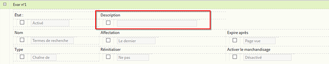

# Descriptions des rapports personnalisés

Vous pouvez fournir des descriptions de rapport personnalisées pour les eVars, les props, les classifications et les  de. Les descriptions sont visibles par tous vos utilisateurs finaux.

**[!UICONTROL Analytics]** > **[!UICONTROL Admin]** > **[!UICONTROL Report Suites]** > **[!UICONTROL Edit Settings]** > **[!UICONTROL *variable *]**

>[!NOTE] L’ajout de descriptions est disponible pour la plupart des classifications traditionnelles, mais pas actuellement pour les classifications mobiles.

1. Fournissez une description du rapport. Le nombre maximal de caractères est 255.
1. Cliquez sur **[!UICONTROL Save]**.

La description est visible à deux endroits :

* Dans la barre de titre de ce rapport :

   

* En tant qu’info-bulle lorsque vous passez la souris sur le rapport dans le volet de navigation de gauche :

   

