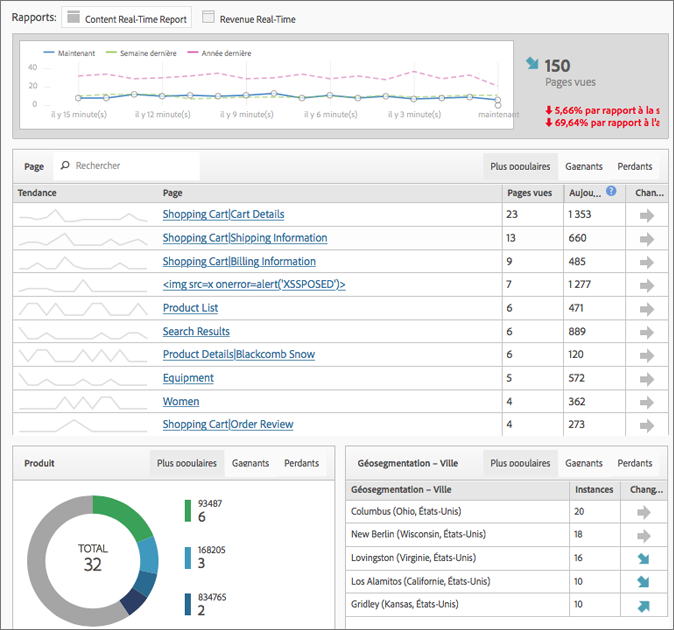

# Rapports en temps réel

Affiche le trafic des pages Web et classe les  de pages en temps réel. Fournit des données pratiques pour vos prises de décision professionnelles.

>[!NOTE] Les rapports en temps réel ne nécessitent aucune mise en œuvre ni aucun balisage supplémentaire. Elle repose sur le déploiement existant d’Adobe Analytics. Pour configurer les rapports en temps réel, voir  [Configuration des rapports en temps réel](/help/admin/admin/realtime/t-realtime-admin.md).

**[!UICONTROL Site Metrics]** > **[!UICONTROL Real-Time]**

Real-Time répond aux questions suivantes : Qu&#39;est-ce qui est tendance sur mon site, et pourquoi ? Il vous permet, en tant que spécialiste du marketing, de réagir rapidement et de gérer activement les performances de votre contenu et de vos campagnes marketing. Les données en temps réel rapportées sont en retard de moins de deux minutes et sont mises à jour automatiquement minute par minute.

Le comprend des mesures haute fréquence d’Adobe Analytics et des analyses de site pour rapporter visuellement les tendances du trafic et des de page  des sites Web d’actualités et de vente au détail dynamiques. Le rapport Temps réel identifie les tendances de vos données minute par minute, dans les secondes qui suivent la collecte. Il collecte et diffuse des données dans une interface utilisateur à mise à jour automatique, en utilisant la corrélation en temps réel et le suivi du contenu et de certaines conversions.

Parmi les scénarios d’utilisation les plus courants, citons les éditeurs qui souhaitent promouvoir/rétrograder des articles au fur et à mesure que les utilisateurs  les changements  et les marketeurs qui souhaitent suivre le lancement d’une nouvelle gamme de produits.

En tant qu’administrateur, vous pouvez

* Créez jusqu’à 3 rapports en temps réel par suite de rapports, à l’aide de dimensions ou de classifications et de mesures existantes. Utilisez les dimensions secondaires pour établir une corrélation avec (ou ventiler) la dimension principale.
* Ajouter 3 dimensions (ou classifications) par rapport (une principale et deux secondaires), en plus d’une mesure à l’échelle du site.
* Utilisez n’importe quel personnalisé, de panier d’achat ou instance.
* jusqu’à 2 heures de données historiques en temps réel et modifiez ce paramètre :

   * 15 dernières minutes : Granularité de 1 minute
   * 30 dernières minutes : Granularité de 1 minute
   * Dernière heure : Granularité de 2 minutes
   * 2 dernières heures : Granularité de 4 minutes

* Comparez, par exemple, les valeurs de la semaine dernière aux valeurs de l’année dernière (ainsi qu’au total d’aujourd’hui).

N’oubliez pas que les eVars (mesures de conversion) ne sont pas prises en charge, car il n’existe aucun concept de persistance. Bien que vous puissiez sélectionner des mesures de conversion, elles ne fonctionnent que si elles sont définies sur la même page que la ou les dimensions. Pour en savoir plus, voir le message d’avertissement capturé dans la  [Configuration de rapports en temps réel](/help/admin/admin/realtime/t-realtime-admin.md).

La configuration et l’affichage des rapports en temps réel sont limités aux administrateurs ou à tout utilisateur des groupes d’autorisations &quot;Accès à tous les rapports&quot; et &quot; avancés&quot;. Cependant, le temps réel respecte les autorisations. Si, par exemple, vous n’avez pas les droits d’afficher les recettes, vous ne pourrez pas  un rapport en temps réel qui inclut des données sur les recettes.

## Latence des données suite à la configuration d’A4T  {#section_806CE36354FC4C539A0DED9266A5C704}

Une fois l’intégration A4T activée dans le  Adobe, vous constaterez une latence supplémentaire de 5 à 10 minutes dans Adobe Analytics. Cette augmentation de latence permet de stocker les données d’Analytics et de  sur le même accès, ce qui vous permet de ventiler les tests par page et section du site.

Cette augmentation se reflète dans tous les services et outils d’Adobe Analytics, y compris le flux en direct et les  en temps réel, et s’applique dans les cas suivants :

* Pour le flux en direct, les rapports en temps réel et les demandes d’API, ainsi que les données actives des variables de trafic, seuls les accès avec un ID de données supplémentaire sont retardés.
* Pour les données actuelles sur les mesures de conversion, les données finalisées et les flux de données, tous les accès sont retardés de 5 à 7 minutes supplémentaires.

Gardez à l’esprit que l’augmentation de latence débute une fois que vous avez implémenté le service d’identité, même si vous n’avez pas entièrement implémenté cette intégration.
