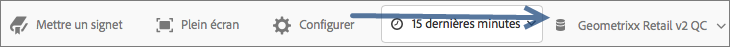
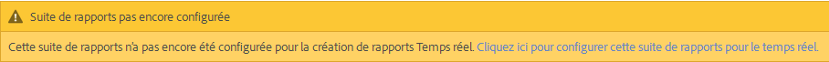
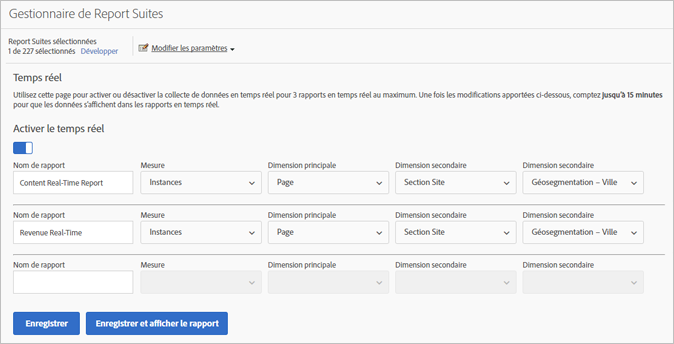
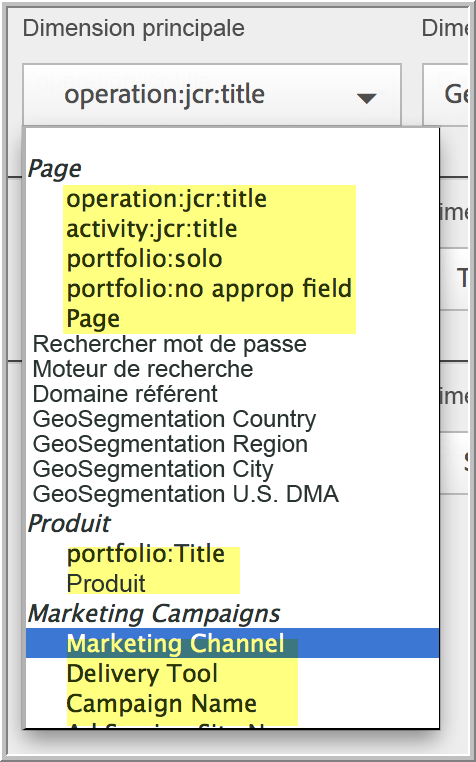
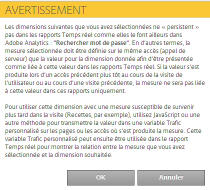

# Configuration des rapports en temps réel

Cette rubrique décrit les étapes d’administration pour configurer les rapports en temps réel.

La configuration des rapports en temps réel dans les Reports &amp; Analytics consiste à sélectionner la suite de rapports et à configurer jusqu’à trois rapports pour cette suite.

1. Sélectionnez la suite de rapports pour laquelle activer les rapports en temps réel.

   Accédez à **[!UICONTROL Analytics]** > **[!UICONTROL Reports]** > **[!UICONTROL View All Reports > Site Metrics]** > **[!UICONTROL Real-Time]** et sélectionnez la suite de rapports dans la liste déroulante située en haut :

   

   Si vous essayez d’afficher des rapports en temps réel pour une suite de rapports qui n’a pas été configurée pour la création de rapports en temps réel, un message s’affiche. Celui-ci vous permet de configurer la suite de rapports.

   

1. Cliquez sur **[!UICONTROL Configure]** (icône d’engrenage) pour exécuter la [!UICONTROL Report Suite Manager].

   (Également disponible sous **[!UICONTROL Analytics]** > **[!UICONTROL Admin > Report Suites]** > **[!UICONTROL Edit Settings]** > **[!UICONTROL Real-Time]**.)

1. Activez le **[!UICONTROL Enable Real-Time]** paramètre.
1. Configurez la collecte de données en temps réel pour trois rapports au maximum, avec une mesure et trois dimensions ou classifications par rapport.

   

   Pour plus d’informations sur les mesures et dimensions en temps réel prises en charge, voir [Mesures et dimensions prises en charge](/help/admin/admin/realtime/realtime-metrics.md).

   Si vous avez créé des classifications, elles apparaissent en retrait sous la dimension pour laquelle elles ont été définies :

   

   >[!NOTE]
   >
   >Pour un rapport Temps réel unique, les dimensions en double ne sont pour l’instant pas prises en charge, même si une autre classification est sélectionnée pour chaque dimension.

   Pour plus d’informations sur les classifications, voir [À propos des classifications](/help/components/c-classifications2/c-classifications.md).

   >[!NOTE]
   >
   >Certaines dimensions (telles que « Mot-clé de recherche » ou « Produit ») ne persistent pas dans le rapport Temps réel comme elles le font ailleurs dans Adobe Analytics. Lorsque vous sélectionnez une mesure non permanente, cet avertissement s’affiche :

   

1. Click **[!UICONTROL Save]** or **[!UICONTROL Save and View Report]**.

   Après cette configuration initiale du rapport, comptez jusqu’à 20 minutes pour que les données commencent à se diffuser. À partir de ce moment, les données sont immédiatement disponibles. Pour en savoir plus sur l’affichage des rapports Temps réel, voir [Exécution d’un rapport Temps réel](https://docs.adobe.com/content/help/en/analytics/analyze/reports-analytics/t-running-report-types.html).

1. Par défaut, tous les utilisateurs ont accès aux rapports Temps réel.
