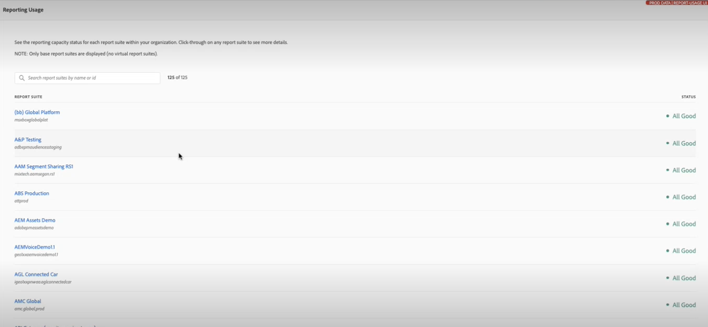

# Responsable des activités de rapport

>[!NOTE]
>
>Cette fonctionnalité est actuellement en test bêta.

Le [!UICONTROL Gestionnaire des activités de création de rapports] vous permet d’afficher la capacité de création de rapports pour chaque suite de rapports de votre entreprise. En tant qu’administrateur, il vous offre une visibilité détaillée sur la création de rapports de la consommation et vous permet de diagnostiquer et de résoudre facilement les problèmes de capacité pendant les heures de pointe de la création de rapports.

Lorsque votre entreprise atteint la capacité de demande de création de rapports et que ses performances en matière de création de rapports se dégradent, vous pouvez désormais diagnostiquer automatiquement les problèmes de création de rapports sans intervention de l’assistance clientèle ou de l’ingénierie d’Adobe. Vous pouvez facilement gérer les files d’attente de rapports dans une seule interface et agir immédiatement &#x200B; &#x200B; pour améliorer l’expérience de vos utilisateurs. Cet outil :

* Vous informe, en temps réel, de votre capacité de création de rapports actuelle dans l’ensemble de vos suites de rapports.
* Fournit des informations détaillées sur les requêtes de rapport en cours, qu’elles soient en file d’attente ou en cours.
* Vous permet d’optimiser la file d’attente des rapports en établissant des priorités pour certaines d’entre elles et en annulant d’autres requêtes de rapport afin de libérer de la capacité. En d’autres termes, vous pouvez demander en temps réel : ce rapport est-il nécessaire à ce moment-là ou puis-je l&#39;annuler au profit de rapports plus urgents ?

## Accès au Gestionnaire des activités de création de rapports

Dans Adobe Analytics, les administrateurs accèdent à **[!UICONTROL Administration]** > **[!UICONTROL Gestionnaire des activités de création de rapports]**.

## Autorisations

Vous avez besoin des autorisations d’administrateur système Analytics pour gérer l’activité de création de rapports. L’accès administrateur de produit n’est pas suffisant.

## Affichage de la file d’attente des rapports

Lors de l’ouverture de la variable [!UICONTROL Activité de création de rapports] La page d’aperçu de Manager répertorie vos suites de rapports de base activées.

| Élément de lʼinterface utilisateur | Description |
| --- | --- |
| **[!UICONTROL Suite de rapports]** | Suite de rapports de base dont vous surveillez l’activité de création de rapports. |
| **[!UICONTROL Suite de rapports virtuelle]** | Affiche toutes les suites de rapports virtuelles qui se trouvent dans cette suite de rapports de base. Les suites de rapports virtuelles rendent les demandes de création de rapports plus complexes en raison de niveaux supplémentaires de filtrage et de segmentation appliqués. Toutes les requêtes provenant des suites de rapports virtuelles sont combinées et descendent dans la suite de rapports de base.
Par exemple, si vous avez 10 requêtes provenant de 5 suites de rapports virtuelles, il s’agit de 50 requêtes au niveau de la suite de rapports de base. De cette façon, vous pouvez atteindre la capacité très rapidement. |
| **[!UICONTROL Capacité d’utilisation]** | En pourcentage, la capacité de création de rapports de la suite de rapports est utilisée, en temps réel. |
| **[!UICONTROL État]** | Quatre indicateurs de statut possibles : <ul><li>**Rouge - [!UICONTROL À la capacité]**: La suite de rapports est limitée en termes de capacité de création de rapports. (100%) </li><li>**Jaune - [!UICONTROL Capacité locale]**: Cette suite de rapports risque d’atteindre sa capacité maximale. (90 à 99 %)</li><li>**Vert - [!UICONTROL Très bien]**: Il existe de nombreuses capacités de reporting. (0 % - 89 %)</li><li>**Gris - [!UICONTROL Statut en attente/Non activé]**: Capacité des rapports non disponible.</li></ul> |

{style=&quot;table-layout:auto&quot;}

### Autres actions relatives aux activités de création de rapports

* Cliquez sur **[!UICONTROL Actualiser]** en haut à droite pour actualiser les résultats.
* Cliquez sur l’étoile à gauche du nom de la suite de rapports pour marquer cette suite de rapports comme favori.
* Vérifier **[!UICONTROL Favoris]** en haut à gauche pour afficher vos favoris.
* Effectuez une recherche sur les suites de rapports par nom ou par identifiant dans la barre de recherche.
* Filtrez les suites de rapports selon leur état.

## Afficher l’activité de création de rapports pour des suites de rapports individuelles

Cliquez sur le lien de titre d’une suite de rapports pour laquelle vous souhaitez afficher les détails.

### Graphique linéaire

Le graphique linéaire montre l’activité de création de rapports pour la suite de rapports sélectionnée au cours des deux dernières heures.

* L’axe X affiche les données de capacité de reporting sur les deux dernières heures.
* L’axe des ordonnées affiche le temps d’attente moyen d’une requête, en secondes.
* Vous pouvez pointer sur le graphique en courbes pour afficher les points dans la durée et le temps d’attente moyen de cet instant.

   

### Filtre

Vous pouvez filtrer le tableau par application (voir la liste dans le tableau ci-dessous), par utilisateur et par projet.

### Numéros de résumé

Les numéros de résumé affichent les informations suivantes :

| Numéro du résumé | Description |
| --- | --- |
| [!UICONTROL Utilisateurs] | Nombre d’utilisateurs qui envoient actuellement des demandes de création de rapports à cette suite de rapports. |
| [!UICONTROL Projets] | Projets Workspace, classeurs de Report Builder, etc. |
| [!UICONTROL Requêtes] | Nombre de requêtes en cours d’exécution. |
| [!UICONTROL Temps d’attente moyen] | Temps d’attente moyen pour toutes les requêtes en cours d’exécution. |
| [!UICONTROL Capacité d’utilisation] | Capacité d’utilisation actuelle de cette suite de rapports. |

{style=&quot;table-layout:auto&quot;}

### Tableau

Le tableau détaillé ci-dessous présente des détails sur la suite de rapports.

| Colonne | Description |
| --- | --- |
| [!UICONTROL ID de requête] | Peut être utilisé à des fins de dépannage. |
| [!UICONTROL Heure d’exécution] | Durée d’exécution de la requête. |
| [!UICONTROL Temps d’attente] | Durée pendant laquelle la requête a été en attente avant d’être traitée. Généralement à &quot;0&quot; lorsque la capacité est suffisante. |
| [!UICONTROL Heure de début] | Lorsque le traitement de la requête a commencé (heure locale de l’administrateur). |
| [!UICONTROL Application] | Les applications prises en charge par la variable [!UICONTROL Gestionnaire des activités de création de rapports] sont : <ul><li>Interface utilisateur d’Analysis Workspace</li><li>Projets planifiés Workspace</li><li>Report Builder</li><li>Interface utilisateur du créateur : Segment, Mesures calculées, Annotations, Audiences, etc.</li><li>Appels API de la version 1.4 ou 2.0</li><li>Alertes intelligentes</li></ul> |
| [!UICONTROL Utilisateur] | L’utilisateur qui a lancé la requête. |
| [!UICONTROL Projet] | Noms de projet Workspace enregistrés, ID de rapport API, etc. (Les métadonnées peuvent varier d’une application à l’autre.) |
| [!UICONTROL Limites mensuelles] | Nombre de limites mensuelles qu’une requête traverse. Cela ajoute à la complexité de la requête. |
| [!UICONTROL Colonnes] | Nombre de mesures et de ventilations dans Workspace pour évaluer la complexité de la requête. |
| [!UICONTROL Segments] | Nombre de segments appliqués à cette requête. Cela ajoute à la complexité de la requête. |
| [!UICONTROL État] | Indicateurs de statut : <ul><li>**En cours**: La demande est en cours de traitement.</li><li>**En attente**: La demande attend d’être traitée.</li></ul> |

{style=&quot;table-layout:auto&quot;}

## Annulation des demandes de création de rapports

Pour annuler une requête

1. Cochez la case à gauche d’une ou de plusieurs **[!UICONTROL ID de requête]** dans le tableau, puis cliquez sur **[!UICONTROL Annulation des requêtes]** en bas.
1. Dans le **[!UICONTROL Annuler la requête x]** qui s’affiche, vous pouvez modifier le message d’annulation, si nécessaire.
1. Cliquez sur **[!UICONTROL Continuer]**.

   

Par exemple, les utilisateurs de l’application dans Workspace verront apparaître l’avis suivant dans leurs projets :

## Questions fréquentes

| Question | Réponse |
| --- | --- |
| Puis-je acheter une capacité de reporting supplémentaire ? | Cette fonctionnalité sera disponible dans un avenir proche. |

{style=&quot;table-layout:auto&quot;}
