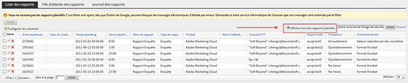
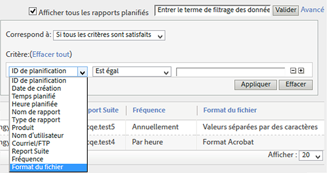
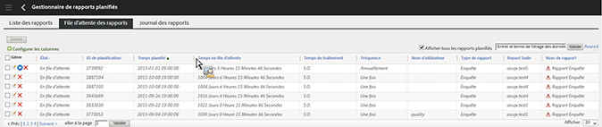
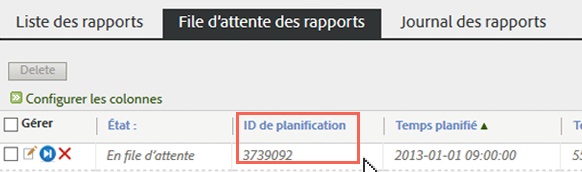

# File d’attente des rapports planifiés

Permet aux utilisateurs de niveau administrateur d’afficher et de gérer des rapports planifiés à l’échelle de l’organisation.

**[!UICONTROL Analytics]** &gt; **[!UICONTROL Composants]** &gt; **[!UICONTROL Rapports programmés]**

Les fonctionnalités de niveau administrateur dans le gestionnaire de rapports programmés incluent :

* L’option [Afficher tous les rapports planifiés](/help/admin/admin/scheduled-reports-admin.md#section_3F167CAAEEC24140B476CF95B7402690) de votre organisation.
* Des [fonctionnalités de filtrage avancées](/help/admin/admin/scheduled-reports-admin.md#section_206A52A85DE84947AAB3AD082FBF6275) à l’échelle de votre organisation.
* Le nouvel onglet [File d’attente des rapports](/help/admin/admin/scheduled-reports-admin.md#section_03C866115D354BB182E90BF4D52F1E0B) qui répertorie tous les rapports mis en file d’attente pour exécution sur les serveurs de création de rapports.
* Fourniture de l’[ID de planification](/help/admin/admin/scheduled-reports-admin.md#section_568B70F4228C4229977CB85D2DCD53A1) dans l’interface de file d’attente des rapports.

## Affichage de tous les rapports planifiés {#section_3F167CAAEEC24140B476CF95B7402690}

Dans l’onglet **[!UICONTROL Liste des rapports]**, vous pouvez **[!UICONTROL Afficher tous les rapports planifiés]** de votre organisation en plus de ceux que vous avez personnellement planifiés.

> [!NOTE] La colonne **[!UICONTROL Nom de rapport]** affiche le nom du rapport planifié et la colonne **[!UICONTROL Nom de fichier]** affiche tout nom de fichier personnalisé défini par vous dans les Options de remise avancées. En conséquence, si vous planifiez plusieurs rapports du même type et que vous indiquez des noms personnalisés pour chacun, le gestionnaire de rapports programmés affiche plusieurs entrées avec le même nom de rapport mais avec des noms de fichiers différents. En effet, le rapport de fin en cours de planification étant le même, la colonne Nom de rapport comporte les mêmes noms de rapports pour tous les rapports sauf les noms des fichiers personnalisés (tels que définis).

## Fonctionnalités de filtrage avancées {#section_206A52A85DE84947AAB3AD082FBF6275}

Par exemple, si vous souhaitez filtrer selon tous les rapports planifiés par heure, indiquez **[!UICONTROL Fréquence égale par heure]** dans le filtre **[!UICONTROL Avancé]** et cliquez sur **[!UICONTROL Appliquer]** :

## File d’attente des rapports {#section_03C866115D354BB182E90BF4D52F1E0B}

Cette file d’attente permet de gérer et potentiellement supprimer tous les rapports planifiés qui « bouchent » la file d’attente. (Généralement, le délai d’expiration des rapports est de 4 heures.)

La file d’attente des rapports vous permet également d’« Ignorer le rapport planifié une fois ». Cliquez simplement sur l’icône bleue dans la colonne **[!UICONTROL Gérer]**.

## ID de planification {#section_568B70F4228C4229977CB85D2DCD53A1}

La fourniture de l’**[!UICONTROL ID de planification]** dans l’interface de file d’attente des rapports est utile lorsque vous devez contacter le service à la clientèle Adobe pour la résolution d’un problème de rapports planifiés.

