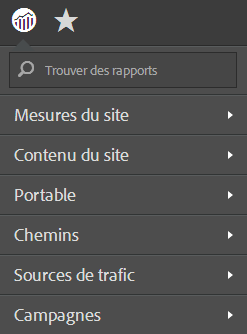
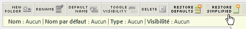

# Menu des rapports simplifié

Procédure d’implémentation du menu des rapports simplifié dans les Reports and Analytics.

Le menu simplifié Reports &amp; Analytics d’Adobe vous permet de choisir d’appliquer un menu alternatif et simplifié contenant des dossiers restructurés. Le menu simplifié contient ces options par défaut :

> [!NOTE] N’oubliez pas que l’application du menu simplifié annule toutes les personnalisations que vous avez apportées à la structure du menu par défaut. En outre, elle met en œuvre la structure du menu simplifié pour tous les Marketing Reports &amp; Analytics dans votre organisation. Réfléchissez bien aux ramifications (par exemple à la formation développée autour de votre structure de menus existante) avant de mettre en œuvre ce nouveau menu. En effet, il n’est pas possible de rétablir une personnalisation dans votre structure de menu existante.

1. Sélectionnez **[!UICONTROL Analytics]** > **[!UICONTROL Admin]** > **[!UICONTROL Suites de rapports]** pour ouvrir le Gestionnaire de suites de rapports.
1. Sélectionnez la suite de rapports pour laquelle mettre en œuvre la structure simplifiée du menu.
1. Sélectionnez **[!UICONTROL Modifier les paramètres]** > **[!UICONTROL Général]** > **[!UICONTROL Personnaliser les menus]**.
1. Cliquez sur **[!UICONTROL Restaurer simplifié]** pour mettre en œuvre la structure simplifiée du menu.

   

1. Pour revenir au menu par défaut (non personnalisé), cliquez sur **[!UICONTROL Restaurer les valeurs par défaut]**.
