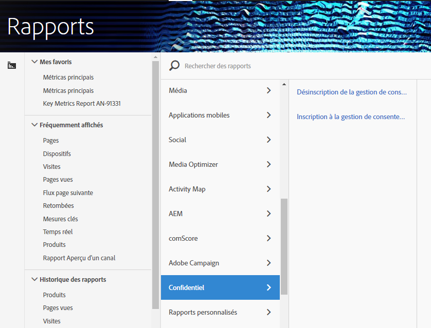

# Variables de création de rapports de confidentialité

Pour faciliter la gestion des données de confidentialité, un ensemble de variables réservées peut être utilisé conjointement avec des variables de données contextuelles spécifiques.
Ces variables de rapports de confidentialité fournissent un cadre convivial pour la capture de l’état de confidentialité sur chaque accès Analytics.

## Variables

* Droit d’opposition de gestion du consentement
   * Variable réservée : Prop de liste
   * Type : Chaîne délimitée par des virgules
   * Contient:
      * `contextData.['cm.ssf']=1` affiché en tant que SSF
      * `contextData.['opt.dmp']=N` affiché en tant que DMP
      * `contextData.['opt.sell']=N` affiché comme VENTE

* Accord préalable de gestion du consentement
   * Variable réservée : Prop de liste
   * Type : Chaîne délimitée par des virgules
   * Contient:
      * `contextData.['opt.dmp']=Y` affiché en tant que DMP
      * `contextData.['opt.sell']=Y` affiché comme VENTE

## Création de rapports  

Vous pouvez activer les variables de création de rapports de confidentialité à l’aide d’un nouveau paramètre de confidentialité disponible dans la console d’administration Analytics.

Chaque suite de rapports peut être configurée comme suit :
1. In Reports &amp; Analytics click **[!UICONTROL Admin &gt; Report Suites.]**
1. Select the report suite(s) where you are collecting media data and click **[!UICONTROL Edit Settings &gt; Privacy Management.]**

   

1. Cliquez sur le bouton **[!UICONTROL Activer les rapports]** de confidentialité des données. **** Remarque : Une fois activées, ces variables ne peuvent plus être désactivées.

   

1. Une fois activé, un message de confirmation s’affiche.

   

1. Les variables réservées sont désormais disponibles pour la création de rapports.  Voir Exclusion de la gestion du consentement et Exclusion de la gestion du consentement.

   

## Mise en œuvre

Trois variables de données contextuelles ont été prédéfinies pour fonctionner avec les variables réservées de la gestion des rapports de confidentialité.  Il appartient à chaque ingénieur de l’implémentation de déterminer comment gérer et conserver le paramètre de ces variables.

Voir Variables [de données](https://docs.adobe.com/help/en/analytics/implementation/javascript-implementation/variables-analytics-reporting/context-data-variables.html) contextuelles pour obtenir des instructions générales sur l’implémentation des variables de données contextuelles.

### SSF

* Données contextuelles: `contextData.['cm.ssf']`
* Valeurs acceptées :
   * 1 - Lorsque vous envoyez la valeur "1", cela indique que le transfert côté serveur est dans un état d’exclusion. La valeur "1" associée à cette variable bloquera le partage de cet accès avec Adobe Audience Manager. Voir Conformité [AAM à la confidentialité en ligne.](https://docs.adobe.com/help/en/analytics/integration/audience-analytics/audience-analytics-workflow/ssf-gdpr.html)
   * Aucune autre valeur n’est acceptée pour ce paramètre.

### DMP

* Données contextuelles: `contextData.['opt.dmp']`
* Valeurs acceptées :
   * N - Lorsque vous envoyez la valeur "N", cela indique que le client choisit de ne pas partager sur les plateformes de gestion de données. **** Remarque : La définition de cette variable sur "N" ne bloque pas le partage sur AAM pour l’instant. Toutefois, le blocage des appels à la fonctionnalité AAM sera ajouté début 2020. Pour l’instant, Adobe recommande de définir `c.cm.ssf=1` et `c.opt.dmp=N` de bloquer l’envoi des accès à AAM.
   * Y - Lors de l’envoi de la valeur "Y", cela indique que le consommateur opte pour le partage sur les plateformes de gestion de données.

### VENDRE

* Données contextuelles: `contextData.['opt.sell']`
* Valeurs acceptées :
   * N - Lorsque la valeur "N" est envoyée, cela indique que le consommateur choisit de ne pas partager ou vendre les données à des tiers.
   * Y - Lorsque vous envoyez la valeur "Y", cela indique que le consommateur opte pour le partage ou la vente des données à des tiers.
