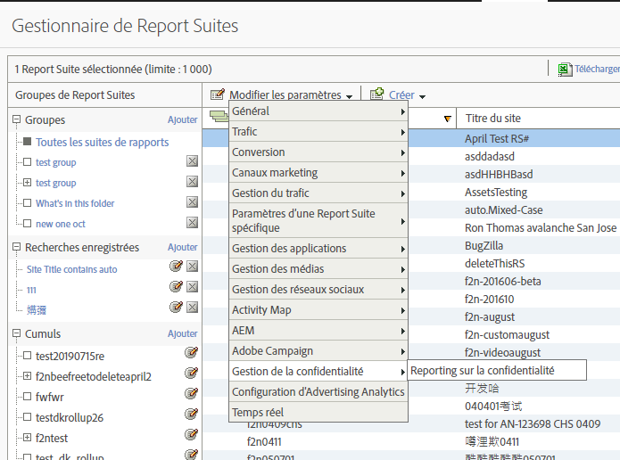
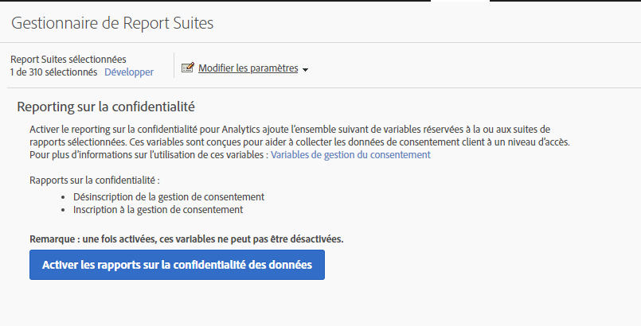
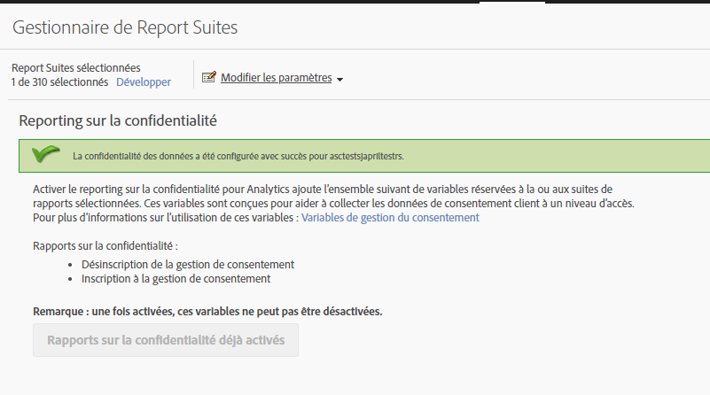
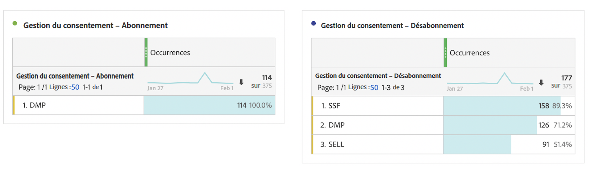

# Variables de création de rapports de confidentialité

Pour faciliter la gestion des données confidentielles, un ensemble de variables réservées peut être utilisé conjointement avec des variables de données contextuelles spécifiques.
Ces variables de création de rapports de confidentialité fournissent un cadre convivial pour capturer l’état de confidentialité de chaque accès Analytics.

## Variables

* Droit d’opposition de gestion du consentement
   * Variable réservée : Prop de liste
   * Type : Chaîne délimitée par des virgules
   * Contient :
      * `contextData.['cm.ssf']=1` affiché en tant que SSF
      * `contextData.['opt.dmp']=N` affiché en tant que DMP
      * `contextData.['opt.sell']=N` affiché en tant que SELL

* Accord préalable de gestion du consentement
   * Variable réservée : Prop de liste
   * Type : Chaîne délimitée par des virgules
   * Contient :
      * `contextData.['opt.dmp']=Y` affiché en tant que DMP
      * `contextData.['opt.sell']=Y` affiché en tant que SELL

## Création de rapports

Vous pouvez activer les variables de création de rapports de confidentialité à l’aide d’un nouveau paramètre de confidentialité disponible dans Analytics Admin Console.

Chaque suite de rapports peut être configurée comme suit :
1. Dans Rapports et analyses, cliquez sur **[!UICONTROL Admin > Report Suites]**.
1. Select the report suite(s) where you are collecting media data and click **[!UICONTROL Edit Settings > Privacy Management]**.

   

1. Click the **[!UICONTROL Enable Data Privacy Reports]** button.

   > [!NOTE] Une fois activées, ces variables ne peuvent pas être désactivées.

   

1. Une fois l’activation effectuée, un message de confirmation s’affiche.

   

1. Les variables réservées sont désormais disponibles pour l’analyse dans les rapports et analyses et Workspace. Voir Gestion du consentement – Opt-out et Gestion du consentement – Opt-in.

   

## Mise en œuvre

Trois variables de données contextuelles ont été prédéfinies pour fonctionner avec les variables réservées à la gestion des rapports de confidentialité.  Il appartient à chaque ingénieur d’implémentation de déterminer comment gérer et conserver le paramétrage de ces variables.

Voir [Variables de données contextuelles](https://docs.adobe.com/help/en/analytics/implementation/javascript-implementation/variables-analytics-reporting/context-data-variables.html) pour obtenir des instructions générales sur l’implémentation des variables de données contextuelles.

### SSF (transfert côté serveur)

* Données contextuelles : `contextData.['cm.ssf']`
* Valeurs acceptées :
   * 1 - Lorsque vous envoyez la valeur « 1 », cela indique que le transfert côté serveur est dans un état d’opt-out. La valeur « 1 » associée à cette variable bloquera le partage de cet accès avec Adobe Audience Manager. Voir [Conformité AAM à la directive ePrivacy](https://docs.adobe.com/help/en/analytics/integration/audience-analytics/audience-analytics-workflow/ssf-gdpr.html).
   * 0 - Facultatif. Utilisez la valeur « 0 » pour les clients qui ont consenti au marketing ciblé. Si la variable n’est pas définie, les résultats seront les mêmes.

### DMP (plate-forme de gestion des données)

* Données contextuelles : `contextData.['opt.dmp']`
* Valeurs acceptées :
   * N - Lorsque vous envoyez la valeur « N », cela indique que le client refuse le partage sur les plateformes de gestion de données.  **Remarque**: Depuis le 15 janvier 2020, la définition de cette variable sur &quot;N&quot; bloque le partage côté serveur de cet accès à AAM.
   * Y - Lorsque vous envoyez la valeur « Y », cela indique que le client autorise le partage sur les plateformes de gestion de données.

### SELL (vente)

* Données contextuelles : `contextData.['opt.sell']`
* Valeurs acceptées :
   * N - Lorsque la valeur « N » est envoyée, cela indique que le consommateur choisit de ne pas partager ou vendre les données à des tiers.
   * Y - Lorsque la valeur « Y » est envoyée, cela indique que le consommateur opte pour le partage ou la vente des données à des tiers.
