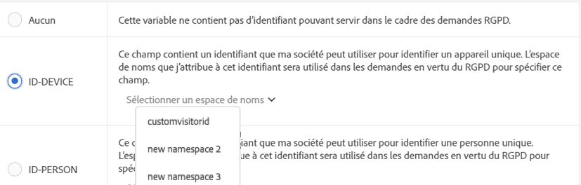

# Étiquettes relatives à la confidentialité des données pour les variables Analytics

## Pourquoi étiqueter vos données ? {#section_A075CDF3AD0744BD8CEB41CE3FB7BFB3}

De nombreux clients Adobe ont fait examiner les lois sur la confidentialité des données (RGPD, CCPA, etc.) par des équipes juridiques et ont tiré leurs propres conclusions sur la façon dont les données doivent être traitées afin de se conformer aux lois sur la confidentialité des données. Les interprétations juridiques peuvent différer d’une entreprise à l’autre et les paramètres de traitement des données souhaités peuvent également varier selon les clients. Les clients ayant des préférences pour le traitement des données en vertu de la Confidentialité des données et des ensembles de données différents, Adobe permet à ses clients, en tant que contrôleur des données, de personnaliser les paramètres pour le traitement des données en vertu de la Confidentialité des données de leurs données uniques. Cela permet à chaque client unique de traiter les demandes relatives à la Confidentialité des données de la façon qui convient le mieux à sa marque et à son ensemble de données unique.

Adobe Analytics fournit des outils permettant d’étiqueter les données en fonction de leur sensibilité et des restrictions contractuelles. Les étiquettes sont importantes et utiles pour aider : (1) identifier les personnes concernées, (2) déterminer les données à renvoyer dans le cadre d&#39;une demande d&#39;accès et (3) identifier les champs de données à supprimer dans le cadre d&#39;une demande de suppression.

Avant de pouvoir déterminer quelles étiquettes doivent être appliquées à tel ou tel champ/variable, vous devez [comprendre les ID](/help/admin/c-data-governance/gdpr-analytics-ids.md) que vous capturez dans vos données Analytics et définir ceux qui seront utilisés pour les demandes relatives à la Confidentialité des données.

La mise en œuvre de la Confidentialité des données pour Adobe Analytics prend en charge les étiquettes suivantes pour les données d’identification, les données sensibles et la gouvernance des données.

## Étiquettes DULE  {#section_B2E78130957647338495EF37DE21D6BC}

>[!NOTE] Le cadre DULE (Data Usage Labeling &amp; Enforcement) est conçu pour fournir un moyen uniforme au sein de l’ensemble des Solutions/Services/Plateformes Adobe pour capturer, communiquer et utiliser les métadonnées relatives aux données dans Adobe Experience Cloud. Les métadonnées aident les contrôleurs des données à indiquer quelles données sont des informations personnelles, des données sensibles et à définir les restrictions contractuelles associées aux données. Dans cette version initiale, Analytics révèle uniquement les étiquettes DULE pertinentes pour la Confidentialité des données. Les étiquettes DULE étant prises en charge par d’autres produits Adobe, les versions futures introduiront des étiquettes de données sensibles supplémentaires, ainsi que des étiquettes contractuelles, qui aideront à garantir que les données partagées entre les produits sont exclusivement utilisées de manière légalement admissible.

## Étiquettes de données d’identification (DULE)  {#identity-data-labels}

Les étiquettes « I » pour les données d’identification servent à catégoriser les données qui peuvent identifier ou permettre de contacter une personne spécifique.

<table id="table_6B5368D714424E52835D5DFE189BD080"> 
 <thead> 
  <tr> 
   <th colname="col1" class="entry"> Étiquette </th> 
   <th colname="col2" class="entry"> Définition </th> 
   <th colname="col3" class="entry"> Autres exigences </th> 
  </tr>
 </thead>
 <tbody> 
  <tr> 
   <td colname="col1"> <p>I1 </p> </td> 
   <td colname="col2"> <p><b>Directement identifiable</b>: Données permettant d’identifier ou d’activer le contact direct avec une personne, par exemple un nom ou une adresse électronique. </p> </td> 
   <td colname="col3"> 
    <ul id="ul_4E2AD59D119E40D28B869D0BB63B9FD9"> 
     <li id="li_AC3E99B57E3A4AE2A12BE219680AFC58">Impossible de définir sur  </li> 
     <li id="li_BB66992863C8402F8D58656293F31E71">Ne peut pas être définie sur des eVars de marchandisage </li> 
    </ul> </td> 
  </tr> 
  <tr> 
   <td colname="col1"> <p>I2 </p> </td> 
   <td colname="col2"> <p><b>Indirectement identifiable</b>: Données pouvant être utilisées en combinaison avec d’autres données pour identifier ou activer le contact direct avec un individu ou un appareil. </p> <p>Ne permettent pas l’identification d’un individu en soi, mais peuvent être combinées avec d’autres informations (qui peuvent être ou non en votre possession), pour identifier une personne. Par exemple, un numéro de fidélité du client ou un ID utilisé par un système de gestion de la relation client  unique pour chacun de ses clients. </p> </td> 
   <td colname="col3"> 
    <ul id="ul_A0EF0F3DC5804D4FBE228946D697ABEB"> 
     <li id="li_A592EA6DA82C4D8C80E03F02ADF4E20E">Impossible de définir sur  </li> 
     <li id="li_46CE7B1E84884CDAB356A6DF89397849">Ne peut pas être définie sur des eVars de marchandisage </li> 
    </ul> </td> 
  </tr> 
 </tbody> 
</table>

## Étiquettes de données sensibles (DULE)  {#sensitive-data-labels}

Les étiquettes « S » pour les données sensibles sont utilisées pour catégoriser les données sensibles telles que les données géographiques. D’autres étiquettes de données sensibles seront ajoutées dans le futur afin d’identifier d’autres types d’informations sensibles.

<table id="table_A778A508620545CCB37830E5CF1C75B7"> 
 <thead> 
  <tr> 
   <th colname="col1" class="entry"> Étiquette </th> 
   <th colname="col2" class="entry"> Définition </th> 
  </tr>
 </thead>
 <tbody> 
  <tr> 
   <td colname="col1"> <p>S1 </p> </td> 
   <td colname="col2"> <p> Données géographiques précises relatives à la latitude et à la longitude qui peuvent être utilisées pour déterminer l’emplacement exact d’un dispositif (dans un rayon de 100 mètres ou moins). </p> </td> 
  </tr> 
  <tr> 
   <td colname="col1"> <p>S2 </p> </td> 
   <td colname="col2"> <p> Données de géolocalisation pouvant être utilisées pour déterminer un espace géorepéré largement défini </p> </td> 
  </tr> 
 </tbody> 
</table>

## Étiquettes de gouvernance des données (Confidentialité des données) {#data-governance-labels}

Les étiquettes de gouvernance des données permettent aux utilisateurs de classer les données en fonction des considérations liées à la confidentialité et des conditions contractuelles afin qu’elles soient conformes aux réglementations et aux politiques d’entreprise.

**Étiquettes d’accès relatives à la confidentialité des données**

<table id="table_663EFF43A454498386F7F3E60875E0F8"> 
 <thead> 
  <tr> 
   <th colname="col1" class="entry"> Étiquette </th> 
   <th colname="col2" class="entry"> Définition </th> 
   <th colname="col3" class="entry"> Autres exigences </th> 
  </tr>
 </thead>
 <tbody> 
  <tr> 
   <td colname="col1"> <p>Aucun </p> </td> 
   <td colname="col2"> <p>Sélectionnez cette option si cette variable ne contient aucune donnée qui doit être incluse dans les données renvoyées au sujet de données dans le cadre d’une demande d’accès relative à la Confidentialité des données. </p> </td> 
   <td colname="col3"> </td> 
  </tr> 
  <tr> 
   <td colname="col1"> <p>ACC-ALL </p> </td> 
   <td colname="col2"> <p>Les valeurs dans ce champ doivent être incluses dans <u>toutes</u> les demandes d’accès relatives à la Confidentialité des données. </p> <p>Si cet accès provient d’un appareil partagé par plusieurs individus, en appliquant cette étiquette, vous indiquez, en tant que contrôleur de données, qu’il est acceptable de partager les données dans ce champ avec tout individu ayant accès à l’appareil partagé. </p> </td> 
   <td colname="col3"> <p>Les champs ayant cette étiquette seront renvoyés pour toutes les demandes relatives à la Confidentialité des données. </p> </td> 
  </tr> 
  <tr> 
   <td colname="col1"> <p>ACC-PERSON </p> </td> 
   <td colname="col2"> <p> Les valeurs dans ce champ doivent être incluses uniquement pour les demandes d’accès relatives à la Confidentialité des données lorsque nous sommes pratiquement certains que l’accès provient du sujet des données, tel que déterminé par un ID de demande relative à la Confidentialité des données correspondant à la valeur d’un champ ID-PERSON. </p> </td> 
   <td colname="col3"> <p>Vous devez également définir une étiquette ID-PERSONNE sur une variable de cette suite de rapports et envoyer des requêtes à l’aide de cet ID, sinon cette étiquette ne s’appliquera jamais. </p> </td> 
  </tr> 
 </tbody> 
</table>

Bien que peu de variables reçoivent l’une des autres étiquettes, on s’attend à ce que les étiquettes d’accès soient appliquées à la plupart de vos variables. Cependant, c&#39;est à vous, en consultation avec votre équipe juridique, de décider quelles données vous avez collectées doivent être partagées avec les personnes concernées.

**Étiquettes de suppression de la confidentialité des données**

<table id="table_59DFCE4D90214CB5972BDDE5B7391B4D"> 
 <thead> 
  <tr> 
   <th colname="col1" class="entry"> Étiquette </th> 
   <th colname="col2" class="entry"> Définition </th> 
   <th colname="col3" class="entry"> Autres exigences </th> 
  </tr>
 </thead>
 <tbody> 
  <tr> 
   <td colname="col1"> </td> 
   <td colname="col2"> <p>Contrairement aux autres libellés, ces libellés de suppression ne s’excluent pas mutuellement. Vous pouvez sélectionner l’un ou l’autre, les deux ou aucun. Une étiquette Aucun distincte n’est pas nécessaire, car l’option Aucune est indiquée simplement en ne cochant aucune des options Supprimer. </p> </td> 
   <td colname="col3"> <p>Une étiquette de suppression n’est requise que pour les champs qui contiennent une valeur permettant d’associer un accès à la personne concernée (c.-à-d. qui permettrait d’identifier la personne concernée). </p> <p> Autres informations personnelles (favoris, historique de navigation/achat, conditions de santé, etc.) n'a pas besoin d'être supprimé car l'association avec la personne concernée sera rompue. </p> </td> 
  </tr> 
  <tr> 
   <td colname="col1"> <p>SUPP-APPAREIL </p> </td> 
   <td colname="col2"> <p>Pour les demandes de suppression relatives à la Confidentialité des données, les valeurs de ce champ ne doivent être rendues anonymes que pour les demandes où l’accès présente un ID-DEVICE spécifié. </p> <p>Si la même valeur apparaît dans d’autres accès qui ne sont pas supprimés, alors ces autres instances ne seront pas modifiées. Cela aura pour effet de modifier les chiffres pour les rapports qui calculent des chiffres uniques dans ce champ. Sur les périphériques partagés, cela peut supprimer des identifiants pour d’autres personnes, au-delà de la seule personne concernée. </p> <p>Les chiffres ne changent pas si ce champ détient également une étiquette ID-DEVICE et si la valeur de ce champ a été utilisée comme ID pour la demande relative à la Confidentialité des données. </p> </td> 
   <td colname="col3"> 
    <ul id="ul_45C3A09E1F05492B97C3F3DEA7C78FBC"> 
     <li id="li_BAB277F92F284ADE9D7B6839BDD716E2">Il nécessite également une étiquette I1 ou I2 ou S1 </li> 
     <li id="li_6DDFC0571457489CBA9D76F547247F20">Impossible de définir sur  </li> 
     <li id="li_E79C6DFC6C58478EAA1504E3820D512C">Ne peut pas être définie sur des eVars de marchandisage </li> 
     <li id="li_B78E273212E447D49D0707E174B66DEC">Ne peut pas être défini sur les classifications </li> 
     <li id="li_F0F52D0DE7454557A6A97063C1FBC372">Vous devez envoyer des requêtes à l’aide d’un ID-DEVICE ou définir expandedIDs sur true, sinon cette étiquette ne s’appliquera jamais. </li> 
    </ul> </td> 
  </tr> 
  <tr> 
   <td colname="col1"> <p>DEL-PERSON </p> </td> 
   <td colname="col2"> <p>Pour les demandes de suppression relatives à la Confidentialité des données, les valeurs de ce champ ne doivent être rendues anonymes que pour les demandes où l’accès présente un ID-PERSON spécifié. </p> <p>Si la même valeur apparaît dans d’autres accès qui ne sont pas supprimés, alors ces autres valeurs ne seront pas modifiées. Cela aura pour effet de modifier les chiffres pour les rapports qui calculent des chiffres uniques dans ce champ. Les chiffres ne changeront pas si ce champ détient également une étiquette ID-PERSON et si la valeur de ce champ a été utilisée comme ID pour la demande relative à la Confidentialité des données. </p> </td> 
   <td colname="col3"> 
    <ul id="ul_6722E42E036E47B4B5E17DC213636D51"> 
     <li id="li_6C1A64FF68AF428A827D8C6C33E22970">Il nécessite également une étiquette I1 ou I2 ou S1 </li> 
     <li id="li_8053533FFE874EE795C8B6043A4F73B3">Impossible de définir sur  </li> 
     <li id="li_D6700CF4D03E44DDA83C4DDBB5B70CC3">Ne peut pas être définie sur des eVars de marchandisage </li> 
     <li id="li_B6C2B15484B344889DBF29B62E2EA8FD">Ne peut pas être défini sur les classifications </li> 
     <li id="li_3BBD0C27D9644C2B9618457A0BFC15EF">Vous devez également définir une étiquette ID-PERSONNE sur une variable de cette suite de rapports et envoyer des requêtes à l’aide de cet ID. Sinon, cette étiquette ne s’appliquera jamais. </li> 
    </ul> </td> 
  </tr> 
 </tbody> 
</table>

**Étiquettes d’identité relative à la confidentialité des données**

<table id="table_F6BBC868457443A19A7B693BD6C55B4B"> 
 <thead> 
  <tr> 
   <th colname="col1" class="entry"> Étiquette </th> 
   <th colname="col2" class="entry"> Définition </th> 
   <th colname="col3" class="entry"> Autres exigences </th> 
  </tr>
 </thead>
 <tbody> 
  <tr> 
   <td colname="col1"> <p>Aucun </p> </td> 
   <td colname="col2"> <p>Cette variable ne contient pas d’identifiant pouvant servir dans le cadre des demandes d’accès relatives à la Confidentialité des données. </p> </td> 
   <td colname="col3"> <p>Vous ne devez définir l’une des autres étiquettes que si ce champ contient un ID que vous utiliserez pour soumettre des demandes d’accès ou de suppression via l’API relative à la Confidentialité des données ou l’interface utilisateur. </p> </td> 
  </tr> 
  <tr> 
   <td colname="col1"> <p>ID-DEVICE </p> </td> 
   <td colname="col2"> <p>Ce champ contient un ID qui peut être utilisé afin d’identifier un appareil pour une demande relative à la Confidentialité des données, mais ne peut pas distinguer les différents utilisateurs d’un appareil partagé. </p> <p>Vous ne devez pas spécifier cette étiquette pour toutes les variables contenant des identifiants (les étiquettes I1/I2 servent à cela). Utilisez cette étiquette si vous soumettez des demandes relatives à la Confidentialité des données qui utilisent des identifiants stockés dans cette variable et que vous voulez rechercher cette variable pour l’identifiant spécifié. </p> </td> 
   <td colname="col3"> 
    <ul id="ul_618019CB8FCA4A5C94C47636240197B2"> 
     <li id="li_0E5ADED36FF24A348FDD434E2CC8C8EE">Il nécessite également une étiquette I1 ou I2 </li> 
     <li id="li_20BCFF07B2BF468C8E0D477C10B2EF9F">Impossible de définir sur  </li> 
     <li id="li_0BD73EEF4184475D8E97878CF8DBEB90">Ne peut pas être définie sur des eVars de marchandisage </li> 
     <li id="li_129851035C4A4BF0922296B4C3BEE39B">Ne peut pas être défini sur les classifications </li> 
    </ul> </td> 
  </tr> 
  <tr> 
   <td colname="col1"> <p>ID-PERSONNE </p> </td> 
   <td colname="col2"> <p>Ce champ contient un ID qui peut être utilisé pour identifier un utilisateur authentifié (une personne spécifique) pour une demande relative à la Confidentialité des données. </p> <p>Vous ne devez pas spécifier cette étiquette pour toutes les variables contenant des identifiants (les étiquettes I1/I2 servent à cela). Utilisez cette étiquette si vous soumettez des demandes relatives à la Confidentialité des données qui utilisent des identifiants stockés dans cette variable et que vous voulez rechercher cette variable pour l’identifiant spécifié. </p> </td> 
   <td colname="col3"> 
    <ul id="ul_0C7EEC8FCB5C4BCDA5D48F3C98770A67"> 
     <li id="li_2E781AE8D7A046A7996C7300CA854B86">Il nécessite également une étiquette I1 ou I2 </li> 
     <li id="li_EB4C6430C218405DAAE81DEE010DCAA2">Impossible de définir sur  </li> 
     <li id="li_05AA67B45974474F9DA520E8B877BA11">Ne peut pas être définie sur des eVars de marchandisage </li> 
     <li id="li_8A6BF4B40ED249289EAD46FE1C755FB0">Ne peut pas être défini sur les classifications </li> 
    </ul> </td> 
  </tr> 
 </tbody> 
</table>

## Fournir un espace de noms lors de l’étiquetage d’une variable comme ID-DEVICE ou ID-PERSON  {#section_F0A47AF8DA384A26BD56032D0ABFD2D7}

Lorsque vous étiquetez une variable comme ID-DEVICE ou ID-PERSON, vous êtes invité à fournir un  . Vous pouvez soit utiliser un  précédemment défini, soit en définir un nouveau.

**Utilisation d’un  précédemment défini**

Si vous avez précédemment affecté un libellé d’ID à d’autres variables dans l’une des suites de rapports de votre  de connexion, vous pouvez sélectionner l’un de ces  de existants. Vous devez réutiliser le  si cette variable contient le même type d’ID que les autres variables déjà étiquetées avec ce  et que vous souhaitez les rechercher toutes lors de l’envoi d’une requête.

1. Click **[!UICONTROL Select Namespace]** and select one of the existing namespaces.
1. Cliquez sur **[!UICONTROL Apply]**.



**Définir un nouveau**

Vous pouvez également définir un nouveau  de . Nous vous recommandons de  limiter chaînes  aux caractères alphanumériques, ainsi qu’aux caractères de soulignement, au tiret et à l’espace. Ils seront convertis en minuscules.

1. Click **[!UICONTROL Select Namespace]** and type in the namespace title.

   

1. Press **[!UICONTROL Enter]** to add this namespace. Le bouton Appliquer devient alors actif.
1. Cliquez sur **[!UICONTROL Apply]**.

La chaîne que vous spécifiez comme espace de noms est la même que celle que vous devez utiliser pour soumettre des demandes via l’API relative à la Confidentialité des données comme valeur du paramètre « espace de noms ». La requête entraînera alors une recherche par Adobe Analytics de toutes les variables de toutes vos suites de rapports qui partagent ce   pour l’ID que vous avez spécifié avec la requête.

Vous ne devez pas spécifier l’étiquette ID-DEVICE ou ID-PERSON sur toutes les variables contenant des ID (les étiquettes I1/I2 servent à cela). Utilisez cette étiquette si vous allez soumettre des demandes relatives à la Confidentialité des données qui utilisent des identifiants stockés dans cette variable et que vous voulez rechercher cette variable pour l’identifiant spécifié. Par exemple, si eVar1 peut contenir une adresse électronique, et eVar2 un nom d’utilisateur de connexion, mais que vous soumettrez uniquement des demandes avec le nom d’utilisateur, vous pouvez alors étiqueter eVar1 comme I1, ACC-PERSON, DEL-PERSON, et eVar2 comme I2, ACC-PERSON, DEL-PERSON, ID-PERSON avec l’espace de noms « nom d’utilisateur ». Vous pouvez ensuite envoyer une requête avec un bloc JSON de section utilisateur, tel que :

```
{
     "namespace": "user name",
     "type": "analytics",
     "value": "rocketman123"
}
```

Il est acceptable d’utiliser le même  pour différentes variables au sein d’une même suite de rapports. Par exemple, certaines implémentations personnalisées stockent un CRM-ID dans une prop et une eVar. Si l’ID de gestion de la relation client apparaît toujours dans l’un des deux (l’eVar, par exemple) et seulement occasionnellement dans l’autre (la prop), et qu’il n’apparaît jamais dans la prop sans apparaître également dans l’eVar, alors seule l’eVar nécessite une étiquette d’identification et un espace de noms, car Adobe ne peut rechercher l’ID que dans celle-ci. Toutefois, si l’ID de gestion de la relation client apparaît tantôt dans une variable, tantôt dans l’autre, les deux doivent alors avoir le même espace de noms. Adobe recherchera dans les deux variables les occurrences de l’ID spécifié dans une demande relative à la Confidentialité des données avec cet espace de noms. Vous devez toujours avoir des étiquettes DEL sur toutes ces variables, de sorte que la valeur soit anonymisée, où qu’elle se produise.

Autre exemple : vous pouvez avoir un ID CRM qui est parfois envoyé via eVar1 et parfois envoyé via prop7. Vous disposez alors d’une règle de traitement qui copie la valeur d’eVar1, le cas échéant, dans eVar3. Sinon, il copie la valeur de prop7 dans eVar3. Dans ce scénario, l’eVar3 contiendra toujours l’identifiant CRM s’il est connu. Par conséquent, seule l’eVar3 requiert une étiquette ID-PERSON.

>[!CAUTION] Les espaces de noms « visitorId » et « customVisitorId » sont réservés à l’identification du cookie de suivi hérité d’Analytics et de l’identifiant visiteur du client Analytics. N’utilisez pas ces espaces de noms pour les variables de trafic ou de conversion personnalisées.

## Les types de variables et les étiquettes Confidentialité des données/DULE pris en charge {#section_CE7C3EDE1344466A98BC45E394B40762}

L’étiquetage Confidentialité des données/DULE affecte quatre grandes catégories de variables Analytics. Toutes les variables ne prennent pas en charge toutes les étiquettes. Ce tableau indique les variables qui prennent en charge ou non les libellés.

<table id="table_95D4416B3A8A40C28B2610D0003456E6"> 
 <thead> 
  <tr> 
   <th colname="col1" class="entry"> Type de variable </th> 
   <th colname="col2" class="entry"> Étiquettes prises en charge </th> 
   <th colname="col3" class="entry"> Étiquettes non prises en charge </th> 
  </tr>
 </thead>
 <tbody> 
  <tr> 
   <td colname="col1"> 
    <ul id="ul_0615B545A5AD43F2A6F25698A47AAD3E"> 
     <li id="li_A4B3E8E241B149C99F2A71B21227AD72">Evénements de succès personnalisées </li> 
     <li id="li_8AEF688AE9B8426C82D199E4B195330D">eVars de marchandisage </li> 
     <li id="li_DFFCA65DCC6146AEB6D47476B4D4CC3B">Variables à plusieurs valeurs (mvVars) </li> 
     <li id="li_3192D08B12C249D1AAA8AAEEDE2FD7D7">Variables de hiérarchie </li> 
    </ul> </td> 
   <td colname="col2"> <p>S1/S2 </p> <p>ACC-ALL, ACC-PERSON </p> </td> 
   <td colname="col3"> <p>I1/I2 </p> <p>ID-PÉRIPHÉRIQUE, ID-PERSON </p> <p>DEL-DEVICE, DEL-PERSON </p> </td> 
  </tr> 
  <tr> 
   <td colname="col1"> <p>Classifications </p> </td> 
   <td colname="col2"> <p>I1/I2, S1/S2 </p> <p>ACC-ALL, ACC-PERSON </p> </td> 
   <td colname="col3"> <p>ID-PÉRIPHÉRIQUE, ID-PERSON </p> <p>DEL-DEVICE, DEL-PERSON </p> </td> 
  </tr> 
  <tr> 
   <td colname="col1"> 
    <ul id="ul_1C2FD4D606664965A88F10818E1C11A9"> 
     <li id="li_590975F5C7304317B22C80B20718E914">Variables de trafic (props) </li> 
     <li id="li_6E614B7036994434BFDA71A4424529A0">Variables commerciales (eVars non merchandising) </li> 
    </ul> </td> 
   <td colname="col2"> <p>Toutes les étiquettes </p> </td> 
   <td colname="col3"> N/A </td> 
  </tr> 
  <tr> 
   <td colname="col1"> <p>La plupart des autres variables </p> <p><i>(Voir le tableau ci-dessous pour les exceptions)</i> </p> </td> 
   <td colname="col2"> <p>ACC-ALL, ACC-PERSON </p> </td> 
   <td colname="col3"> <p>I1/I2, S1/S2 </p> <p>ID-PÉRIPHÉRIQUE, ID-PERSON </p> <p>DEL-DEVICE, DEL-PERSON </p> </td> 
  </tr> 
 </tbody> 
</table>

## Variables auxquelles des étiquettes autres que ACC-ALL/ACC-PERSON peuvent être attribuées/modifiées {#section_4FA003003D1B4E2EBCFCDB1A7CD4A824}

<table id="table_0972910DB2D7473588F23EA47988381D"> 
 <thead> 
  <tr> 
   <th colname="col1" class="entry"> Groupe </th> 
   <th colname="col2" class="entry"> Variables </th> 
   <th colname="col3" class="entry"> Étiquettes modifiables </th> 
   <th colname="col4" class="entry"> Commentaire </th> 
  </tr>
 </thead>
 <tbody> 
  <tr> 
   <td colname="col1" morerows="1"> 
    <ul id="ul_62FA1BAA3B9245909509566D8C03F900"> 
     <li id="li_38F7C4E18ECB42C292370713F502B8EB">Dimensions de conversion </li> 
     <li id="li_41CB61F927CB4402AAB4A62E219CD153">Dimensions de trafic personnalisées </li> 
    </ul> </td> 
   <td colname="col2"> <p>Tous, à l’exception des classifications </p> </td> 
   <td colname="col3"> <p>Tous </p> </td> 
   <td colname="col4"> </td> 
  </tr> 
  <tr> 
   <td colname="col2"> <p>Classifications </p> </td> 
   <td colname="col3"> <p>Aucun / I1 / I2 </p> <p>Aucun / S1 / S2 </p> </td> 
   <td colname="col4"> </td> 
  </tr> 
  <tr> 
   <td colname="col1"> <p>Evénements de conversion </p> </td> 
   <td colname="col2"> <p>Tous </p> </td> 
   <td colname="col3"> <p>Aucun / S1 / S2 </p> </td> 
   <td colname="col4"> </td> 
  </tr> 
  <tr> 
   <td colname="col1"> <p>Dimensions et événements de solution </p> </td> 
   <td colname="col2"> <p>Lien d’Activity Map, </p> <p>Activity Map  Activity Map </p> </td> 
   <td colname="col3"> <p>Aucun / I1 / I2 </p> <p>Aucun / DEL-APPAREIL / DEL-PERSON </p> </td> 
   <td colname="col4"> <p>Les variables peuvent contenir des paramètres d’URL, qui peuvent inclure des données directement ou indirectement identifiables. Si votre mise en œuvre ne collecte pas de données directement ou indirectement identifiables dans ces variables, alors elles n’ont pas besoin d’étiquettes d’identité ou de suppression. </p> <p>Notez que la suppression efface les paramètres d’URL, mais conserve l’URL de base. </p> </td> 
  </tr> 
  <tr> 
   <td colname="col1"> <p>Dimensions du traitement des données </p> </td> 
   <td colname="col2"> <p>Identifiant visiteur personnalisé </p> </td> 
   <td colname="col3"> <p>ID-PÉRIPHÉRIQUE/ID-PERSON </p> <p>DEL-DEVICE/DEL-PERSON </p> </td> 
   <td colname="col4"> <p>Vous ne pouvez pas supprimer les étiquettes d’ID ou DEL (définies sur Aucune), mais vous pouvez les modifier en variantes DEVICE ou PERSON en fonction de votre implémentation d’identification personnalisée. </p> <p>Si vous n’utilisez pas l’ID visiteur personnalisé, alors le paramètre n’a pas d’importance. </p> </td> 
  </tr> 
  <tr> 
   <td colname="col1" morerows="1"> 
    <ul id="ul_5EB0193732D44A20AEA08CE9DFE01DBD"> 
     <li id="li_F70D969F83314A94BD8567449968EE2F">Dimensions standard </li> 
     <li id="li_6046764B19FF4679B51E55671C2C0ADB">Dimensions du traitement des données </li> 
    </ul> </td> 
   <td colname="col2"> <p>Adresse IP </p> <p>Adresse IP 2 </p> </td> 
   <td colname="col3"> <p>DEL-DEVICE/DEL-PERSON </p> </td> 
   <td colname="col4"> <p>Vous ne pouvez pas supprimer le libellé DEL, mais vous pouvez le modifier pour qu’il soit DEL-DEVICE ou DEL-PERSON, ou les deux. </p> </td> 
  </tr> 
  <tr> 
   <td colname="col2"> <p>Action ClickMap (héritée), </p> <p>Contexte ClickMap (hérité), </p> <p>Activity Map, </p> <p>URL de la page, </p> <p>URL de la page d’accès originale, </p> <p>Référent, </p> <p>URL de la page du début de la visite </p> </td> 
   <td colname="col3"> <p>Aucun / I1 / I2 </p> <p>Aucun / DEL-APPAREIL / DEL-PERSON </p> </td> 
   <td colname="col4"> <p>Les variables peuvent contenir des paramètres d’URL, qui peuvent inclure des données directement ou indirectement identifiables. Si votre mise en œuvre ne collecte pas de données directement ou indirectement identifiables dans ces variables, alors elles n’ont pas besoin d’étiquettes d’identité ou de suppression. </p> <p>Notez que la suppression efface les paramètres d’URL, mais conserve l’URL de base. </p> </td> 
  </tr> 
 </tbody> 
</table>

## Gestion des suppressions  {#section_F3DEE591671A4B16A8E043F91C137ECB}

La prise en charge par Adobe Analytics des demandes de suppression relatives à la Confidentialité des données est conçue pour minimiser l’impact sur la génération de rapports. Dans la plupart des cas, les mesures qui apparaissent dans les rapports ne devraient pas changer. Ainsi, un rapport antérieur exécuté avant la suppression relative à la Confidentialité des données restera le même une fois la suppression effectuée. En effet, les données supprimées sont complètement dissociées du sujet des données et les données non identifiables restent en place pour que les valeurs rapportées soient toujours cohérentes.

Le tableau suivant décrit comment différentes variables sont « supprimées ». Ce n&#39;est pas un  complet.

<table id="table_A329C2E2645F4685BC208826D070A5F6"> 
 <thead> 
  <tr> 
   <th colname="col1" class="entry"> Variables </th> 
   <th colname="col2" class="entry"> Méthode de suppression </th> 
  </tr>
 </thead>
 <tbody> 
  <tr> 
   <td colname="col1"> <p>・ Variables de trafic (props) </p> <p>・ Variables commerciales (eVars) </p> </td> 
   <td colname="col2"> <p>La valeur existante est remplacée par une nouvelle valeur du formulaire « Data Privacy-356396D55C4F9C7AB3FBB2F2FA223482 », dans laquelle la valeur hexadécimale de 32 chiffres suivant le préfixe « Data Privacy » est un nombre pseudo-aléatoire de 128 octets au chiffrement fort. Puisqu’elle est remplacée par une chaîne aléatoire, la valeur d’origine ne peut pas être retrouvée à partir de cette nouvelle valeur, tout comme il n’est pas possible d’obtenir la nouvelle valeur en connaissant la valeur d’origine. </p> <p>Pour une variable donnée, si la valeur identique à la valeur remplacée apparaît dans d’autres accès qui sont également supprimés dans le cadre de la même demande relative à la Confidentialité des données, toutes les instances de cette valeur sont remplacées par la même nouvelle valeur. </p> <p>Si certaines instances d’une valeur sont remplacées par une requête de suppression et qu’une requête ultérieure supprime d’autres (nouvelles) instances de la valeur d’origine, la nouvelle valeur de remplacement sera différente de la valeur de remplacement d’origine. </p> </td> 
  </tr> 
  <tr> 
   <td colname="col1"> <p>Identifiant d’achat </p> </td> 
   <td colname="col2"> <p>La valeur existante est remplacée par une nouvelle valeur du formulaire « G-7588FCD8642718EC50 », dans laquelle les 18 caractères hexadécimaux suivant le préfixe « G- » sont les 18 caractères qui composent un nombre pseudo-aléatoire de 128 octets au chiffrement fort. Tous les commentaires qui s’appliquent à la suppression des variables de trafic et de commerce s’appliquent également ici. </p> <p>L’identifiant d’achat est un identifiant de transaction dont le principal objectif est de s’assurer qu’un achat n’est pas crédité deux fois, par exemple quand quelqu’un rafraîchit la page de confirmation d’achat. L’ID lui-même peut lier l’achat à une ligne de votre propre base de données où l’achat est enregistré. Dans la plupart des cas, il n’est pas nécessaire de supprimer cet identifiant, il n’est donc pas supprimé par défaut. Si vous êtes toujours en mesure de lier un achat à un utilisateur après la demande de suppression relative à la Confidentialité des données de vos propres données, vous pourriez avoir à supprimer ce champ pour que les données Analytics concernant ce visiteur ne puissent pas être reliées à l’acheteur. </p> </td> 
  </tr> 
  <tr> 
   <td colname="col1"> <p>Visitor ID </p> </td> 
   <td colname="col2"> <p>La valeur est un entier de 128 bits et est remplacée par une valeur de pseudo-personnage de 128 bits forte sur le plan cryptographique. </p> </td> 
  </tr> 
  <tr> 
   <td colname="col1"> <p>• MCID </p> <p>• Identifiant visiteur personnalisé </p> <p>• Adresse IP </p> <p>• Adresse IP 2 </p> </td> 
   <td colname="col2"> <p>La valeur est effacée (définie sur une chaîne vide ou 0 selon le type de variable). </p> </td> 
  </tr> 
  <tr> 
   <td colname="col1"> <p>・ Action ClickMap (héritée) </p> <p>・ Contexte ClickMap (hérité) </p> <p>• Activity Map </p> <p>• URL de la page </p> <p>• URL de la page d’accès originale </p> <p>• Référent </p> <p>• URL de la page du début de la visite </p> </td> 
   <td colname="col2"> <p>Les paramètres d’URL sont effacés/supprimés. Si la valeur ne ressemble pas à une URL, elle est effacée (définie sur la chaîne vide). </p> </td> 
  </tr> 
  <tr> 
   <td colname="col1"> <p>• Latitude </p> <p>• Longitude </p> </td> 
   <td colname="col2"> <p>La précision n'est pas supérieure à 1 km. </p> </td> 
  </tr> 
 </tbody> 
</table>

## Variables qui ne prennent pas en charge les étiquettes de suppression prévues {#section_956B766EFFEC427E87E6CFF3A4217E86}

Cette section vise à clarifier les informations concernant les variables Analytics ne prenant pas en charge la suppression. Parfois, ces variables sont supprimées par des utilisateurs externes à Analytics (par exemple par l’équipe juridique) qui ne connaissent pas le type de données contenu dans la variable et font des hypothèses incorrectes à partir du nom de la variable. Voici une liste de certaines de ces variables, et des raisons pour lesquelles elles ne demandent pas de suppression ou ne nécessitent pas d’étiquette spécifique de suppression.

<table id="table_6FECF3D654514862912D371E6BE4143B"> 
 <thead> 
  <tr> 
   <th colname="col1" class="entry"> Variable </th> 
   <th colname="col2" class="entry"> Commentaires </th> 
  </tr>
 </thead>
 <tbody> 
  <tr> 
   <td colname="col1"> <p>Nouvel identifiant visiteur </p> </td> 
   <td colname="col2"> <p>Le nouvel identifiant visiteur est un booléen qui est vrai la première fois qu’un identifiant visiteur donné est détecté. Il n’est pas nécessaire de le supprimer une fois que l’identifiant visiteur est rendu anonyme. Après l’anonymisation, il correspondra à la première fois que nous avons vu cette identification anonymisée. </p> </td> 
  </tr> 
  <tr> 
   <td colname="col1"> <p>Code postal </p> <p>Code postal géographique </p> </td> 
   <td colname="col2"> <p>Les codes postaux sont définis uniquement pour les accès provenant des États-Unis. Ils ne sont pas définis pour les accès provenant de l’UE. Même lorsqu'ils sont établis, ils ne fournissent qu'une vaste zone géographique qui rend difficile la re-identification de la personne concernée. </p> </td> 
  </tr> 
  <tr> 
   <td colname="col1"> <p>Latitude géographique </p> <p>Longitude géographique </p> </td> 
   <td colname="col2"> <p>Elles fournissent une localisation approximative dérivée de l’adresse IP. La précision est généralement similaire à celle d’un code postal, à quelques dizaines de kilomètres de l’emplacement réel. </p> </td> 
  </tr> 
  <tr> 
   <td colname="col1"> <p>Agent utilisateur </p> </td> 
   <td colname="col2"> <p>L’agent utilisateur identifie la version du navigateur utilisée. </p> </td> 
  </tr> 
  <tr> 
   <td colname="col1"> <p>Identifiant utilisateur </p> </td> 
   <td colname="col2"> <p> Indique la suite de rapports Analytics (sous forme de nombre) contenant les données. </p> </td> 
  </tr> 
  <tr> 
   <td colname="col1"> <p>Identifiant de suite de rapports </p> </td> 
   <td colname="col2"> <p> Indique le nom de la suite de rapports Analytics contenant les données. </p> </td> 
  </tr> 
  <tr> 
   <td colname="col1"> <p>Visitor ID </p> <p>MCID / ECID </p> </td> 
   <td colname="col2"> <p> Ils ont une étiquette DEL-DEVICE, mais le libellé DEL-PERSON ne peut pas être ajouté. If you specify <a href="/help/admin/c-data-governance/gdpr-id-expansion.md"> ID Expansion</a> with each request, then these IDs will automatically be deleted for all delete requests, even those using an ID-PERSON. </p> <p>Si vous n’utilisez pas l’extension d’ID, mais souhaitez que ces identifiants de cookie soient anonymisés sur les accès qui contiennent un ID correspondant dans une prop ou une eVar, vous pouvez contourner cette limitation d’étiquetage en étiquetant la prop ou l’eVar avec une étiquette ID-PÉRIPHÉRIQUE, même si elle identifie réellement une personne (toutes les étiquettes DEL-PERSON doivent également être modifiées en étiquettes DEL). Dans ce cas, puisque seules certaines instances de l’ID de ou de l’ECID sont anonymisées, le nombre de uniques change dans les  historiques. </p> </td> 
  </tr> 
  <tr> 
   <td colname="col1"> <p>ID AMO </p> </td> 
   <td colname="col2"> <p> L’identifiant Adobe Advertising Cloud est une variable de solution qui possède une étiquette DEL-DEVICE non modifiable. Il est renseigné à partir d’un cookie, comme le sont l’identifiant visiteur et le MCID. Elle doit être supprimée des accès chaque fois que ces autres ID sont supprimés. Pour plus d’informations, voir la description de ces variables. </p> </td> 
  </tr> 
 </tbody> 
</table>

## Champs de date pour les demandes d’accès  {#section_6678FB4FF42B481C9B78E64F61782397}

Il existe cinq variables standard qui contiennent des horodatages :

<table id="table_49A9255366254F799E1682C30CBD98EB"> 
 <thead> 
  <tr> 
   <th colname="col1" class="entry"> Horodatage </th> 
   <th colname="col2" class="entry"> Définition </th> 
  </tr>
 </thead>
 <tbody> 
  <tr> 
   <td colname="col1"> <p>Heure d’accès (GMT) </p> </td> 
   <td colname="col2"> <p>Heure à laquelle Adobe Analytics a reçu l’accès. </p> </td> 
  </tr> 
  <tr> 
   <td colname="col1"> <p>Heure d’accès personnalisée (GMT) </p> </td> 
   <td colname="col2"> <p>Heure à laquelle l’accès s’est produit ; pour certaines applications mobiles et d’autres mises en oeuvre, elle peut être antérieure à la date de réception. Si, par exemple, une connexion réseau n’était pas disponible au moment où elle s’est produite, l’application peut retenir l’accès et l’envoyer lorsqu’une connexion devient disponible. </p> </td> 
  </tr> 
  <tr> 
   <td colname="col1"> <p>Heure de la date </p> </td> 
   <td colname="col2"> <p>Même valeur que l’heure d’accès personnalisée UTC, mais dans le fuseau horaire de la suite de rapports, non GMT.</p> </td> 
  </tr> 
  <tr> 
   <td colname="col1"> <p>Heure du premier accès (GMT) </p> </td> 
   <td colname="col2"> <p>Valeur UTC Heure d’accès personnalisée pour le premier accès reçu pour la valeur d’ID de pour cet accès. </p> </td> 
  </tr> 
  <tr> 
   <td colname="col1"> <p>Heure de début de la visite (UTC) </p> </td> 
   <td colname="col2"> <p>Heure d’accès personnalisée UTC du premier accès reçu pour la visite actuelle de cet identifiant visiteur.</p> </td> 
  </tr> 
 </tbody> 
</table>

Le code permettant de générer les fichiers renvoyés lors des demandes d’accès relatives à la Confidentialité des données nécessite qu’au moins l’une des trois premières variables d’horodatage soit incluse dans la demande d’accès (et dispose d’une étiquette ACC s’appliquant au type de demande). Si aucune d’elles n’est incluse, l’heure d’accès personnalisée UTC sera traitée comme si elle possédait une étiquette ACC-ALL.

Le fichier CSV d’accès renvoyé lors des demandes d’accès relatives à la Confidentialité des données convertira les valeurs de ces champs pour passer d’horodatages uniques en champs date/heure au format AAAA-MM-JJ HH:MM:SS (par exemple, 2018-05-01 13:49:22). Dans le fichier de résumé HTML, ces valeurs d’horodatage seront tronquées pour n’inclure que la date (AAAA-MM-JJ), afin de réduire le nombre de valeurs uniques possibles pour ces champs.
