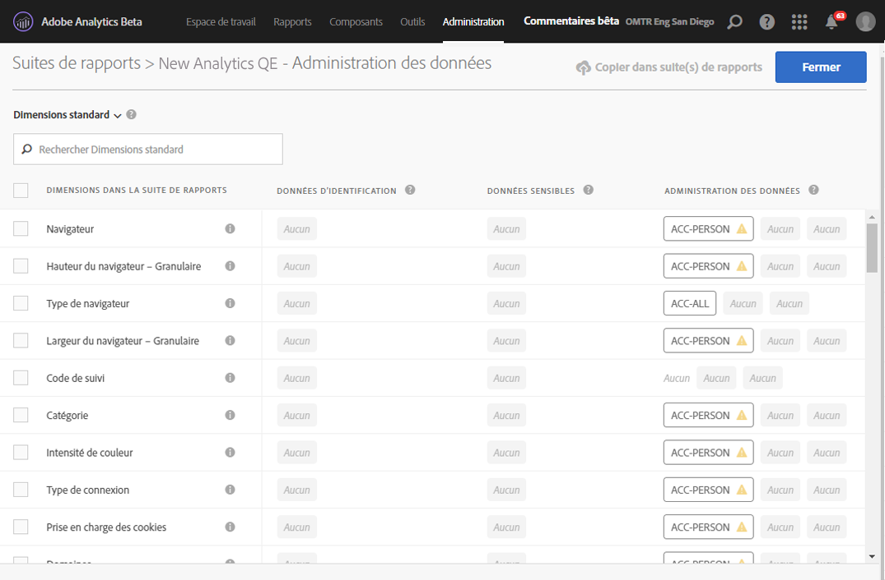
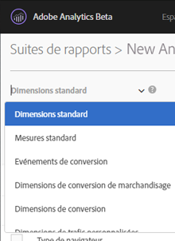
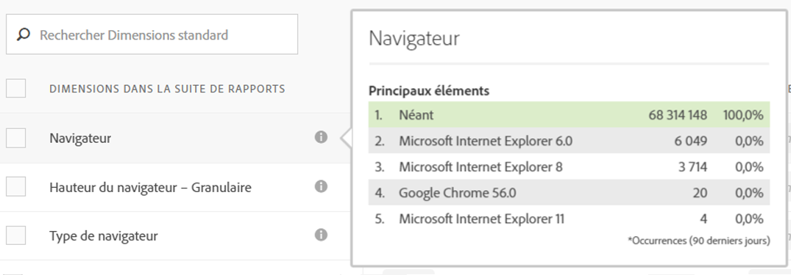
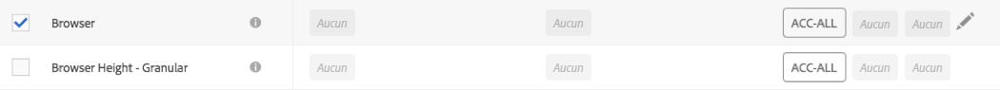
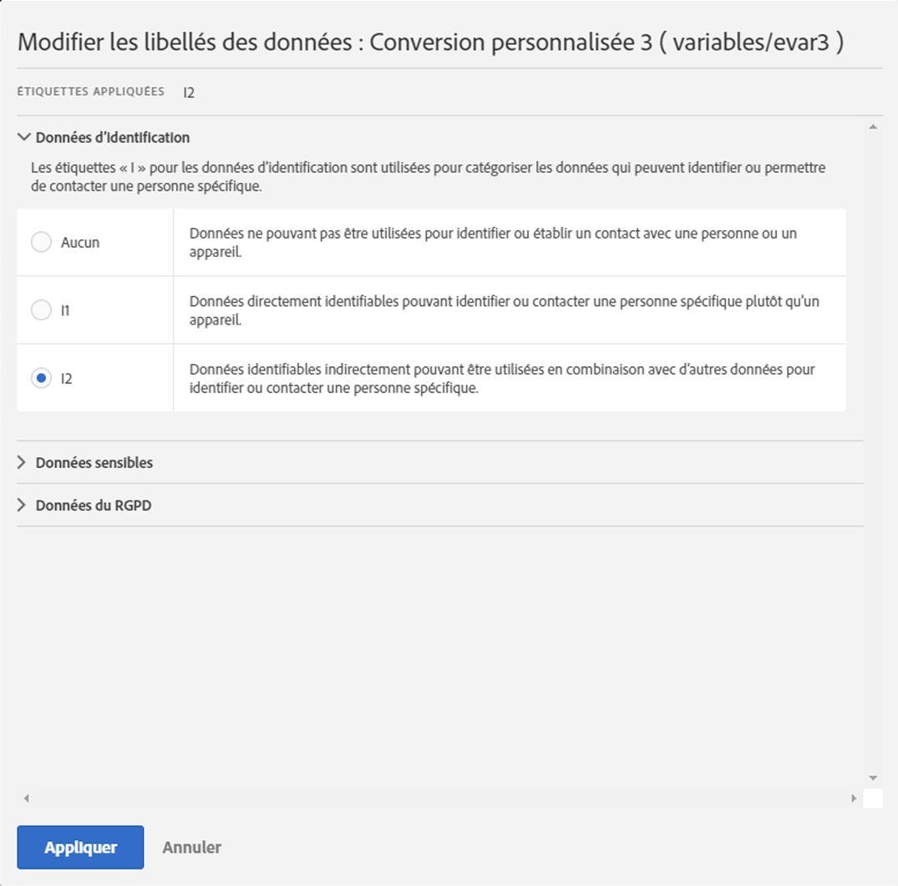
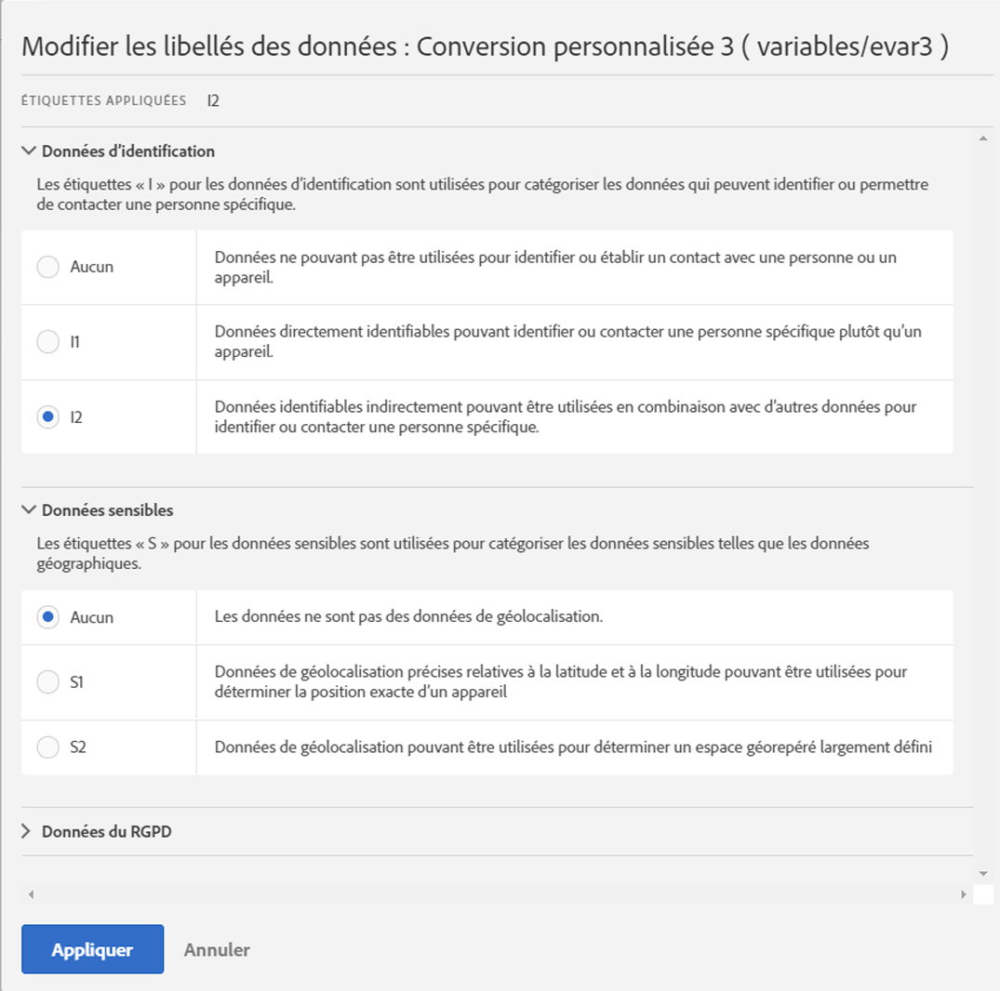
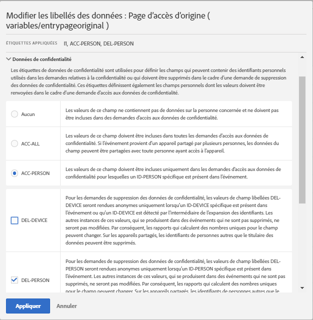
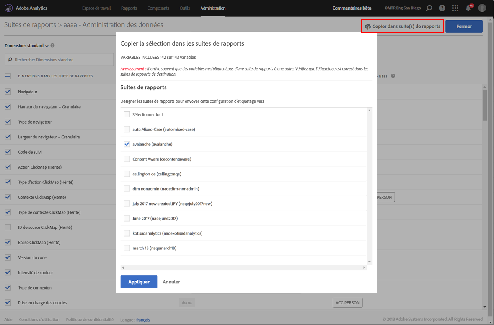

# Étiqueter les données d’une suite de rapports

Étiqueter les données de la suite de rapports signifie que vous attribuez des étiquettes d’identité, de sensibilité et de gouvernance des données à chaque variable dans une suite de rapports donnée. Assurez-vous d’abord de vous familiariser avec les étiquettes et leurs définitions.

> [!NOTE] Souvenez-vous que l’étiquetage doit être vérifié chaque fois qu’une nouvelle suite de rapports est créée ou qu’une nouvelle variable est activée dans une suite de rapports existante. Il peut également être nécessaire de vérifier l’étiquetage lors de l’activation de nouvelles intégrations à des solutions puisque celles-ci peuvent exposer de nouvelles variables nécessitant un étiquetage. Une nouvelle implémentation de vos applications mobiles ou sites web peut modifier la manière dont les variables existantes sont utilisées, rendant nécessaire la mise à jour des étiquettes.

## Attribuer ou modifier des étiquettes de suites de rapports {#section_39F829F35A274EACA532E2F6FF392996}

**Exemple** : en tant que contrôleur des données, vous prévoyez de collecter des adresses électroniques et des ID de cookie auprès des sujets des données pour traiter leurs demandes relatives à la Confidentialité des données. Ces ID de cookie sont stockés dans une suite de rapports dans Adobe Analytics. Pour créer une étiquette pour les adresses électroniques et les ID de cookie, vous devez utiliser le cadre DULE (Data Usage Labeling &amp; Enforcement) d’Adobe Cloud Platform dans Analytics.

1. Dans Analytics, sélectionnez **[!UICONTROL Administration]** &gt; **[!UICONTROL Gouvernance des données]** &gt; **[!UICONTROL (sélectionner la suite de rapports)]** 

1. Sélectionnez le groupe de variables que vous voulez étiqueter.

   

   * **Dimensions standard** (dimensions Adobe Analytics prêtes à l’emploi)
   * **Mesures standard** (mesures Adobe Analytics prêtes à l’emploi)
   * **Événements de conversion** (Succès personnalisés)
   * **Dimensions de conversion de marchandisage** (eVars de marchandisage)
   * **Dimensions de conversion** (eVars de non-marchandisage)
   * **Dimensions de trafic personnalisées** (props)
   * **Dimensions et événements relatifs aux solutions** (Dimensions/événements relatifs à des solutions telles que Mobile, Video, Activity Map, etc., et intégrations à des solutions telles qu’Adobe Campaign, Adobe Experience Manager, Advertising Cloud, etc.)
   * **Dimensions de traitement des données** (variables non directement exposées à la génération de rapports via l’interface utilisateur Adobe Analytics, mais disponibles via les demandes Flux de données et/ou Data Warehouse)

1. (Facultatif) Cliquez sur l’icône d’information (i) en regard de chaque variable pour mieux comprendre ses valeurs les plus courantes au cours des 90 derniers jours. (Cette fonctionnalité n’est pas disponible pour les dimensions de traitement des données, car elles ne sont pas disponibles dans l’interface utilisateur Analytics.)

   

1. Sélectionnez une ou plusieurs variables en cochant leurs cases, puis sélectionnez l’icône **[!UICONTROL Modifier]** (à droite) pour modifier une ou plusieurs variables.

   

1. La boîte de dialogue des étiquettes de **données d’identification** s’ouvre automatiquement. Ces étiquettes classent les données pouvant être utilisées seules ou en combinaison avec d’autres données afin d’identifier ou de permettre un contact direct avec un individu. Pour plus d’informations sur ces options, reportez-vous à [Étiquettes de données d’identification (DULE).](/help/admin/c-data-governance/gdpr-labels.md#identity-data-labels)

   >[!NOTE]
   >
   >Le cadre DULE (Data Usage Labeling &amp; Enforcement) est conçu pour fournir un moyen uniforme au sein des Solutions/Services/Plateformes pour capturer, communiquer et utiliser les métadonnées relatives aux données dans Adobe Experience Cloud. Les métadonnées aident les contrôleurs des données à indiquer quelles données sont des informations personnelles, des données sensibles et à définir les restrictions contractuelles associées aux données.

   

1. Ouvrez la section **Données sensibles** pour définir les étiquettes des données sensibles qui catégorisent les données de géolocalisation. Pour plus d’informations sur ces options, reportez-vous à [Étiquettes de données sensibles (DULE).](/help/admin/c-data-governance/gdpr-labels.md#sensitive-data-labels)

   

1. Ouvrez la section Confidentialité des données pour définir les étiquettes de **gouvernance des données**. Utilisez cette section pour enseigner à Adobe comment traiter chaque variable pour les demandes d’accès et de suppression relatives à la Confidentialité des données, et pour définir les variables à analyser pour trouver les ID des sujets de données pour ces demandes. Pour plus d’informations sur ces options, reportez-vous à [Étiquettes de gouvernance des données (Confidentialité des données).](/help/admin/c-data-governance/gdpr-labels.md#data-governance-labels)

   

1. Cliquez sur **[!UICONTROL Appliquer]** lorsque vous avez entièrement terminé l’étiquetage.

## Copier des étiquettes dans une ou plusieurs suites de rapports {#section_7C6FDAFF049F4126B84F6261F72668EE}

Si vous souhaitez appliquer les mêmes paramètres DULE/Confidentialité des données à plusieurs suites de rapports, vous pouvez procéder comme suit :

1. Sélectionnez le groupe de variables (Dimensions standard, Dimensions de conversion, etc.) contenant la variable que vous souhaitez copier. Notez que vous ne pouvez copier les étiquettes que d’un seul groupe de variables à la fois.
1. Sélectionnez certaines ou toutes les variables de ce groupe.
1. Cliquez sur **[!UICONTROL Copier des étiquettes dans une ou plusieurs suites de rapports]** en haut à droite de la boîte de dialogue Gouvernance des données.

   

1. Cochez **[!UICONTROL Sélectionner tout]** pour copier les étiquettes pour les variables sélectionnées dans toutes les suites de rapports ou sélectionnez les suites de rapports dans lesquelles vous voulez copier les étiquettes.

   >[!IMPORTANT]
   >
   >Gardez à l’esprit que toutes les suites de rapports que vous sélectionnez doivent être mappées à votre organisation Experience Cloud.

   Lorsque vous copiez les étiquettes pour une variable ou un groupe de variables dans une autre suite de rapports, la copie a lieu sur la variable se trouvant à la même position dans la suite de rapports de destination. Pour les Dimensions standard, Mesures standard, Dimensions et événements relatifs aux solutions et Dimensions de Traitement des données, les étiquettes seront copiées dans la variable portant **le même nom** dans la suite de rapports de destination.

   Cependant, pour les variables de conversion (eVars), les dimensions de conversion de marchandisage et les dimensions de trafic personnalisées (props), la copie aura lieu sur la variable portant **le même numéro** dans la suite de rapports de destination. Par exemple, eVar12 sera copiée dans eVar12 dans toutes les suites de rapports de destination. Les noms de ces variables seront ignorés lors de la détermination de la cible de la copie. Si la variable correspondante n’est pas activée dans la suite de rapports de destination, la copie échoue pour cette variable.

   Lors de la copie des étiquettes pour des classifications définies pour une variable, les étiquettes sont copiées dans une classification de la variable correspondante dans la suite de rapports de destination (par exemple, eVar7 dans eVar7) qui porte le même nom que la classification définie pour la copie. Sinon, la copie pour les étiquettes de cette classification échoue.

   Après l’application d’un groupe d’étiquettes, un message d’état s’affiche. Celui-ci indique le nom des variables de destination ou classifications et des suites de rapports pour lesquelles la copie a échoué.

   >[!IMPORTANT]
   >
   >Vous devez toujours vérifier les suites de rapports de destination pour vous assurer que les étiquettes sont copiées correctement. Ceci est particulièrement important pour les variables possédant des étiquettes ID ou DEL.

1. Cliquez sur **[!UICONTROL Appliquer]**.

