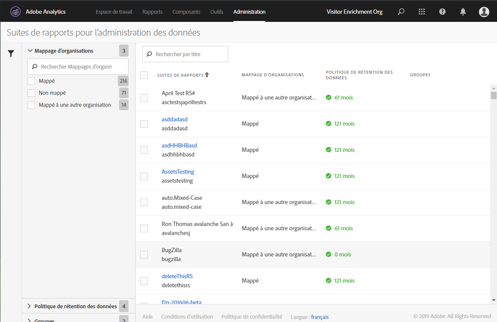
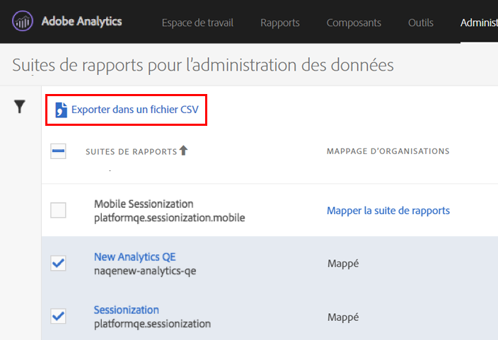

# Afficher/Gérer les paramètres de gouvernance des données de la suite de rapports

La boîte de dialogue Gouvernance des données dans les Outils d’administration offre un aperçu des suites de rapports configurées pour la gouvernance des données, indique si elles ont été mappées à une organisation Experience Cloud et si une politique de conservation des données est mise en place pour cette suite de rapports.

1. Connectez-vous à Adobe Experience Cloud.
1. Sélectionnez **[!UICONTROL Analytics]** > **[!UICONTROL Administration]** > **[!UICONTROL Gouvernance des données]**.

   Vous verrez toutes les suites de rapports faisant partie de votre société de connexion :

   

<table id="table_448292730FF0475E9DCB731882F9A29B"> 
 <thead> 
  <tr> 
   <th colname="col1" class="entry"> Paramètre </th> 
   <th colname="col2" class="entry"> Description </th> 
  </tr> 
 </thead>
 <tbody> 
  <tr> 
   <td colname="col1"> 
Suites de rapports 
 </td> 
   <td colname="col2"> 
La première ligne contient le nom convivial de la suite de rapports. La deuxième ligne contient le nom interne de la suite de rapports. Si vous êtes autorisé à définir des étiquettes pour une suite de rapports, la première ligne est un lien cliquable qui vous dirige vers la page d’étiquetage. 
 </td> 
  </tr> 
  <tr> 
   <td colname="col1"> 
Mappage de l’organisation 
 </td> 
   <td colname="col2"> 
    <ul id="ul_EF8F613B0C5E42D19DB60BD0C89C114B"> 
     <li id="li_B35EE88555F547EFBF55ADE9D0C9EC3B"><b>Mappé</b> : cette suite de rapports a déjà été mappée à la même organisation Experience Cloud que la société de connexion Analytics à laquelle vous êtes connecté. Seules les suites de rapports possédant ce paramètre peuvent être étiquetées. </li> 
     <li id="li_4E800BF80CFF477BAA091EF272D9071C"><b>Mapper la suite de rapports</b> : en cliquant sur ce lien, vous pouvez <a href="https://marketing.adobe.com/resources/help/fr_FR/mcloud/report-suite-mapping.html">mapper une suite de rapports</a> à une organisation Experience Cloud. 
Cela signifie que vous serez redirigé vers la page d’administration du mappage de la suite de rapports pour l’organisation Experience Cloud où vous devez trouver la suite de rapports et lui attribuer sa propre organisation. Une fois cette étape franchie, revenez à cette interface utilisateur de gouvernance des données. 
 </li> 
     <li id="li_FF825A65D089487BBF5FCB0D74D41CD7"><b>Mappé à une autre organisation</b> : une autre organisation Experience Cloud a déjà mappé cette suite de rapports à son organisation. </li> 
    </ul> </td> 
  </tr> 
  <tr> 
   <td colname="col1"> 
Politique de conservation des données 
 </td> 
   <td colname="col2"> 
La mise en œuvre de la Confidentialité des données pour Analytics nécessite la mise en place d’une politique de conservation des données. 
 
Ce paramètre indique si : 
 
    <ul> 
     <li>une politique de conservation des données est en place pour cette suite de rapports ; </li> 
     <li>combien de temps les données sont conservées par Adobe avant d’être supprimées. Par défaut, la période de conservation des données est de 25 mois. </li> 
    </ul> 
Remarque : Adobe Analytics ne peut pas vous aider à traiter les demandes de l’API relative à la Confidentialité des données, c’est-à-dire traiter les demandes d’accès ou de suppression que vous recevez de vos utilisateurs finaux, si la période de conservation des données n’a pas été définie. Veuillez contacter votre gestionnaire du succès client pour définir votre période de conservation des données. 
 </td> 
  </tr> 
  <tr> 
   <td colname="col1"> 
Groupes 
 </td> 
   <td colname="col2"> 
La fonction de regroupement n’est pas prise en charge actuellement. 
 </td> 
  </tr> 
  <tr> 
   <td colname="col1"> 
Barre latérale gauche 
 </td> 
   <td colname="col2"> 
Cliquez sur l’icône de l’entonnoir pour ouvrir ou fermer la barre latérale. 
 
La section Mappage d’organisations indique le nombre de suites de rapports qui entrent dans chacune des catégories décrites. 
 
La section Politique de rétention des données indique chaque politique de conservation des données actuellement en place au sein de votre organisation, ainsi que le nombre de suites de rapports auxquelles cette politique de conservation a été affectée. 
 </td> 
  </tr> 
  <tr> 
   <td colname="col1"> 
Exporter dans un fichier CSV 
 </td> 
   <td colname="col2"> 
Si vous cochez une ou plusieurs suites de rapports, l’option Exporter au format CSV s’affiche. Cette option vous permet de télécharger un fichier CSV contenant toutes les définitions d’étiquettes actuelles pour l’ensemble des variables des suites de rapports sélectionnées. 
 
Nous recommandons à votre équipe juridique de passer en revue vos choix d’étiquetage. Cette option facilite la vérification. En effet, au lieu d’effectuer la vérification lorsque vous êtes connecté à l’interface utilisateur Gouvernance des données, vous pouvez partager le fichier .CSV avec celle-ci. 
 
 
 </td> 
  </tr> 
 </tbody> 
</table>

