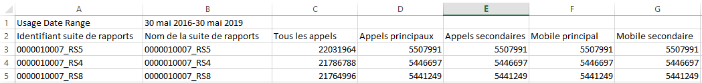

# Affichage de l’utilisation des suites de rapports

L’onglet Suite de rapports d’utilisation fournit des données d’utilisation du serveur pour chaque suite de rapports pour toutes les sociétés de connexion associées à la société de facturation, pour la période d’utilisation actuelle.

**[!UICONTROL Analytics]** > **[!UICONTROL Admin]** > **[!UICONTROL Utilisation de l’appel au serveur]** > **[!UICONTROL Suite de rapports d’utilisation]**

>[!IMPORTANT]
>
>Si une suite de rapports n’est [pas liée à une organisation Experience Cloud](https://marketing.adobe.com/resources/help/fr_FR/mcloud/report-suite-mapping.html), ses données d’utilisation ne seront pas reflétées dans le tableau de bord. De plus, un ID de facturation pourrait être associé à plusieurs organisations Experience Cloud, il ne s’agit pas toujours d’une relation 1:1 entre l’organisation et l’ID de facturation.

Le tableau de bord de la suite de rapports d’utilisation :

* affiche l’utilisation de l’appel au serveur de la période d’utilisation actuelle (tous les appels, principal, secondaire, principal mobile, secondaire mobile) pour chaque suite de rapports de votre organisation Experience Cloud ;
* affiche le pourcentage de l’utilisation générale par catégories d’appels au serveur ;
* est mis à jour quotidiennement ;
* est téléchargeable ;
* vous permet d’accéder à l’interface utilisateur de la **[!UICONTROL Gestion des alertes]**.

| Colonne | Définition |
|--- |--- |
| Nom de la suite de rapports | Le nom convivial de la suite de rapports |
| Tous les appels (% du total) | Tous les appels au serveur effectués durant la période d’utilisation actuelle. |
| Appels principaux (%) | Tous les appels au serveur principal (et leur pourcentage du total) effectués durant la période d’utilisation actuelle. |
| Appels secondaires (%) | Tous les appels au serveur secondaire (et leur pourcentage du total) effectués durant la période d’utilisation actuelle. |
| Principal mobile (%) | Tous les appels au serveur principal mobile (et leur pourcentage du total) effectués durant la période d’utilisation actuelle. |
| Secondaire mobile (%) | Tous les appels au serveur secondaire mobile (et leur pourcentage du total) effectués durant la période d’utilisation actuelle. |

## Télécharger le rapport d’utilisation {#section_D7345660B5E043CD8850954216509A3D}

Cette option vous permet de télécharger les données d’utilisation actuelles, ainsi que les données de périodes antérieures (en remontant jusqu’à janvier 2015). Le rapport est téléchargé au format .cvs.

1. Sélectionnez au moins une suite de rapports.
1. Cliquez sur **[!UICONTROL Télécharger un rapport]**.

   

| Élément du rapport | Description |
|--- |--- |
| Nom de fichier | Nom codé en dur : rapport d’utilisation `day and time of report creation.csv` |
| Suites de rapports incluses | Toutes les suites de rapports que vous avez sélectionnées sur la page du rapport d’utilisation du serveur sont incluses dans cette liste. |
| Types d’appels inclus | Spécifiez n’importe quelle combinaison entre : Tous les appels (par défaut), Principal, Secondaire, Principal mobile, Principal secondaire. |
| Période | Vous pouvez sélectionner la période d’utilisation actuelle ou indiquer une période spécifique.  Pour définir une période personnalisée, indiquez le début de la période et la fin de la période.  **Remarque :**vous ne pouvez pas télécharger des données d’utilisation antérieures à janvier 2015 . |

1. Cliquez sur **[!UICONTROL Télécharger]**.

Voici une capture d’écran de ce à quoi ressemble le fichier .csv téléchargé. Il comprend une colonne pour l’identifiant de la suite de rapports. L’identifiant de la suite de rapports spécifie un identifiant unique pouvant uniquement contenir des caractères alphanumériques. Cet identifiant ne peut pas être modifié après la création d’une suite de rapports.

