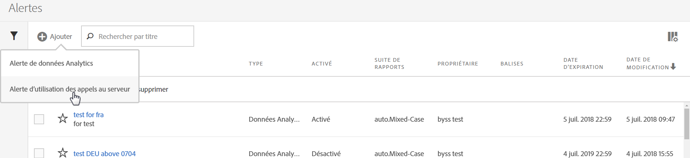
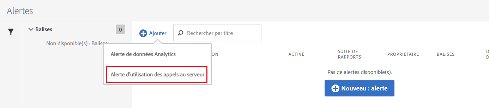
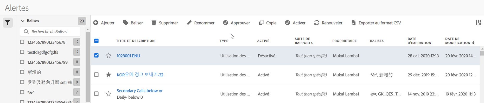

# Alerte d’utilisation des appels au serveur

Lorsque vous configurez une alerte, elle s’applique à toutes les suites de rapports de toutes les sociétés de connexion associées à une société de facturation.

## Aperçu

Une nouvelle catégorie d’alertes appelée **[!UICONTROL Alertes d’utilisation de l’appel au serveur]** fait partie de l’interface utilisateur existante [Gestion des alertes](https://marketing.adobe.com/resources/help/fr_FR/analytics/analysis-workspace/intellligent_alerts.html).

Elle contient déjà **une alerte par défaut** qui apparaît dans toutes les sociétés de connexion qui ont accès à la fonctionnalité d’utilisation de l’appel au serveur. Cette alerte déclenche l’envoi d’une notification à tous les administrateurs de la société de connexion si l’un des critères suivants est rempli :

* &quot;toute&quot; utilisation de l’appel au serveur qui &quot;est supérieure ou égale&quot; à 100 % pour n’importe quel type d’appel au serveur que vous avez sélectionné, OU
* &quot;toute&quot; utilisation de l’appel au serveur qui &quot;est supérieure ou égale&quot; à 90 % pour n’importe quel type d’appel au serveur que vous avez sélectionné, OU
* &quot;toute&quot; utilisation de l’appel au serveur qui &quot;est supérieure ou égale&quot; à 75 % pour n’importe quel type d’appel au serveur que vous avez sélectionné, ET &quot;la période d’utilisation passée&quot; &quot;est inférieure ou égale&quot; à 75 % de la période d’utilisation.

Vous pouvez accéder aux alertes d’utilisation des appels au serveur de deux façons :

* cliquez sur **[!UICONTROL Gérer les alertes]** dans le coin supérieur droit de l’onglet Utilisation actuelle ou Suite de rapports d’utilisation ; ou
* accédez à **[!UICONTROL Composants]** > **[!UICONTROL Alertes]** dans Adobe Analytics.

## Créer des alertes d’utilisation des appels au serveur {#section_2A2882C6D48D47C1944D52FB7C766BEC}

Pour créer des alertes supplémentaires :

1. Cliquez sur **[!UICONTROL + Ajouter]** et sélectionnez **[!UICONTROL Alertes d’utilisation de l’appel au serveur]**.

   

1. Définissez l’alerte.

   

   * **Titre** : spécifiez un nom explicite. Vous ne pouvez pas enregistrer une alerte sans nom.
   * **Granularité du temps** : indique la fréquence de vérification de l’alerte. *Pour l’instant, nous ne prenons en charge que la granularité hebdomadaire.* Cela signifie que l’alerte sera vérifiée de façon hebdomadaire et analysera les données de la période d’utilisation actuelle.
   * **Destinataires** : indique toutes les personnes de l’organisation qui doivent recevoir un courrier électronique lorsqu’une alerte déclenche le seuil spécifié.
   * **Date d’expiration** : par défaut, la date d’expiration est fixée à un an à compter de la date de création de l’alerte.
   * **Envoyer une alerte lorsque** :

      * Pour l’un de ces déclencheurs de mesure
Ajoute le type d’appel au serveur en tant que mesure et spécifie le seuil de l’alerte en sélectionnant le modificateur et le seuil :
         * est supérieur ou égal
         * est inférieur ou égal
      * Avec
Spécifie le seuil et la condition (est supérieur ou égal ou est inférieur ou égal) pour la période d’utilisation passée.

1. Cliquez sur **[!UICONTROL Enregistrer]**.

## Gérer des alertes d’utilisation de l’appel au serveur {#section_8FF98170763C4B5CBEC6DD43F893177A}

Pour gérer des alertes :

1. Cochez la case à côté d’une ou de plusieurs alertes. Les actions pour gérer les alertes apparaissent en haut.
1. Effectuez une ou plusieurs actions :

   | Action | Définition |
   |--- |--- |
   | + Ajouter | Accédez au [Générateur d’alertes](/help/admin/c-server-call-usage/scu-alerts.md) en cliquant sur [!UICONTROL + Ajouter] |
   | Baliser | Ajoutez des balises aux alertes pour les organiser et les utiliser plus facilement. |
   | Supprimer | Vous pouvez supprimer toutes les alertes sauf les alertes par défaut. |
   | Renommer | Vous pouvez renommer toutes les alertes sauf les alertes par défaut. |
   | Approuver | Approuvez les alertes pour les rendre &quot;officielles&quot;. |
   | Activer/Désactiver | Vous pouvez activer ou désactiver toutes les alertes sauf les alertes par défaut. |
   | Renouveler | Lorsqu’une ou plusieurs alertes sont sélectionnées, elles peuvent être renouvelées. Cela prolonge leur date d’expiration d’un an à partir du moment où vous avez cliqué sur l’option [!UICONTROL Renouveler], quelle que soit leur date d’expiration d’origine. |
   | Exporter dans un fichier CSV | Reportez-vous à [Télécharger le rapport d’utilisation](/help/admin/c-server-call-usage/report-suite-usage.md). |

