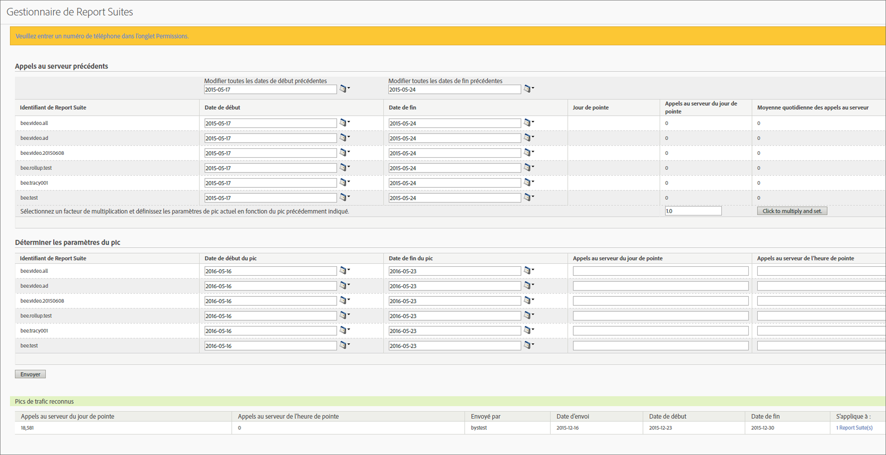

# Estimation des appels au serveur précédents et planification d’un pic de trafic

Vous pouvez obtenir, par exemple, une moyenne des appels quotidiens au serveur de l’année passée durant un intervalle de temps précis, ainsi que l’augmentation prévue du volume d’appels au serveur de cette année. Vous pouvez ainsi prévoir un pic de trafic d’après ce facteur de multiplication.

1. Connectez-vous à Analytics en tant qu’administrateur, puis accédez à **[!UICONTROL Admin]** &gt; **[!UICONTROL Gestion du trafic]**.

1. Cliquez sur **[!UICONTROL Développer]** pour développer la liste des suites de rapports, puis sur **[!UICONTROL Sélectionner des suites de rapports]** pour sélectionner plusieurs suites de rapports.

1. Cliquez sur **[!UICONTROL Pics prévus]**.
1. Sous **[!UICONTROL Appels au serveur précédents]** sélectionnez des dates de début et de fin pour les suites de rapports sélectionnées.

   La valeur de Jour de pointe, Appels au serveur du jour de pointe et Moyenne quotidienne des appels au serveur est générée.

1. Saisissez une valeur pour le facteur de multiplication, puis cliquez sur **[!UICONTROL Cliquer pour multiplier et définir]**.

   La valeur de chaque colonne est multipliée pour chaque suite de rapports.

1. Sous **[!UICONTROL Déterminer les paramètres du pic]** soumettez les paramètres du pic pour les suites de rapports sélectionnées.

   Le pic est maintenant planifié pour chaque suite de rapports sélectionnée.

