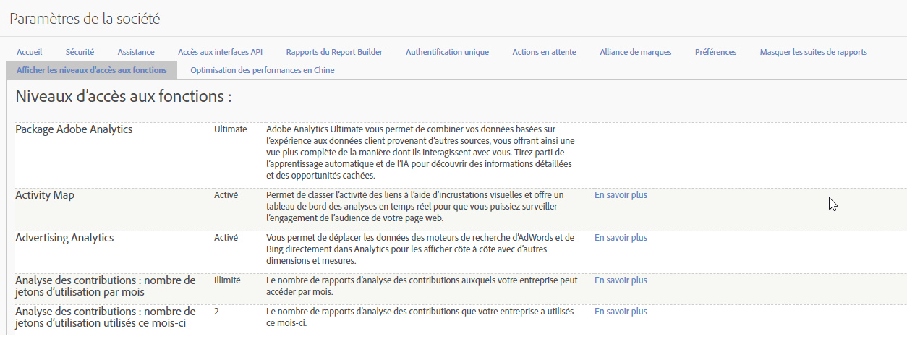

# Niveaux d’accès aux fonctions

**[!UICONTROL Admin]** > **[!UICONTROL Paramètres de la société]** > **[!UICONTROL Afficher les niveaux d’accès aux fonctions]**

Ce groupe de paramètres vous permet de vue le niveau d’accès aux packages et fonctionnalités Adobe Analytics auxquels votre société a droit. Some features are only available with more advanced product packages (SKUs) such as [Adobe Analytics Ultimate](https://www.adobe.com/fr/analytics/compare-adobe-analytics-packages.html).

