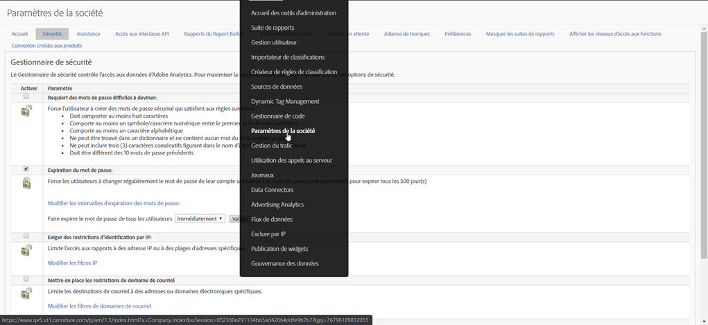

# Fin de vie pour l’ [!UICONTROL application des restrictions d’identification par IP]

La fonction **[Mettre en place les restrictions](/help/admin/company/security-manager.md)** de connexion IP dans Adobe Analytics vous permet d’autoriser la liste blanche des adresses IP spécifiques (considérées comme sécurisées) afin de permettre les connexions réussies et l’accès à votre environnement Adobe Analytics. Dans de nombreux cas, cette fonctionnalité est utilisée pour configurer une adresse IP d’entreprise comme la seule adresse IP sécurisée à partir de laquelle les utilisateurs peuvent se connecter. Par conséquent, pour utiliser Adobe Analytics, les utilisateurs doivent se trouver dans un bureau d’entreprise ou se connecter au réseau via VPN.

Nous prévoyons de mettre fin à cette fonctionnalité en octobre 2020.

## Pourquoi cette fonctionnalité est-elle en fin de vie ?

Cette fonctionnalité est parfois rompue par la migration de connexion à Experience Cloud et/ou la connexion à Experience Cloud. Il est connu pour être coupé pour les clients qui utilisent les attributs **** du client ou la bibliothèque d’ **[!UICONTROL audiences]**.

De plus, si vous possédez plusieurs solutions Experience Cloud, vous pouvez contourner cette exigence en vous connectant à Experience Cloud avec l’une des autres solutions, car cette fonctionnalité n’existe pas ou n’est pas prise en charge en dehors d’Analytics elle-même. Les utilisateurs peuvent également contourner ce problème en usurpant les adresses IP.

Enfin, Adobe propose une solution alternative fonctionnelle et bien plus performante via la connexion unique et les ID fédérés. Cette fonctionnalité vous permet de mieux contrôler et de mieux sécuriser l’expérience de connexion de vos utilisateurs. Voir ci-dessous pour plus d’informations.

## En quoi la suppression de cette fonction vous affecte-t-elle ?

Pour tous les clients qui ont configuré des restrictions **[!UICONTROL de connexion]** d’IP, cette fonctionnalité sera supprimée en octobre 2020. A ce moment-là, les restrictions d’identification par IP toujours en vigueur ne seront plus appliquées. Si vous devez encore limiter la connexion par adresse IP, vous devez examiner et mettre en oeuvre la solution recommandée pour les identifiants de connexion unique et fédérés (plus d’informations et de ressources ci-dessous).

En outre, le paramètre **[!UICONTROL Mettre en place les restrictions]** de connexion IP sera supprimé de **[!UICONTROLAdmin &gt; Paramètres de la société &gt; Gestionnaire]** de sécurité dans l’interface utilisateur d’Analytics (comme illustré ci-dessous).

## Quelles sont tes autres options ?

Comme indiqué ci-dessus, cette fonction Analytics sera en fin de vie. Afin de vous donner le temps de mettre en oeuvre l’authentification unique et les Federated ID, nous avons reporté la date de fin de vie à octobre 2020.

Les SSO et les Federated ID sont des solutions supérieures à la fonctionnalité de restriction d'identification par IP que nous avons en place aujourd'hui et vous apporteront plus de contrôle, de sécurité et de fonctionnalités. Pour plus d’informations sur la configuration des identifiants fédérés/SSO, vous trouverez la documentation d’aide suivante. Nous vous recommandons de les lire attentivement et de collaborer avec votre service informatique pour les mettre en oeuvre :

* [Connexion unique et Experience Cloud](https://spark.adobe.com/page/JeSB8EPEQIvjD/)
* [Console d’administration - Documentation de configuration des identités](https://helpx.adobe.com/enterprise/using/set-up-identity.html)
* [Console d’administration - Didacticiel sur la configuration des identités (vidéo)](https://helpx.adobe.com/enterprise/how-to/identity-directories-domains.html?playlist=/ccx/v1/collection/product/enterprise/topics/enterprise-identity/collection.ccx.js&ref=helpx.adobe.com)
* [Didacticiel de configuration des ID fédérés (vidéo)](https://helpx.adobe.com/enterprise/how-to/identity-configure-ids.html?playlist=/ccx/v1/collection/product/enterprise/topics/enterprise-identity/collection.ccx.js&ref=helpx.adobe.com)
* [Connexion unique - Questions fréquentes](https://helpx.adobe.com/enterprise/using/sso-faq.html)
* [Types d’identité pris en charge par Adobe](https://helpx.adobe.com/enterprise/using/identity.html)

Si vous souhaitez continuer à exprimer votre soutien aux restrictions d’identification par IP et demander qu’elles soient fournies par Experience Cloud, vous pouvez voter pour cette fonctionnalité sur notre page Forum.