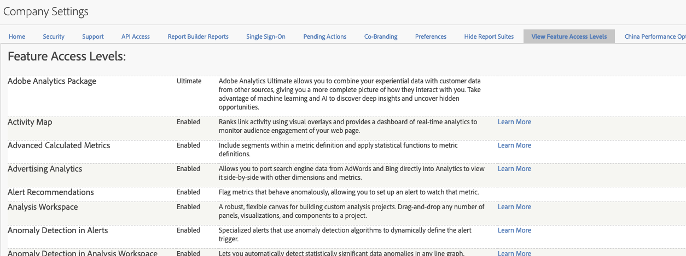

# Niveaux d’accès aux fonctions

**[!UICONTROL Administration]** > **[!UICONTROL Tous les administrateurs]** > **[!UICONTROL Paramètres de l’entreprise]** > **[!UICONTROL Affichage des niveaux d’accès aux fonctionnalités]**

Ce groupe de paramètres vous permet d’afficher le niveau d’accès aux modules et fonctionnalités Adobe Analytics auxquels votre entreprise a droit. Certaines fonctionnalités sont uniquement disponibles avec les packages de produits plus avancés (SKU), tels que [Adobe Analytics Ultimate](https://www.adobe.com/fr/data-analytics-cloud/analytics/ultimate.html).

