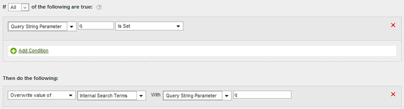

# Cas d’utilisation des règles de traitement

Les applications de la manière dont vous pouvez utiliser les règles de traitement dans votre organisation sont nombreuses. Les sections suivantes décrivent certaines des façons les plus courantes de les utiliser à votre avantage.

+++Copier une variable de données contextuelles dans une eVar

Les règles de traitement sont utilisées pour déplacer les valeurs de [Variables de données contextuelles](/help/implement/vars/page-vars/contextdata.md) vers [Props](/help/components/dimensions/prop.md) et [eVars](/help/components/dimensions/evar.md). Sans règles de traitement, les variables de données contextuelles n’ont aucun sens et ne renseignent des données dans aucun rapport dans Analytics.

La liste [!UICONTROL Variables contextuelles] contient toutes les variables qui ont été envoyées à la suite de rapports au cours des 30 derniers jours. Si vous connaissez le nom de la variable de données contextuelles mais que vous ne l’avez pas envoyée à la suite de rapports actuelle, vous pouvez l’ajouter manuellement :

L’exemple suivant prend la variable de données contextuelles `search_term` et place sa valeur dans eVar3 :

| Ensemble de règles | Valeur |
| Condition | `search_term` (données contextuelles) est défini |
| Action | [!UICONTROL Remplacer la valeur de] eVar3 par `search_term` (données contextuelles) |

L’exemple ci-dessus fonctionne bien lorsqu’il n’y a que quelques eVars à renseigner. Si votre entreprise dispose de centaines de variables de données contextuelles qui nécessitent chacune leur propre eVar, vous pouvez utiliser des instructions conditionnelles. Une règle de traitement unique peut contenir des dizaines d’instructions conditionnelles, ce qui permet à votre entreprise de renseigner toutes les eVars d’une suite de rapports sans avoir à respecter la limite de 150 règles de traitement.

L’exemple suivant renseigne plusieurs variables avec des variables de données contextuelles variables. Une action contient également une instruction conditionnelle :

| Ensemble de règles | Valeur |
| Action | [!UICONTROL Remplacer la valeur de] eVar55 par `spa.billing_customer_name` (Données contextuelles) |
| Action | [!UICONTROL Remplacer la valeur de] Prop7 par `testhierarchy` (Données contextuelles), si `testhierarchy` (Données contextuelles) est défini |
| Action | [!UICONTROL Remplacer la valeur de] eVar8 par `spa.ims_org` (Données contextuelles) |

+++

+++Définir un événement à l’aide d’une variable de données contextuelles

Les règles de traitement peuvent déclencher des événements en fonction de [variables de données contextuelles](/help/implement/vars/page-vars/contextdata.md).

La liste [!UICONTROL Variables contextuelles] contient toutes les variables qui ont été envoyées à la suite de rapports au cours des 30 derniers jours. Si vous connaissez le nom de la variable de données contextuelles mais que vous ne l’avez pas envoyée à la suite de rapports actuelle, vous pouvez l’ajouter manuellement :

La définition de règle suivante définit un événement sur chaque accès contenant une variable de données contextuelles spécifique :

| Ensemble de règles | Valeur |
| --- | --- |
| Condition | `search_term` (données contextuelles) est défini |
| Action | [!UICONTROL Définir l’événement] Event1 sur [!UICONTROL Valeur personnalisée] `1` |

+++

+++Renseigner une variable à l’aide d’un paramètre de chaîne de requête

Vous pouvez renseigner une variable à l’aide d’un paramètre de chaîne de requête. Dans la plupart des cas, vous ajustez généralement votre implémentation pour obtenir les valeurs de chaîne de requête souhaitées. Cependant, si vous ne pouvez pas ajuster facilement votre implémentation pour collecter ces données, les règles de traitement constituent une alternative appropriée. Si une faute de frappe ou un problème similaire vous empêche d’indiquer la valeur, vous pouvez renseigner la variable à l’aide de règles de traitement.

Vérifiez toujours si une valeur est vide ou contient la valeur attendue avant de la remplacer.

| Ensemble de règles | Valeur |
| --- | --- |
| Condition | La campagne n’est pas définie |
| Action | [!UICONTROL Remplacer la valeur de] Campaign par [!UICONTROL Paramètre de chaîne de requête] `cpid` |

| Ensemble de règles | Valeur |
| --- | --- |
| Condition | [!UICONTROL Paramètre De Chaîne De Requête] `q` [!UICONTROL Est Défini] |
| Action | [!UICONTROL Remplacer la valeur de] Termes de recherche interne avec [!UICONTROL Paramètre de chaîne de requête] `q` |

+++

+++Définition conditionnelle d’un événement

Les événements peuvent être définis en fonction de n’importe quelle condition disponible dans les règles de traitement. Par exemple, vous pouvez déclencher un événement lorsque le nom de la page est « Présentation du produit ».

| Ensemble de règles | Valeur |
| --- | --- |
| Condition | Si [!UICONTROL  Nom De La Page ] Est Égal À « Présentation Du Produit » |
| Action | [!UICONTROL Définir l’événement] [!UICONTROL Consultations de produit] sur [!UICONTROL Valeur personnalisée] `1` |

+++

+++Ajouter une sous-catégorie en concaténant le nom de page et de catégorie

Vous pouvez utiliser l’option de concaténation pour renseigner des valeurs en en combinant d’autres.

| Ensemble de règles | Valeur |
| --- | --- |
| Condition | Aucun (toujours exécuter) |
| Action | [!UICONTROL Remplacer la valeur de] eVar1 par [!UICONTROL Valeur concaténée] Catégorie + Nom de page |

+++

+++Nettoyer les valeurs d’un rapport

Vous pouvez comparer les valeurs aux fautes d’orthographe collectées et les mettre à jour pour les afficher correctement dans les rapports.

Adobe recommande d’utiliser l’option de correspondance la plus restrictive possible pour éviter les remplacements indésirables. Vous pouvez exécuter un rapport sur la variable et rechercher les conditions de règle potentielles que vous souhaitez utiliser. Les comparaisons de chaînes ne respectent pas la casse.

| Ensemble de règles | Valeur |
| --- | --- |
| Condition | Si prop1 [!UICONTROL commence par] « [!DNL Shoping] » |
| Action | [!UICONTROL Remplacer la valeur de] Prop1 par [!UICONTROL Valeur personnalisée] « [!DNL Shopping] » |

+++

+++Supprimer un événement d’un accès

Vous pouvez supprimer ou ignorer un événement spécifique d’un accès à l’aide des règles de traitement sans modifier votre implémentation. Si vous définissez l’événement sur une valeur personnalisée `0`, l’événement n’est pas comptabilisé.

| Ensemble de règles | Valeur |
| Condition | Aucun (toujours exécuter) |
| Action | [!UICONTROL Définir l’événement] Event1 sur [!UICONTROL Valeur personnalisée] `0` |

+++
