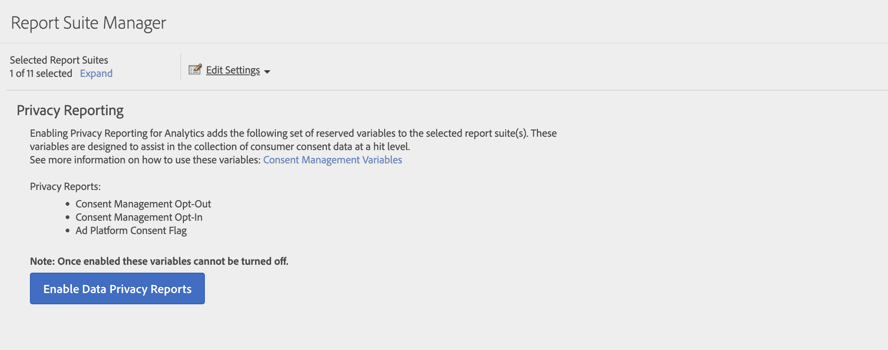

# Compte rendu des performances sur la confidentialité

Le compte rendu des performances sur la confidentialité vous permet d’activer les dimensions [Inscription à la gestion du consentement](/help/components/dimensions/cm-opt-in.md), [Désinscription de la gestion du consentement](/help/components/dimensions/cm-opt-out.md) et [Consentement de la plateforme publicitaire](/help/components//dimensions/ad-consent.md) à utiliser dans le compte rendu des performances.

>[!NOTE]
>
>Nous avons ajouté un nouvel indicateur de consentement de la plateforme publicitaire. Vous devez réactiver les rapports sur la confidentialité des données si vous souhaitez que cette nouvelle variable prenne effet.

Pour accéder à cette page :

1. Connectez-vous à Adobe Analytics et accédez à **[!UICONTROL Admin]** > **[!UICONTROL Suites de rapports]**.
1. Sélectionnez une ou plusieurs suites de rapports, puis sélectionnez **[!UICONTROL Modifier les paramètres]** > **[!UICONTROL Gestion de la confidentialité]** > **[!UICONTROL Compte rendu des performances sur la confidentialité]**.

   

1. Cliquez sur **[!UICONTROL Activer les rapports de confidentialité des données]**.

   >[!NOTE]
   >
   >Une fois activées, ces variables ne peuvent pas être désactivées.

   

1. Une fois ces variables activées, un message de confirmation s’affiche. Les dimensions sont disponibles dans les rapports.

   
