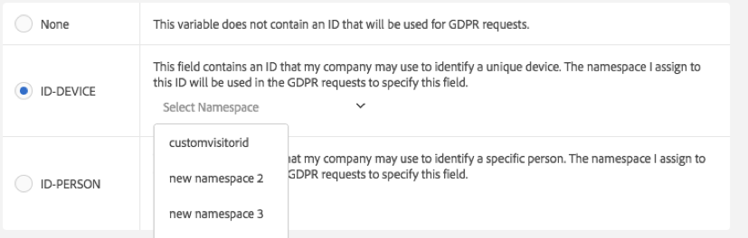
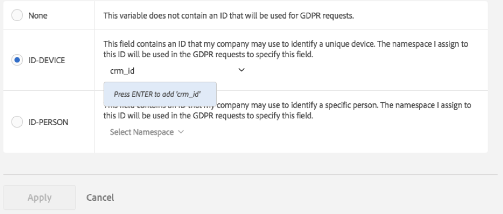

# Étiquettes relatives à la confidentialité des données pour les variables Analytics

Il relève de la responsabilité de la clientèle d’Adobe, qui contrôle les données, de se conformer aux lois applicables sur la confidentialité des données, telles que le RGPD (règlement général sur la protection des données) et le CCPA (California Consumer Privacy Act). Notre clientèle doit consulter ses propres équipes juridiques pour déterminer comment les données doivent être traitées conformément aux lois sur la confidentialité des données. Adobe comprend que chacun de ses clients a des besoins spécifiques en matière de confidentialité. C’est pourquoi Adobe leur permet de personnaliser les paramètres souhaités pour le traitement des données liées à la confidentialité des données. Cela permet à chaque client unique de traiter les demandes relatives à la Confidentialité des données de la façon qui convient le mieux à sa marque et à son ensemble de données unique.

Adobe Analytics offre des outils d’étiquetage des données en fonction de leur confidentialité et des restrictions contractuelles. L’application de libellés constitue une étape importante pour : (1) identifier les titulaires de données, (2) déterminer les données à fournir dans le cadre d’une demande d’accès et (3) identifier les champs de données qui doivent être supprimés dans le cadre d’une demande de suppression.

Avant de pouvoir déterminer quels libellés doivent être appliqués à tel ou tel champ/variable, vous devez [comprendre les ID](/help/admin/tools/privacy-labeling/best-practices.md) que vous capturez dans vos données Analytics et définir ceux qui seront utilisés pour les demandes relatives à la Confidentialité des données.

La mise en œuvre de la confidentialité des données dans Adobe Analytics prend en charge les libellés suivants pour les données d’identité, les données sensibles et la gouvernance des données.

>[!NOTE]
>
>Les étiquettes I1, I2, S1 et S2 ont la même signification que les étiquettes DULE correspondantes dans Adobe Experience Platform. Cependant, elles sont utilisées à des fins très différentes. Dans Adobe Analytics, ces libellés sont utilisés pour permettre d’identifier les champs qui doivent être anonymisés à la suite d’une demande Privacy Service. Dans Adobe Experience Platform, elles sont utilisées pour le contrôle d’accès, la gestion du consentement et l’application des restrictions marketing aux champs étiquetés. Adobe Experience Platform prend en charge de nombreuses étiquettes supplémentaires qui ne sont pas utilisées par Adobe Analytics. En outre, les étiquettes d’Adobe Experience Platform sont appliquées aux schémas. Si vous utilisez le connecteur de données Analytics pour importer vos données Adobe Analytics dans Adobe Experience Platform, vous devez vous assurer que les libellés DULE appropriés sont configurés dans Adobe Experience Platform pour les schémas utilisés par chacune de vos suites de rapports. Les libellés attribués dans Adobe Analytics ne sont pas automatiquement appliqués à ces schémas dans Adobe Experience Platform, car ils ne représentent qu’un sous-ensemble des libellés DULE que vous devrez peut-être appliquer. En outre, différentes suites de rapports peuvent partager un schéma, mais avoir des étiquettes différentes attribuées aux props et aux evars portant le même numéro, et le schéma peut être partagé par des jeux de données provenant d’autres sources de données, ce qui peut prêter à confusion sur la raison pour laquelle certains champs ont reçu ces étiquettes.

## Étiquettes de données d’identification {#identity-data-labels}

Les étiquettes « I » pour les données d’identification sont utilisées pour classer les données qui peuvent servir à identifier ou à contacter une personne spécifique.

| Étiquette | Définition | Autres exigences |
| --- | --- | --- |
| I1 | Directement identifiables : données qui peuvent spécifiquement identifier ou permettre un contact direct avec un individu, comme un nom ou une adresse e-mail. | <ul><li>Ne peut pas être défini sur des événements</li><li>Ne peut pas être défini sur des eVars de marchandisage</li></ul> |
| I2 | Indirectement identifiables : données qui peuvent être utilisées en combinaison avec d’autres données pour identifier ou permettre un contact direct avec un individu ou un appareil.  Ce libellé ne permet pas, à lui seul, d’identifier un individu, mais il peut être combiné à d’autres informations (dont vous disposez ou non) pour identifier quelqu’un. Parmi les exemples figure le numéro de fidélisation des clients ou l’identifiant utilisé par le système GRC d’une entreprise, propre à chacun de ses clients. | <ul><li>Ne peut pas être défini sur des événements</li><li>Ne peut pas être défini sur des eVars de marchandisage</li></ul> |

{style="table-layout:auto"}

## Étiquettes de données sensibles {#sensitive-data-labels}

Les étiquettes « S » pour les données sensibles sont utilisées pour classer les données sensibles telles que les données géographiques. D’autres étiquettes de données sensibles seront introduites à l’avenir pour identifier d’autres types d’informations sensibles.

| Étiquette | Définition |
| --- | --- |
| S1 | Données de géolocalisation précises liées à la latitude et à la longitude pouvant être utilisées pour déterminer la position exacte d’un appareil (à moins de 100 m). |
| S2 | Données de géolocalisation pouvant être utilisées pour déterminer une zone géographie délimitée définie plus largement. |

{style="table-layout:auto"}

## Étiquettes de gouvernance des données (confidentialité des données) {#data-governance-labels}

Les étiquettes de gouvernance des données permettent de classer les données en fonction des considérations liées à la confidentialité et des conditions contractuelles afin d’aider la clientèle d’Adobe à respecter les réglementations et politiques d’entreprise.

### Libellés d’accès à la confidentialité des données {#access}

| Étiquette | Définition | Autres exigences |
| --- | --- | --- |
| Aucun | Sélectionnez cette option si cette variable ne contient aucune donnée devant être incluse dans les données renvoyées au titulaire de données dans le cadre d’une demande d’accès au titre de la confidentialité des données. | |
| ACC-ALL | Les valeurs dans ce champ doivent être incluses dans toutes les demandes d’accès relatives à la Confidentialité des données. Si ce hit provient d’un appareil partagé par plusieurs individus, en appliquant ce libellé, vous indiquez, en tant que contrôleur de données, qu’il est acceptable de partager les données dans ce champ avec tout individu ayant accès à l’appareil partagé. | Les champs ayant ce libellé seront renvoyés pour toutes les demandes relatives à la Confidentialité des données. |
| ACC-PERSON | Les valeurs dans ce champ doivent être incluses uniquement pour les demandes d’accès à des informations personnelles lorsque vous avez la quasi certitude que le hit provient du titulaire de données, tel que déterminé par un ID de demande d’accès à des informations personnelles correspondant à la valeur d’un champ ID-PERSON. | Vous devez également définir un libellé ID-PERSON sur certaines variables de cette suite de rapports et soumettre les demandes utilisant cet ID, ou ce libellé ne sera jamais appliqué. |

{style="table-layout:auto"}

Peu de variables recevront d’autres libellés, vous devez donc vous attendre à ce que les libellés d’accès soient appliqués à la plupart de vos variables. Vous pouvez, cependant, en consultation avec votre équipe juridique, décider quelles données collectées doivent être partagées avec les titulaires de données.

### Libellés de suppression pour la confidentialité des données {#delete}

Contrairement aux autres libellés, les libellés de suppression ne sont pas mutuellement exclusifs. Vous pouvez sélectionner l’un ou l’autre, les deux ou aucun. Le libellé [!UICONTROL Aucun] n’est pas nécessaire, car le simple fait de ne pas cocher d’option de suppression indique qu’il n’y en a [!UICONTROL Aucun].

Un libellé de suppression n’est nécessaire que pour les champs contenant une valeur qui permettrait d’associer un hit au titulaire de données (autrement dit, qui permettrait d’identifier le titulaire de données). Autres informations personnelles (favoris, historique de navigation/achat, états de santé, etc.) ne doivent pas être supprimées, car l’association avec le titulaire de données sera rompue.

| Étiquette | Définition | Autres exigences |
| --- | --- | --- |
| DEL-DEVICE | Pour les demandes de suppression relatives à la confidentialité des données, les valeurs de ce champ ne doivent être rendues anonymes que pour les demandes où le hit présente un ID-DEVICE spécifié.  Si la même valeur apparaît dans d’autres hits qui ne sont pas supprimés, alors ces autres instances ne seront pas modifiées. Cela aura pour effet de modifier les chiffres pour les rapports qui calculent des chiffres uniques dans ce champ. Sur les appareils partagés, cette opération peut supprimer les identifiants d’autres personnes en plus de ceux du titulaire de données.  Les chiffres ne changent pas si ce champ détient également une étiquette ID-DEVICE et si la valeur de ce champ a été utilisée comme ID pour la demande relative à la Confidentialité des données. | <ul><li>Nécessite également une étiquette I1, I2 ou S1</li><li>Ne peut pas être défini sur des événements</li><li>Ne peut pas être défini sur des eVars de marchandisage</li></li><li>Ne peut pas être défini sur des classifications</li><li>Vous devez soumettre les demandes utilisant une étiquette ID-DEVICE ou dont la valeur expandIDs est définie sur « true », ou cette étiquette ne sera jamais appliquée.</li></ul> |
| DEL-PERSON | Pour les demandes de suppression relatives à la confidentialité des données, les valeurs de ce champ ne doivent être rendues anonymes que pour les demandes où le hit présente un ID-PERSON spécifié.  Si la même valeur apparaît dans d’autres hits qui ne sont pas supprimés, alors ces autres valeurs ne seront pas modifiées. Cela entraînera une modification des nombres dans les rapports qui calculent le nombre de valeurs uniques pour ce champ. Les valeurs ne changeront pas si ce champ comporte également un libellé ID-PERSON et si la valeur de ce champ a été utilisée comme identifiant pour la demande relative à la confidentialité des données. | <ul><li>Nécessite également un libellé I1, I2 ou S1</li><li>Ne peut pas être défini sur des événements</li><li>Ne peut pas être défini sur des eVars de marchandisage</li></li><li>Ne peut pas être défini sur des classifications</li><li>Vous devez envoyer les demandes en utilisant un libellé ID-PERSON défini sur une variable de cette suite de rapports et soumettre les requêtes avec cet identifiant, faute de quoi ce libellé ne sera jamais appliqué.</li></ul> |

{style="table-layout:auto"}

### Libellés d’identité pour la confidentialité des données {#identity}

| Étiquette | Définition | Autres exigences |
| --- | --- | --- |
| Aucun | Cette variable ne contient pas d’identifiant qui sera utilisé dans le cadre de demandes relatives à la confidentialité des données. | Vous ne devez définir une de ces autres étiquettes que si ce champ contient un ID que vous utiliserez pour soumettre des demandes d’accès ou de suppression via l’[API Privacy Service](https://experienceleague.adobe.com/docs/experience-platform/privacy/api/overview.html?lang=fr) ou l’interface utilisateur. |
| ID-DEVICE | Ce champ contient un identifiant qui peut être utilisé pour identifier un appareil dans le cadre d’une demande relative à la confidentialité des données, mais ne permet pas de distinguer les différents utilisateurs d’un appareil partagé.  Vous ne devez pas spécifier ce libellé pour toutes les variables contenant des identifiants (c’est à cela que servent les libellés I1/I2). Utilisez ce libellé si vous soumettez des demandes relatives à la confidentialité des données qui utilisent des identifiants stockés dans cette variable et que vous voulez rechercher cette variable pour l’identifiant spécifié. | Nécessite également un libellé I1 ou I2.<ul><li>Ne peut pas être défini sur des événements</li><li>Ne peut pas être défini sur des eVars de marchandisage</li><li>Ne peut pas être défini sur des classifications</li></ul> |
| ID-PERSON | Ce champ contient un ID qui peut être utilisé pour identifier un utilisateur authentifié (une personne spécifique) dans le cadre d’une demande relative à la confidentialité des données.  Vous ne devez pas spécifier ce libellé pour toutes les variables contenant des identifiants (c’est à cela que servent les libellés I1/I2). Utilisez ce libellé si vous comptez envoyer des demandes relatives à la confidentialité des données à l’aide d’identifiants stockés dans cette variable et souhaitez rechercher l’identifiant spécifié dans cette variable. | <ul><li>Nécessite également une étiquette I1 ou I2.</li><li>Ne peut pas être défini sur des événements</li><li>Ne peut pas être défini sur des eVars de marchandisage</li><li>Ne peut pas être défini sur des classifications</li></ul> |

{style="table-layout:auto"}

## Fournir un espace de noms lors de l’étiquetage d’une variable en tant qu’ID-DEVICE ou ID-PERSON {#provide-namespace}

Lorsque vous appliquez à une variable le libellé ID-DEVICE ou ID-PERSON, vous êtes invité à fournir un espace de noms. Vous pouvez utiliser un espace de noms défini précédemment ou en définir un nouveau.

### Utiliser un espace de noms défini précédemment {#previously-defined}

Si vous aviez précédemment défini une étiquette d’identification pour d’autres variables dans des suites de rapports de votre société de connexion, vous pouvez sélectionner un espace de noms existant. Vous devez réutiliser l’espace de noms si cette variable contient le même type d’ID que les autres variables déjà étiquetées avec cet espace de noms et que vous souhaitez toutes les rechercher lorsque vous soumettez une demande.

1. Cliquez sur **[!UICONTROL Sélectionner un espace de noms]**, puis sélectionnez un espace de noms existant.
   
1. Cliquez sur **[!UICONTROL Appliquer]**.


### Définir un nouvel espace de noms {#define}

Vous pouvez également définir un nouvel espace de noms. Nous vous recommandons de limiter les chaînes d’espace de noms à des caractères alphanumériques, plus le trait de soulignement, la barre oblique et l’espace. Ceux-ci seront tous convertis en minuscules.

1. Cliquez sur **[!UICONTROL Sélectionner un espace de noms]**, puis tapez le titre de l’espace de noms.

   

1. Appuyez sur **[!UICONTROL Entrée]** pour ajouter cet espace de noms. Le bouton Appliquer devient alors actif.
1. Cliquez sur **[!UICONTROL Appliquer]**.

La chaîne que vous spécifiez comme espace de noms est la même que celle que vous devez utiliser pour soumettre des demandes via l’API relative à la Confidentialité des données comme valeur du paramètre « espace de noms ». Adobe Analytics recherche ensuite l’identifiant spécifié avec la demande dans toutes les variables de toutes vos suites de rapports qui partagent cet espace de noms.

Vous ne devez pas spécifier l’étiquette ID-DEVICE ou ID-PERSON sur toutes les variables contenant des ID (les étiquettes I1/I2 servent à cela). Utilisez ce libellé si vous comptez envoyer des demandes relatives à la confidentialité des données à l’aide d’identifiants stockés dans cette variable et souhaitez rechercher l’identifiant spécifié dans cette variable. Par exemple, si eVar1 peut contenir une adresse e-mail et eVar2 un nom d’utilisateur de connexion, mais que vous envoyez toujours les demandes uniquement avec le nom d’utilisateur, vous pouvez attribuer à eVar1 les libellés I1, ACC-PERSON et DEL-PERSON, et à eVar2 les libellés I2, ACC-PERSON, DEL-PERSON et ID-PERSON avec l’espace de noms « nom d’utilisateur ». Vous pouvez ensuite soumettre une demande avec un bloc JSON de section utilisateur comme suit :

```
{
     "namespace": "user name",
     "type": "analytics",
     "value": "rocketman123"
}
```

Le même espace de noms peut être utilisé pour différentes variables d’une même suite de rapports. Par exemple, certaines implémentations personnalisées stockent un ID de gestion de la relation client dans une prop et une eVar. Si l’identifiant GRC apparaît toujours dans l’une des variables (l’eVar, par exemple) et seulement occasionnellement dans l’autre (la prop), et qu’il n’apparaît jamais dans la prop sans apparaître également dans l’eVar, seule l’eVar nécessite un libellé ID et un espace de noms, car Adobe peut rechercher l’identifiant uniquement dans cette eVar. Toutefois, si l’ID de gestion de la relation client apparaît tantôt dans une variable, tantôt dans l’autre, les deux doivent alors avoir le même espace de noms. Adobe recherchera dans les deux variables les occurrences de l’ID spécifié dans une demande relative à la Confidentialité des données avec cet espace de noms. Vous devez toujours attribuer des étiquettes DEL à toutes ces variables pour que la valeur soit rendue anonyme quel que soit son emplacement.

Autre exemple, vous pouvez avoir un ID de gestion de la relation client qui est parfois envoyé via eVar1, parfois via prop7. Vous avez ensuite une règle de traitement qui copie la valeur d’eVar1, le cas échéant, dans eVar3. Sinon, la valeur est copiée de prop7 dans eVar3. Dans ce scénario, eVar3 contiendra toujours l’ID GRC s’il est connu. Dès lors, seule eVar3 nécessite un libellé ID-PERSON.

>[!CAUTION]
>
>Les espaces de noms `visitorId` et `customVisitorId` sont réservés à l’identification du cookie de suivi hérité d’Analytics et de l’identifiant de visite du client ou de la cliente Analytics. N’utilisez pas ces espaces de noms pour les variables de trafic ou de conversion personnalisées.

## Types de variables et les étiquettes de confidentialité des données prises en charge {#variable-types}

Les étiquettes de confidentialité des données concernent quatre grandes catégories de variables d’Analytics. Toutes les variables ne prennent pas en charge tous les libellés. Ce tableau montre quelles variables prennent en charge ou non quelles étiquettes.

| Type de variable | Étiquettes prises en charge | Étiquettes non prises en charge |
|--- |--- |--- |
| <ul><li>Succès personnalisées</li><li>eVars de marchandisage</li><li>Variables à plusieurs valeurs (mvVars)</li><li>Variables de hiérarchie</li></ul> | <ul><li>S1/S2</li><li>ACC-ALL, ACC-PERSON</li></ul> | <ul><li>I1/I2</li>  <li>ID-DEVICE, ID-PERSON</li><li>DEL-DEVICE, DEL-PERSON</li></ul> |
| Classifications | <ul><li>I1/I2, S1/S2</li><li>ACC-ALL, ACC-PERSON</li></ul> | <ul><li>ID-DEVICE, ID-PERSON</li><li>DEL-DEVICE, DEL-PERSON</li></ul> |
| <ul><li>Variables de trafic (props)</li><li>Variables de commerce (eVars non dédiées au marchandisage)</li></ul> | Toutes les étiquettes | - |
| La plupart des autres variables (*voir le tableau ci-dessous pour les exceptions*) | ACC-ALL, ACC-PERSON | <ul><li>I1/I2, S1/S2</li><li>ID-DEVICE, ID-PERSON</li><li>DEL-DEVICE, DEL-PERSON</li></ul> |

{style="table-layout:auto"}

## Variables auxquelles des étiquettes autres que ACC-ALL/ACC-PERSON peuvent être attribuées/modifiées {#variables}

<table id="table_0972910DB2D7473588F23EA47988381D"> 
 <thead> 
  <tr> 
   <th colname="col1" class="entry"> Groupe </th> 
   <th colname="col2" class="entry"> Variables </th> 
   <th colname="col3" class="entry"> Étiquettes modifiables </th> 
   <th colname="col4" class="entry"> Commenter </th> 
  </tr>
 </thead>
 <tbody> 
  <tr> 
   <td colname="col1" morerows="1"> 
    <ul id="ul_62FA1BAA3B9245909509566D8C03F900"> 
     <li id="li_38F7C4E18ECB42C292370713F502B8EB">Dimensions de conversion </li> 
     <li id="li_41CB61F927CB4402AAB4A62E219CD153">Dimensions de trafic personnalisées </li> 
    </ul> </td> 
   <td colname="col2"> <p>Toutes, sauf les classifications </p> </td> 
   <td colname="col3"> <p>Tous </p> </td> 
   <td colname="col4"> </td> 
  </tr>
  <tr> 
   <td colname="col1"> <p>Variables de trafic </p> </td> 
   <td colname="col2"> <p>Propriétés de liste </p> </td> 
   <td colname="col3"> <p>Aucun/S1/S2 </p> </td> 
   <td colname="col4"> <p>Les props de liste peuvent contenir plusieurs valeurs et ne sont pas autorisées en tant qu’identifiants de confidentialité.</p> </td> 
  </tr> 
  <tr> 
   <td colname="col2"> <p>Classifications </p> </td> 
   <td colname="col3"> <p>Aucune/I1/I2 </p> <p>Aucun/S1/S2 </p> </td> 
   <td colname="col4"> </td> 
  </tr> 
  <tr> 
   <td colname="col1"> <p>Événements de conversion </p> </td> 
   <td colname="col2"> <p>Tous </p> </td> 
   <td colname="col3"> <p>Aucun/S1/S2 </p> </td> 
   <td colname="col4"> </td> 
  </tr> 
  <tr> 
   <td colname="col1"> <p>Dimensions et événements relatifs aux solutions </p> </td> 
   <td colname="col2"> <p>Lien d’Activity Map, </p> <p>Page d’Activity Map </p> </td> 
   <td colname="col3"> <p>Aucun / I1 / I2 </p> <p>Aucun / DEL-DEVICE / DEL-PERSON </p> </td> 
   <td colname="col4"> <p>Les variables peuvent contenir des paramètres d’URL, qui peuvent inclure des données directement ou indirectement identifiables. Si votre implémentation ne collecte pas de données directement ou indirectement identifiables dans ces variables, elles ne nécessitent pas de libellés d’identité ou de suppression. </p> <p>Notez que la suppression efface les paramètres de l’URL, mais conserve l’URL de base. </p> </td> 
  </tr> 
  <tr> 
   <td colname="col1"> <p>Dimensions de traitement des données </p> </td> 
   <td colname="col2"> <p>Identifiant visiteur personnalisé </p> </td> 
   <td colname="col3"> <p>ID-DEVICE/ID-PERSON </p> <p>DEL-DEVICE/DEL-PERSON </p> </td> 
   <td colname="col4"> <p>Vous ne pouvez pas supprimer les étiquettes d’ID ou DEL (définies sur Aucune), mais vous pouvez les modifier en variantes DEVICE ou PERSON en fonction de votre implémentation d’identification personnalisée. </p> <p>Si vous n’utilisez pas l’identifiant visiteur personnalisé, alors le paramètre n’a pas d’importance. </p> </td> 
  </tr> 
  <tr> 
   <td colname="col1" morerows="1"> 
    <ul id="ul_5EB0193732D44A20AEA08CE9DFE01DBD"> 
     <li id="li_F70D969F83314A94BD8567449968EE2F">Dimensions standard </li> 
     <li id="li_6046764B19FF4679B51E55671C2C0ADB">Dimensions de traitement des données </li> 
    </ul> </td> 
   <td colname="col2"> <p>Adresse IP </p> <p>Adresse IP 2 </p> </td> 
   <td colname="col3"> <p>DEL-DEVICE/DEL-PERSON </p> </td> 
   <td colname="col4"> <p>Vous ne pouvez pas supprimer le libellé DEL, mais vous pouvez le remplacer par DEL-DEVICE, DEL-PERSON, ou les deux. </p> </td> 
  </tr> 
  <tr> 
   <td colname="col2"> <p>Action ClickMap (héritée), </p> <p>Contexte ClickMap (hérité), </p> <p>Page, </p> <p>URL de la page, </p> <p>URL de la page d’entrée d’origine, </p> <p>Référent, </p> <p>URL de la page de début de la visite </p> </td> 
   <td colname="col3"> <p>Aucun / I1 / I2 </p> <p>Aucun / DEL-DEVICE / DEL-PERSON </p> </td> 
   <td colname="col4"> <p>Les variables peuvent contenir des paramètres d’URL, qui peuvent inclure des données directement ou indirectement identifiables. Si votre implémentation ne collecte pas de données directement ou indirectement identifiables dans ces variables, elles ne nécessitent pas de libellés d’identité ou de suppression. </p> <p>Notez que la suppression efface les paramètres d’URL, mais conserve l’URL de base. </p> </td> 
  </tr> 
 </tbody> 
</table>

## Gestion des suppressions {#deletion}

La prise en charge par Adobe Analytics des demandes de suppression relatives à la Confidentialité des données est conçue pour minimiser l’impact sur la génération de rapports. Dans la plupart des cas, les mesures affichées dans les rapports ne devraient pas changer. Ainsi, un rapport antérieur exécuté avant la suppression relative à la Confidentialité des données restera le même une fois la suppression effectuée. En effet, les données supprimées sont complètement dissociées du titulaire de données et les données non identifiables restent en place pour que les valeurs rapportées soient toujours cohérentes.

Le tableau suivant décrit comment différentes variables sont « supprimées ». Il ne s’agit pas d’une liste exhaustive.

| Variables | Méthode de suppression |
| --- | --- |
| <ul><li>Variables de trafic (props)</li><li>Variables de commerce (eVars)</li></ul> | La valeur existante est remplacée par une nouvelle valeur au format « Data Privacy-356396D55C4F9C7AB3FBB2F2FA223482 », dans laquelle la valeur hexadécimale à 32 chiffres suivant le préfixe « Data Privacy- » est un nombre pseudo-aléatoire de 128 bits cryptographiquement fort.<p>Puisqu’elle est remplacée par une chaîne aléatoire, la valeur d’origine ne peut pas être retrouvée à partir de cette nouvelle valeur, tout comme il n’est pas possible d’obtenir la nouvelle valeur en connaissant la valeur d’origine.  Pour une variable donnée, si la valeur identique à la valeur remplacée apparaît dans d’autres accès qui sont également supprimés dans le cadre de la même demande relative à la Confidentialité des données, toutes les instances de cette valeur sont remplacées par la même nouvelle valeur.<p>Si certaines instances d’une valeur sont remplacées par une demande de suppression et qu’une demande ultérieure supprime d’autres (nouvelles) instances de la valeur d’origine, la nouvelle valeur de remplacement sera différente de la valeur de remplacement d’origine. |
| Identifiant d’achat | La valeur existante est remplacée par une nouvelle valeur au format « G-7588FCD8642718EC50 », dans laquelle les 18 chiffres hexadécimaux suivant le préfixe « G- » correspondent aux 18 premiers chiffres d’un nombre pseudo-aléatoire de 128 bits cryptographiquement fort. Tous les commentaires qui s’appliquent à la suppression de variables de trafic et de commerce s’appliquent également ici.<p>L’identifiant d’achat est un identifiant de transaction dont le principal objectif est de s’assurer qu’un achat n’est pas crédité deux fois, par exemple quand quelqu’un rafraîchit la page de confirmation d’achat. L’identifiant en lui-même peut associer l’achat à une ligne de votre propre base de données, où l’achat est enregistré. Dans la plupart des cas, il n’est pas nécessaire de supprimer cet identifiant, il n’est donc pas supprimé par défaut.<p>Si vous êtes toujours en mesure de lier un achat à un utilisateur après la demande de suppression relative à la Confidentialité des données de vos propres données, vous pourriez avoir à supprimer ce champ pour que les données Analytics concernant ce visiteur ne puissent pas être reliées à l’acheteur. |
| Identifiant visiteur | La valeur est un entier relatif de 128 octets et est remplacée par une valeur pseudo-aléatoire de 128 octets au chiffrement fort. |
| <ul><li>MCID</li><li>Identifiant visiteur personnalisé</li><li>Adresse IP</li><li>Adresse IP 2 | La valeur est effacée (définie sur une chaîne vide ou sur 0 selon le type de variable). |
| <ul><li>Action ClickMap (héritée)</li><li>Contexte ClickMap (hérité)</li><li>Page</li><li>URL de la page</li><li>URL de la page d’accès originale</li><li>Référent</li><li>URL de la page de début de la visite</li></ul> | Les paramètres d’URL sont effacés/supprimés. Si la valeur ne ressemble pas à une URL, elle est effacée (définie sur une chaîne vide). |
| <ul><li>Latitude</li><li>Longitude</li></ul> | La précision est réduite au mieux à 1 km. |

{style="table-layout:auto"}

## Variables qui peuvent ne pas prendre en charge les étiquettes de suppression prévues {#no-delete-support}

Cette section vise à clarifier les informations concernant les variables d’Analytics qui peuvent ne pas prendre en charge la suppression. Parfois, ces variables sont supprimées par des utilisateurs ou utilisatrices externes à Analytics (par exemple, par l’équipe juridique) qui ne connaissent pas le type de données contenu dans la variable et tirent des conclusions à partir du nom de la variable.

Avant de prendre une décision concernant l’étiquetage ou la suppression, il est important de comprendre le type de données contenu dans chaque variable et de ne pas se fier uniquement à son nom. Voici une liste de certaines de ces variables, ainsi que les raisons pour lesquelles elles peuvent ne pas nécessiter de suppression ou de libellé de suppression spécifique :

| Variable | Commentaires |
| --- | --- |
| [!UICONTROL Nouvel identifiant visiteur] | Le nouvel identifiant visiteur est un booléen qui est « vrai » la première fois qu’un identifiant visiteur donné est détecté. Il n’est pas nécessaire de le supprimer une fois que l’identifiant visiteur est rendu anonyme. Après anonymisation, il correspondra à la première fois que cet identifiant anonymisé a été détecté. |
| [!UICONTROL Code postal]<p>[!UICONTROL Code postal géo] | Les codes postaux ne sont définis que pour les hits provenant des États-Unis. Ils ne sont pas définis pour les hits provenant de l’UE. Même lorsqu’ils sont définis, ils ne fournissent qu’une large zone géographique qui rend difficile la ré-identification du titulaire de données. |
| [!UICONTROL Latitude géo]<p>[!UICONTROL Longitude géo] | Elles fournissent une localisation approximative dérivée de l’adresse IP. La précision est généralement comparable à celle d’un code postal, à quelques dizaines de kilomètres près de l’emplacement réel. |
| [!UICONTROL Agent utilisateur] | L’agent utilisateur identifie la version du navigateur utilisé. |
| [!UICONTROL Identifiant utilisateur] | Spécifie la suite de rapports Analytics (sous forme de nombre) contenant les données. |
| [!UICONTROL Identifiant de suite de rapports] | Spécifie le nom de la suite de rapports Analytics contenant les données. |
| [!UICONTROL Identifiant visiteur]<p>[!UICONTROL MCID] / [!UICONTROL ECID] | Ces ID possèdent une étiquette DEL-DEVICE mais l’ajout de l’étiquette DEL-PERSON est impossible. Si vous souhaitez que ces ID de cookies soient rendus anonymes sur les hits contenant un ID correspondant dans une prop ou une eVar, vous pouvez contourner cette limite d’étiquetage en étiquetant la prop ou l’eVar avec une étiquette ID-DEVICE, même si elle identifie en réalité une personne (toutes les étiquettes DEL-PERSON doivent également être changées en étiquettes DEL-DEVICE). Dans ce cas, comme seules certaines instances de l’identifiant visiteur ou de l’ECID sont anonymisées, le nombre de visiteurs uniques changera dans les rapports historiques. |
| [!UICONTROL ID AMO] | L’Adobe Advertising ID est une variable de solution qui possède une étiquette [!UICONTROL DEL-DEVICE] non modifiable. Il est renseigné à partir d’un cookie, comme le sont l’identifiant visiteur et le MCID. Il doit être supprimé des hits dès que ces autres identifiants sont supprimés. Consultez la description de ces variables pour de plus amples détails. |

{style="table-layout:auto"}

## Champs de date pour les demandes d’accès {#access-requests}

Il existe cinq variables standard qui contiennent des horodatages :

| Horodatage | Définition |
| --- | --- |
| Heure du hit (UTC) | Heure à laquelle Adobe Analytics a reçu le hit. |
| Heure personnalisée du hit (UTC) | Heure à laquelle le hit s’est produit, qui peut être antérieure à celle à laquelle le hit a été reçu pour certaines applications mobiles et autres implémentations. Par exemple, si aucune connexion réseau n’était disponible au moment où le hit s’est produit, l’application peut le conserver et l’envoyer dès qu’une connexion est disponible. |
| Date Heure | Même valeur que Heure personnalisée du hit (UTC), mais dans le fuseau horaire de la suite de rapports, plutôt que GMT. |
| Heure du premier hit (GMT) | Valeur Heure personnalisée du hit (UTC) du premier hit reçu pour la valeur d’identifiant visiteur associée à ce hit. |
| Heure de début de visite UTC | Heure personnalisée du hit (UTC) du premier hit reçu pour la visite actuelle de cet identifiant visiteur. |

{style="table-layout:auto"}

Le code permettant de générer les fichiers renvoyés en réponse aux demandes d’accès relatives à la confidentialité des données exige qu’au moins l’une des trois premières variables de date et heure soit incluse dans la demande d’accès (c’est-à-dire qu’elle comporte un libellé ACC applicable au type de demande). Si aucune d’elles n’est incluse, l’heure personnalisée du hit (UTC) sera traitée comme si elle possédait une étiquette ACC-ALL.

Le fichier CSV de niveau de hit renvoyé lors des demandes d’accès relatives à la confidentialité des données convertira les valeurs de ces champs pour passer de dates et heures au format Unix en champs date/heure au format `YYYY-MM-DD HH:MM:SS` (par exemple, `2018-05-01 13:49:22`). Dans le fichier de résumé HTML, ces valeurs d’horodatage seront tronquées pour n’inclure que la date, `YYYY-MM-DD`, afin de réduire le nombre de valeurs uniques possibles pour ces champs.
