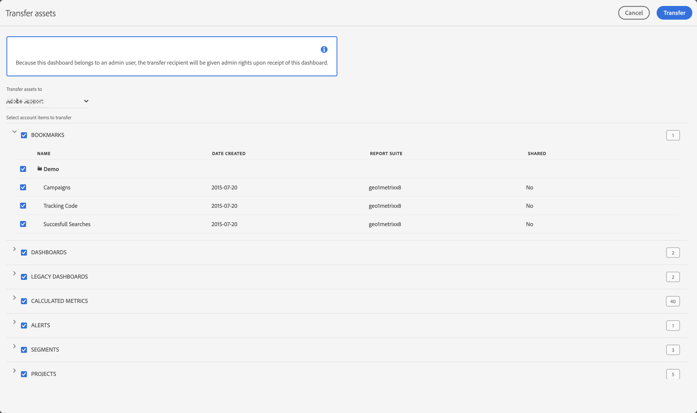

# Gestion des comptes utilisateur, ressources et expirations hérités

Vous pouvez gérer les comptes utilisateur hérités, leur statut de migration, les données d’expiration, le transfert de ressources à d’autres utilisateurs, etc. à l’aide de **[!UICONTROL Admin] > [!UICONTROL Tous les administrateurs] > [!UICONTROL Utilisateurs et administrateurs Analytics]**.

L’écran Utilisateurs affiche une liste des utilisateurs Adobe Analytics actuels, avec les colonnes suivantes :

| Colonne | Description |
|---|---|
| [!UICONTROL Identifiant utilisateur] | Identifiant utilisateur que l’utilisateur utilise pour se connecter à Adobe Analytics. |
| [!UICONTROL Nom] | Nom de l’utilisateur. |
| [!UICONTROL Statut de migration] | Statut de la migration d’un compte utilisateur hérité vers Enterprise ID ou Adobe ID.  Le statut peut être Non initié, En file d’attente ou Migré. |
| [!UICONTROL Adresse électronique] | Adresse e-mail de l’utilisateur. |
| [!UICONTROL Connexion héritée] | Statut de la connexion héritée, qui peut être Activé ou Désactivé. |
| [!UICONTROL Date de création] | Date et heure de création du compte utilisateur dans Adobe Analytics. |
| [!UICONTROL Dernier accès à Analytics] | la date et l’heure du dernier accès du compte utilisateur à Adobe Analytics, |
| [!UICONTROL Expiration] | Date d’expiration du compte d’utilisateur ou Aucun si le compte d’utilisateur n’expire pas. |

- Pour rechercher un utilisateur spécifique, utilisez le champ  *Rechercher par titre*.
- Pour filtrer la liste selon le statut de migration, sélectionnez  **[!UICONTROL Statut de migration]**.
- Pour filtrer la liste selon le statut de connexion hérité, sélectionnez  **[!UICONTROL Connexion héritée]**.
- Pour modifier l’affichage des colonnes, sélectionnez  et sélectionnez les colonnes dans la fenêtre contextuelle.

Vous pouvez appliquer différentes actions lors de la sélection d&#39;un ou plusieurs utilisateurs dans la liste :

| Action | Description |
|---|---|
|  **[!UICONTROL Migrer]** | Vous pouvez migrer un ou plusieurs utilisateurs vers des Enterprise ID ou des Adobe ID. |
|  **[!UICONTROL Définir l’expiration]** | Vous pouvez définir une date d’expiration pour l’utilisation de la connexion Adobe Analytics héritée pour les utilisateurs sélectionnés.  Sélectionnez la date à utiliser dans une fenêtre contextuelle de calendrier pour spécifier la date. Sélectionnez **[!UICONTROL Terminé]** pour confirmer l’expiration. |
|  **[!UICONTROL Transfert de ressources]** | Cette action n’est disponible que lors de la sélection d’un utilisateur. Si l’utilisateur dispose de ressources pouvant être transférées, vous pouvez sélectionner les éléments du compte (tels que des signets, des tableaux de bord, etc.). Sélectionnez **[!UICONTROL Transfert]** pour terminer le transfert.  |
|  **[!UICONTROL Supprimer des comptes]** | Une boîte de dialogue s’affiche pour confirmer la suppression des comptes sélectionnés. Sélectionnez **[!UICONTROL OK]** pour supprimer les comptes. Sélectionnez **[!UICONTROL Annuler]** pour annuler. |
|  **[!UICONTROL Exporter au format CSV]** | Cette action télécharge immédiatement un fichier contenant une liste de valeurs séparées par des virgules des utilisateurs sélectionnés avec leurs détails (nom, statut de migration, e-mail, etc.). |

