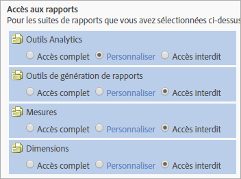

# Personnalisation de l'accès aux rapports - présentation

>[!IMPORTANT]
>
>User and product management is moving to the [Admin Console](https://helpx.adobe.com/enterprise/using/admin-console.html). Adobe vous avertira lorsqu’il sera temps de migrer les utilisateurs. After all customers have migrated, help content for **[!UICONTROL Analytics]** &gt; **[!UICONTROL Admin Tools]** &gt; **[!UICONTROL User Management]** will be retired.

Personnalisez l’accès d’un groupe aux outils Analytics, aux outils de suites de rapports, aux mesures et aux dimensions.

**[!UICONTROL Ajouter un nouveau groupe]** &gt; **[!UICONTROL Accès aux rapports]**

La section [!UICONTROL Accès aux rapports] de la page [!UICONTROL Définir un groupe d’utilisateurs] propose des catégories d’accès grâce auxquelles vous pouvez personnaliser les autorisations à un niveau granulaire.

Vous pouvez par exemple créer un groupe ayant accès à plusieurs outils Analytics ([!UICONTROL Analysis Workspace], [!UICONTROL Reports &amp; Analytics] et [!UICONTROL Report Builder]), avec autorisation d’accès à des mesures et dimensions spécifiques (y compris les eVars) et des fonctionnalités telles que la création de segments ou de mesures calculées.

## Ce que vous devez savoir sur les autorisations {#section_3D25D4A5BD044008870C5B98F696244E}

<table id="table_DB7806E05E2040EC9A4CB7C3596879EC"> 
 <thead> 
  <tr> 
   <th colname="col1" class="entry"> Élément </th> 
   <th colname="col2" class="entry"> Description </th> 
  </tr> 
 </thead>
 <tbody> 
  <tr> 
   <td colname="col1"> 
Accès des administrateurs / groupes prédéfinis 
 </td> 
   <td colname="col2"> 
 Les groupes prédéfinis ne sont plus requis pour les administrateurs. Ces derniers ont maintenant accès à tous les éléments (outils, dimensions et mesures), ainsi qu’aux services web, au Report Builder, à Activity Map et aux Ad Hoc Analysis. 
 
Ces groupes permettent d’autoriser ou de restreindre l’accès des utilisateurs non-administrateurs. 
 </td> 
  </tr> 
  <tr> 
   <td colname="col1"> 
Groupes personnalisés 
 </td> 
   <td colname="col2"> 
 Les groupes personnalisés remplacent les groupes prédéfinis. Les groupes prédéfinis existants seront migrés dans des groupes personnalisés du même nom. Tous les groupes personnalisés que vous avez créés seront préservés avec leurs paramètres. Toutefois, les paramètres ont été déplacés. Par exemple, les paramètres de la société (sous Personnaliser l’Admin Console) se trouvent maintenant sous <a href="../../../admin/user-management2/c-customize-report-access/groups-analytics-tools.md#concept_C4383A6C0F5E4130875FDD3756F2E2FC" format="dita" scope="local"> Personnaliser les outils Analytics</a>. 
 
 Users belonging to  All Report Access have been migrated to a custom group with access to: 
 
    <ul id="ul_7E1B443DEEF7452E85FEB30CA0BBC8BE"> 
     <li id="li_A510C2A4129340E0AB08EEBDBE4AEAD9">Toutes les dimensions </li> 
     <li id="li_8BA1D7A2527C4F10AC93108B9E87F418">Toutes les mesures </li> 
     <li id="li_265830A2C6B94AF28720DA99980EAA51">Toutes les suites de rapports </li> 
     <li id="li_685B99DEAB814D7B9C11B14AA4CB8CD4">Rapport Canal </li> 
     <li id="li_B35420302AAB42509BD6AF0FA6349BF8">Détection des anomalies </li> 
     <li id="li_3787E4696C454D3ABD1D75F6C282A9A2">Rapport en temps réel </li> 
     <li id="li_3797DF9C40D1426588819116362962F5">Accès à Analysis Workspace </li> 
    </ul> 
Les administrateurs peuvent supprimer des groupes personnalisés et créer leurs propres groupes, puisque tous les paramètres qui étaient auparavant disponibles dans les groupes prédéfinis peuvent maintenant être personnalisés dans les paramètres Accès aux rapports sur la page Définition des groupes d’utilisateurs</a>. 
 </td> 
  </tr> 
  <tr> 
   <td colname="col1"> 
Autorisations au niveau des dimensions 
 </td> 
   <td colname="col2"> 
Vous pouvez personnaliser les autorisations afin d’inclure ou d’exclure l’accès aux dimensions (outre les mesures). 
 
    <ul id="ul_DA5A54223673474E9151AF979DA50659"> 
     <li id="li_C3E82F7BC07A4F2F83A85D3D511292CC"> 
Toutes les dimensions et les mesures actuelles des groupes personnalisés ont été automatiquement transférées dans les nouvelles catégories. Si un groupe comprend des mesures actives, il obtiendra par défaut toutes les dimensions (eVars et reconnaissance du contenu) et mesures nouvellement autorisables. 
 </li> 
     <li id="li_CC56F9181CC14AB59318628E72F2E8C9"> Droits d’accès de l’importateur de classifications (anciennement SAINT) : l’accès aux classifications est déterminé par l’accès à la <a href="https://marketing.adobe.com/resources/help/en_US/reference/c_classifications.html" format="html" scope="external">variable</a> sur laquelle repose la classification. </li> 
    </ul> 
See <a href="../../../admin/user-management2/c-customize-report-access/groups-dimensions.md#concept_68B36161345341369B6D01DC7DD42A22" format="dita" scope="local"> Customize Dimension Permissions</a>. 
 </td> 
  </tr> 
  <tr> 
   <td colname="col1"> 
<a href="https://helpx.adobe.com/enterprise/using/admin-console.html" format="html" scope="external"> Adobe Admin Console</a> 
 </td> 
   <td colname="col2"> 
Recommandé uniquement pour les nouveaux clients ou les clients dont les entreprises sont <a href="https://marketing.adobe.com/resources/help/en_US/mcloud/core_services.html" format="html" scope="external">configurées dans Experience Cloud</a>. Pour les clients Analytics actuels, une migration est prévue vers le système de gestion des identités d’Experience Cloud. 
 
More information is available in <a href="https://marketing.adobe.com/resources/help/en_US/experience-cloud/admin-console/analytics-migration/" format="html" scope="external"> Analytics User Migration to the Admin Console</a>. 
 </td> 
  </tr> 
  <tr> 
   <td colname="col1"> 
Reconnaissance du contenu 
 </td> 
   <td colname="col2"> 
Grâce aux variables de la Reconnaissance du contenu, vous pouvez gérer les autorisations des mesures liées aux intégrations des solutions Experience Cloud. Vous pouvez gérer les autorisations de Social, de Mobile ou des autres données qui ont été insérées au moyen d’une intégration à Experience Cloud. Elles seront activées par défaut. 
 </td> 
  </tr> 
  <tr> 
   <td colname="col1"> 
Autorisations / rapports n’existant plus 
 </td> 
   <td colname="col2"> 
Les rapports obsolètes suivants seront supprimés : 
 
    <ul id="ul_C0415CFF0562472297272EC58ECC0774"> 
     <li id="li_62B1CE33B1454987B878B321EB40D62E">Résumé mensuel </li> 
     <li id="li_71CD776D212540A18F9B083D2E11A296">Page d’accueil du visiteur </li> 
     <li id="li_406200AD68C74D11B5F53988A4E76A68">Modules externes Netscape </li> 
     <li id="li_A124637D69C94C78921C8B028D890541">Visiteurs clés </li> 
     <li id="li_5C26FF95371B4F3080FF75C7F8DE0F72">Pages vues par visiteurs clés </li> 
     <li id="li_E7E262BD0CF64E16B838F995F6A13B8A">Instantané du visiteur </li> 
     <li id="li_0EDC74625C0D4B1A992FCA49B648E4C0">DRM </li> 
     <li id="li_ACC92E6EA188409486E7C943F26B9DAC">Protocoles réseau </li> 
     <li id="li_6E18C4D12377416A8124BBD13164B03A">Version Java </li> 
     <li id="li_1599265E59EF4F34BB406356410C9E68">Longueur de l’URL enregistrée comme signet </li> 
     <li id="li_3035442010984C409089B21E03DB7BCC">Envoi du numéro de dispositif </li> 
     <li id="li_6B2163ED8FC84EBF933D97A504B4D527">PTT </li> 
     <li id="li_0EB8A4A7619B45DF87109B183A7C69C8">Prise en charge de Decoration Mail </li> 
     <li id="li_989FAC662F7344E6BDDC517B79D4581E">Informations </li> 
     <li id="li_F1FB7F8E415443F3B63F6D11D59A04AB">Services d’informations </li> 
    </ul> 
Ces rapports : 
 
    <ul id="ul_F71505C59F734EA9B541BF8AB9F9388F"> 
     <li id="li_7D461907B895447280E69CF1520DF47C">Restent accessibles au moyen des signets. </li> 
     <li id="li_27BA2DD6BA4C446FBAA06B6C76CD171F">Ne sont pas inclus dans la nouvelle catégorie de droit d’accès Dimensions. </li> 
     <li id="li_504E9D8421714406A0F37DEF1E10E34B">N’ont plus de droits d’accès modifiables. </li> 
     <li id="li_0022E8DCA07344C793847E8282EFBEEF">Conservent l’accès aux groupes personnalisés avec l’accès en cours. </li> 
    </ul> </td> 
  </tr> 
 </tbody> 
</table>

