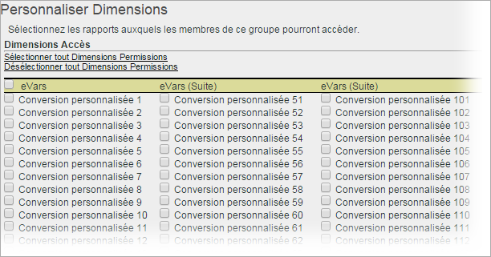

# Personnalisation des autorisations liées aux dimensions

>[!IMPORTANT]
>
>La gestion des utilisateurs et des produits aura dorénavant lieu dans [Admin Console](https://helpx.adobe.com/fr/enterprise/using/admin-console.html). Adobe vous avertira lorsqu’il sera temps de migrer les utilisateurs. Une fois tous les utilisateurs migrés, le contenu d’aide **[!UICONTROL Analytics]** > **[!UICONTROL Outils d’administration]** > **[!UICONTROL Gestion des utilisateurs]** sera retiré.

Personnalisez l’accès des utilisateurs à un niveau plus détaillé, y compris les eVars, les rapports de trafic, les rapports de solution et les rapports de cheminement.

**[!UICONTROL Gestion des utilisateurs]** > **[!UICONTROL Groupes]** > **[!UICONTROL Accès aux rapports]** > **[!UICONTROL Dimensions]** > **[!UICONTROL Personnaliser]**

>[!IMPORTANT]
>
>Certaines dimensions ne requièrent pas d’autorisation à l’heure actuelle. Il s’agit des dimensions suivantes : Longueur du signet mobile ; Numéro d’appareil mobile ; DRM mobile ; Services d’informations mobiles ; Java VM de mobile ; Mobile – Décoration de courrier ; Protocoles Net mobile ; SE Mobile ; Mobile – Presser pour parler.
>
>Ces dimensions sont disponibles pour tous les utilisateurs, quelles que soient les autres autorisations.

Les paramètres sur cette page se rapportent aux suites de rapports sélectionnées sur la page [!UICONTROL Définir un groupe d’utilisateurs].

Consultez les informations suivantes au sujet de la catégorie Dimension en ce qui a trait aux autorisations.

* Les eVars 1 à 250 sont autorisées individuellement.
* Tous les rapports sur le trafic sont des dimensions.
* Les rapports Vidéo et Mobile sont des dimensions, ainsi que d’autres rapports de solutions Analytics (Experience Manager, Advertising Cloud, Social, etc.).
* Les rapports de cheminement sont accessibles aux utilisateurs qui ont accès à la dimension parente.
* Toutes les dimensions et les mesures actuelles des groupes personnalisés ont été automatiquement transférées dans les nouvelles catégories. Si un groupe comprend des mesures actives, il obtiendra par défaut toutes les dimensions (eVars et reconnaissance du contenu) et mesures nouvellement autorisables.
* Droits d’accès de l’importateur de classifications (anciennement SAINT) : l’accès aux classifications est déterminé par l’accès à la [variable](https://docs.adobe.com/content/help/fr-FR/analytics/components/classifications/c-classifications.translate.html) sur laquelle repose la classification.

Pour plus d’informations, voir Modifications [des autorisations](https://docs.adobe.com/content/help/fr-FR/analytics/admin/user-product-management/user-management/permissions-changes.html)Utilisateur et Groupe.

**Personnalisation des dimensions**

Les éléments suivants sont des dimensions pour lesquelles vous pouvez accorder des autorisations.

<table id="table_F37D74A1619A4560A5F5651E855DAF1C"> 
 <thead> 
  <tr> 
   <th colname="col1" class="entry"> Élément </th> 
   <th colname="col2" class="entry"> Descriptions </th> 
  </tr> 
 </thead>
 <tbody> 
  <tr> 
   <td colname="col1"> 
 <a href="/help/admin/admin/conversion-var-admin/conversion-var-admin.md"> eVars </a> 
 </td> 
   <td colname="col2"> 
Les eVars 1 à 250 sont autorisées individuellement. Les eVars sont des variables de conversion personnalisées que vous utilisez pour segmenter les mesures de succès de conversion des segments dans les rapports personnalisés. 
 </td> 
  </tr> 
  <tr> 
   <td colname="col1"> 
 <a href="https://docs.adobe.com/content/help/fr-FR/analytics/implementation/vars/page-vars/evar.html"> Propriétés </a> 
 </td> 
   <td colname="col2"> 
Les props sont des variables de trafic personnalisées. 
 
Voir <a href="https://docs.adobe.com/content/help/fr-FR/analytics/implementation/vars/page-vars/evar.html">Props de trafic et eVars de conversion</a> dans la mise en œuvre Analytics. 
 </td> 
  </tr> 
  <tr> 
   <td colname="col1"> 
 <a href="https://docs.adobe.com/content/help/fr-FR/analytics/implementation/vars/page-vars/page-variables.html"> Hiérarchie </a> 
 </td> 
   <td colname="col2"> 
 La variable de hiérarchie (hierN) détermine l’emplacement d’une page dans la hiérarchie de votre site ou la structure d’une page. 
 </td> 
  </tr> 
  <tr> 
   <td colname="col1"> 
 <a href="https://docs.adobe.com/content/help/fr-FR/analytics/implementation/vars/page-vars/page-variables.html"> Listvar </a> 
 </td> 
   <td colname="col2"> 
 À l’instar de la fonction Propriétés de liste, les variables de liste permettent la définition de plusieurs valeurs dans une même demande d’image. 
 </td> 
  </tr> 
  <tr> 
   <td colname="col1"> 
Standard 
 </td> 
   <td colname="col2"> 
Se rapporte aux Dimensions standard (prêtes à l’emploi) dans Analytics. 
 </td> 
  </tr> 
  <tr> 
   <td colname="col1"> 
 <a href="https://helpx.adobe.com/fr/support/experience-manager.html"> AEM </a> 
 </td> 
   <td colname="col2"> 
Adobe Experience Manager 
 </td> 
  </tr> 
  <tr> 
   <td colname="col1"> 
 <a href="https://helpx.adobe.com/fr/support/advertising-cloud.html"> AMO </a> 
 </td> 
   <td colname="col2"> 
Adobe Advertising Cloud 
 </td> 
  </tr> 
  <tr> 
   <td colname="col1"> 
 <a href="https://docs.adobe.com/content/help/fr-FR/analytics/analyze/activity-map/activity-map.html">Activity Map </a> 
 </td> 
   <td colname="col2"> 
 Dimensions des rapports Activity Map : page d’Activity Map ; lien d’Activity Map ; région d’Activity Map ; lien d’Activity Map par région ; Activity Map XY 
 </td> 
  </tr> 
  <tr> 
   <td colname="col1"> 
 <a href="https://docs.adobe.com/content/help/fr-FR/media-analytics/using/media-overview.html"> Mobile </a> 
 </td> 
   <td colname="col2"> 
Adobe Mobile Services 
 </td> 
  </tr> 
  <tr> 
   <td colname="col1"> 
 Comscore 
 </td> 
   <td colname="col2"> 
Cette intégration de partenaire n’est plus active. 
 </td> 
  </tr> 
  <tr> 
   <td colname="col1"> 
 <a href="https://docs.adobe.com/content/help/fr-FR/media-analytics/using/media-overview.html"> Nielsen </a> 
 </td> 
   <td colname="col2"> 
Cette intégration de partenaire n’est plus active. 
 </td> 
  </tr> 
  <tr> 
   <td colname="col1"> 
 Social 
 </td> 
   <td colname="col2"> 
Inutilisé. 
 </td> 
  </tr> 
 </tbody> 
</table>
