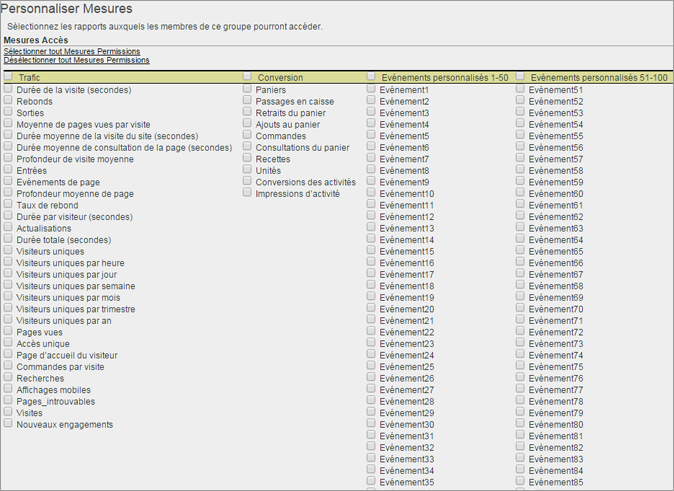

# Personnalisation des autorisations liées aux mesures

>[!IMPORTANT]
>
>La gestion des utilisateurs et des produits aura dorénavant lieu dans [Admin Console](https://helpx.adobe.com/fr/enterprise/using/admin-console.html). Adobe vous avertira lorsqu’il sera temps de migrer les utilisateurs. Une fois tous les utilisateurs migrés, le contenu d’aide **[!UICONTROL Analytics]** > **[!UICONTROL Outils d’administration]** > **[!UICONTROL Gestion des utilisateurs]** sera retiré.

Activez les autorisations pour les mesures de trafic, les mesures de conversion, les événements personnalisés, les événements de solution et la reconnaissance de contenu.

**[!UICONTROL Gestion des utilisateurs]** > **[!UICONTROL Groupes]** > **[!UICONTROL Accès aux rapports]** > **[!UICONTROL Mesures]** > **[!UICONTROL Personnaliser]**

Les paramètres sur la page Personnaliser Mesures s’appliquent aux suites de rapports sélectionnées sur la page [!UICONTROL Définition des groupes d’utilisateurs].

## Événements de solution

Outre les [événements personnalisés](https://marketing.adobe.com/resources/help/fr_FR/sc/implement/events.html), cette catégorie comprend des événements de solution Analytics, y compris Experience Manager (AEM), Advertising Cloud (AMO), Mobile, Vidéo et Social. Pour chaque groupe personnalisé qui comprend des mesures, tous les événements de solution Analytics sont ajoutés comme de nouvelles mesures.

Vous pouvez définir des autorisations pour les événements personnalisés et les événements de solution Analytics (AEM, AMO, Mobile, Vidéo et Social).

Pour chaque groupe personnalisé qui comprend des mesures, tous les événements de solution Analytics sont ajoutés comme de nouvelles mesures.

Pour plus d’informations sur les mesures utilisées dans Analytics, voir [Aperçu des mesures](/help/components/c-variables/c-metrics/metricslist.md).

## Reconnaissance du contenu

Grâce aux variables de la Reconnaissance du contenu, vous pouvez gérer les autorisations des mesures liées aux intégrations des solutions Experience Cloud. Vous pouvez gérer les autorisations de [!DNL Social], de [!DNL Mobile] ou des autres données qui ont été insérées au moyen d’une intégration à [!DNL Experience Cloud]. Elles seront activées par défaut.
