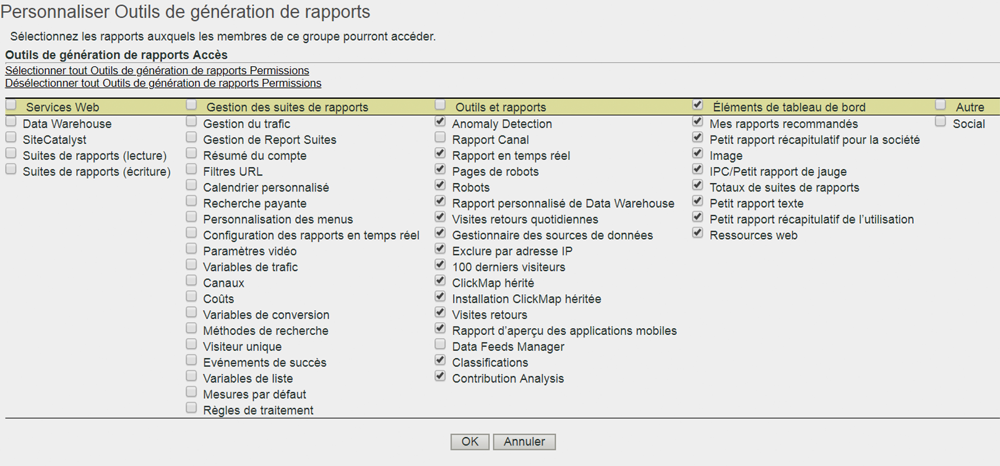

# Personnalisation des autorisations liées aux outils de suites de rapports

>[!IMPORTANT]
>
>La gestion des utilisateurs et des produits aura dorénavant lieu dans [Admin Console](https://helpx.adobe.com/fr/enterprise/using/admin-console.html). Adobe vous avertira lorsqu’il sera temps de migrer les utilisateurs. Une fois tous les utilisateurs migrés, le contenu d’aide **[!UICONTROL Analytics]** > **[!UICONTROL Outils d’administration]** > **[!UICONTROL Gestion des utilisateurs]** sera retiré.

Activez les autorisations d’utilisateurs pour l’accès aux API, la gestion des suites de rapports, les outils et les rapports, ainsi que les éléments de tableau de bord.

**[!UICONTROL Gestion des utilisateurs]** > **[!UICONTROL Groupes]** > **[!UICONTROL Accès aux rapports]** > **[!UICONTROL Outils de suites de rapports]** > **[!UICONTROL Personnaliser]**

La page [!UICONTROL Personnaliser Outils de génération de rapports] permet d’octroyer aux membres d’un groupe l’accès aux éléments ci-après.

## Descriptions des champs

Les paramètres sur cette page se rapportent aux suites de rapports sélectionnées sur la page [!UICONTROL Définir un groupe d’utilisateurs].

| Élément | Description |
|--- |--- |
| **Services web** |  |
| Avec ces paramètres, les utilisateurs peuvent invoquer la méthode de Data Warehouse et récupérer les paramètres des suites de rapports. |  |
| Data Warehouse | Permet à un utilisateur non-administrateur d’invoquer les méthodes de Data Warehouse au moyen de l’API des services web. Voir [Data Warehouse – Documentation à l’intention des développeurs](/help/export/data-warehouse/data-warehouse.md) |
| Suites de rapports (lecture) | Permet à un utilisateur non-administrateur d’appliquer les méthodes de suite de rapports dans l’API. |
| Suites de rapports (écriture) | Permet à un utilisateur non-administrateur d’appliquer les méthodes de suite de rapports dans l’API. |
| **Gestion des suites de rapports** |  |
| Ces paramètres donnent accès aux options de menu sous Administration > Suites de rapports > Modifier les paramètres ([Gestionnaire de suites de rapports](/help/admin/c-manage-report-suites/report-suites-admin.md)). |  |
| [Gestion du trafic](/help/admin/c-traffic-management/traffic-management.md) | Permet d’octroyer les autorisations liées à la gestion du trafic. |
| [Gestion des suites de rapports](/help/admin/c-manage-report-suites/report-suites-admin.md) | Permet d’octroyer des autorisations liées à la gestion des suites de rapports. |
| [Résumé du compte](/help/admin/admin/general-acct-settings-admin.md) | Permet d’octroyer des autorisations de modification des paramètres du compte pour une suite de rapports. |
| [Filtres URL](/help/admin/admin/internal-url-filter-admin.md) | Permet d’octroyer des autorisations liées aux filtres d’URL internes dans les suites de rapports. Les filtres d’URL internes servent à déterminer quels référents, ou pages référentes, sont internes à votre site. |
| [Calendrier personnalisé](/help/admin/admin/custom-calendar.md) | Permet d’octroyer l’autorisation de modifier le calendrier personnalisé. |
| [Recherche payante](https://marketing.adobe.com/resources/help/fr_FR/reference/paid_search_detection.html) | La détection de recherche payante fait la distinction entre les recherches payantes et les recherches naturelles dans les rapports Moteurs de recherche et Mots-clés de recherche. |
| [Personnalisation des menus](/help/admin/admin/customize-menus.md) | Personnalisez les menus de rapports que voient les utilisateurs dans les Reports &amp; Analytics. |
| [Configuration des rapports en temps réel](/help/admin/admin/realtime/t-realtime-admin.md) | Autorisations de configurer les rapports Analytics en temps réel. |
| [Paramètres vidéo](/help/admin/admin/video-management.md) | Autorisation de désigner une série de variables de conversion (eVars) et d’événements personnalisés à utiliser dans le suivi et l’établissement de rapports vidéo. |
| [Classifications des vidéos](https://marketing.adobe.com/resources/help/fr_FR/sc/appmeasurement/video/video_config.html) | Autorisation de désigner une série de variables de conversion (eVars) et d’événements personnalisés à utiliser dans le suivi et l’établissement de rapports vidéo. |
| [Variables de trafic](/help/admin/admin/c-traffic-variables/traffic-var.md) | Autorisation d’établir une corrélation entre des données personnalisées et des événements spécifiques liés au trafic. |
| [Classifications de trafic](/help/admin/admin/c-traffic-variables/traffic-classifications.md) | Consolidé en classifications (sous Outils et rapports). |
| [Canaux](https://marketing.adobe.com/resources/help/fr_FR/mchannel/index.html) | Autorisation d’accès aux paramètres de Canal marketing sous Gestionnaire de suites de rapports > Modifier les paramètres > Canaux marketing. |
| [Coûts](https://marketing.adobe.com/resources/help/fr_FR/mchannel/c_overview_budget.html) | Autorisation d’accès aux Canaux marketing > Coûts de canal marketing dans le Gestionnaire de suites de rapports. |
| [Variables de conversion](/help/admin/admin/conversion-var-admin/conversion-var-admin.md) | La variable de conversion Aperçu personnalisé (ou eVar) est placée dans le code Adobe sur les pages web sélectionnées de votre site. Son principal objectif est de segmenter les mesures de succès de conversion dans les rapports marketing personnalisés. |
| [Méthodes de recherche](/help/admin/admin/finding-methods.md) | Vous permet de déterminer de quelle façon sont renseignés divers rapports sur les méthodes de recherche relatifs aux événements de succès de conversion sur votre site. |
| [Classifications des conversions](/help/admin/admin/conversion-var-admin/conversion-classifications.md) | Consolidé en classifications (sous Outils et rapports). |
| [Visiteur unique](https://marketing.adobe.com/resources/help/fr_FR/reference/t_unique_visitor_variable.html) | Autorisation de spécifier la variable Visiteur unique. |
| [Événements de succès](https://marketing.adobe.com/resources/help/fr_FR/reference/success_event.html) | Actions qui peuvent être suivies (consultation de produits, passages en caisse et achats, notamment). |
| [Hiérarchies de classification](/help/components/c-classifications2/classification-hierarchies.md) | Consolidé en classifications (sous Outils et rapports). |
| [Variables de liste](https://marketing.adobe.com/resources/help/fr_FR/sc/implement/listN.html) | Connue également sous le nom de variable de liste. À l’instar de la fonction Propriétés de liste, les List Vars autorisent plusieurs valeurs dans la même demande d’image. |
| [Mesures par défaut](/help/admin/admin/default-metrics.md) | Les Reports &amp; Analytics affichent un ensemble de mesures par défaut dans tous les rapports de conversion, sauf si un utilisateur sélectionne un ensemble personnalisé. Les mesures sélectionnées s’affichent pour tous les utilisateurs de la suite de rapports associée. |
| [Règles de traitement](https://marketing.adobe.com/resources/help/fr_FR/sc/implement/ref-processing-rules.html) | Accorde l’accès aux règles de traitement, ce qui simplifie la collecte de données et la gestion du contenu lorsqu’il est envoyé aux rapports. |
| **Outils et rapports** |  |
| [Détection des anomalies](https://marketing.adobe.com/resources/help/fr_FR/analytics/analysis-workspace/anomaly_detection.html) | Autorisation d’accès au rapport Détection des anomalies, qui fournit une méthode statistique pour déterminer le degré de modification d’une mesure donnée par rapport à des données antérieures. |
| [Rapport Canal](https://marketing.adobe.com/resources/help/fr_FR/mchannel/index.html) | Autorisation d’accès aux rapports Canal marketing sous Rapports > Rapports Canal marketing. |
| [Rapport en temps réel](/help/admin/admin/realtime/t-realtime-admin.md) | Autorisation d’accès au rapport en temps réel. |
| [Pages de robots](/help/admin/admin/bot-removal/bot-rules.md) | Les règles de robots vous permettent de supprimer de votre suite de rapports le trafic généré par des araignées et des robots (bots) connus. La suppression du trafic de robots permet d’obtenir une mesure plus précise de l’activité des utilisateurs sur votre site web. |
| [Robots](/help/admin/admin/bot-removal/bot-rules.md) | Les règles de robots vous permettent de supprimer de votre suite de rapports le trafic généré par des araignées et des robots (bots) connus. La suppression du trafic de robots permet d’obtenir une mesure plus précise de l’activité des utilisateurs sur votre site web. |
| [Rapport personnalisé de Data Warehouse](/help/export/data-warehouse/data-warehouse.md) | Data Warehouse fait référence à la copie de données brutes non traitées pour les rapports de stockage et personnalisés, que vous pouvez exécuter en filtrant les données. Vous pouvez demander des rapports qui présentent un niveau avancé de relations entre les données brutes, en fonction de vos questions. |
| [Visites retours quotidiennes](/help/components/c-variables/dimensionslist/reports-daily-return-visits.md) | (Hérité) Ce rapport présente le nombre de visiteurs ayant fréquenté votre site plusieurs fois en une journée. Un jour est défini comme la période des dernières 24 heures. |
| [Gestionnaire des sources de données](/help/admin/admin/data-sources.md) | La fonction Sources de données vous permet d’importer des données dans Analytics à partir de sources hors ligne. |
| [Exclure par adresse IP](/help/admin/admin/exclude-ip.md) | Vous pouvez exclure de vos rapports les données d’adresses IP spécifiques (activités internes du site web, tests du site et utilisation par les employés, par exemple). |
| ClickMap hérité | Autorisation d’accès au menu de l’outil de superposition ClickMap hérité. |
| Installation ClickMap héritée | Autorisation d’installer l’outil hérité ClickMap. |
| [Visites retours](/help/components/c-variables/dimensionslist/reports-return-visits.md) | Rapport indiquant le nombre de visites lorsque cette valeur est supérieure à 1. Le rapport Visites récurrentes comprend les visiteurs sans cookies. |
| [Classifications Importer/Exporter](https://marketing.adobe.com/resources/help/fr_FR/reference/c_working_with_saint.html) et [créateur de règles](https://marketing.adobe.com/resources/help/fr_FR/reference/classification_rule_builder.html) | Consolidé en classifications (voir ci-dessous). |
| Gestionnaire des flux de données | Accorde des droits au Flux de données Analytics. |
| Classifications | Combine les autorisations suivantes : Classifications de trafic, Classifications des vidéos, Classifications des conversions, Hiérarchies de classification, Gestionnaire de classifications et Classifications Importer/Exporter et créateur de règles.  Remarque : grâce à cette autorisation, les utilisateurs peuvent modifier les classifications pour toutes les suites de rapports, pas seulement celles sélectionnées. |
| [Analyse des contributions](https://marketing.adobe.com/resources/help/fr_FR/analytics/analysis-workspace/contribution-analysis.html) | Accorde les droits d’utilisation de l’analyse des contributions dans Analysis Workspace. |
| **Éléments de tableau de bord** |  |
| Les paramètres des éléments du tableau de bord permettent d’accéder aux [petits rapports](https://marketing.adobe.com/resources/help/fr_FR/sc/user/dashboard.html) dans Reports &amp; Analytics : Mes rapports recommandés, Petit rapport récapitulatif pour la société, Image, IPC/Petit rapport de jauge, Totaux des suites de rapports, Texte, Petit rapport, Petit rapport récapitulatif de l’utilisation et Ressources web. |  |
| **Autre** |  |
| Social | Contrôle l’accès au menu Gestion des réseaux sociaux dans le Gestionnaire de suites de rapports. |
