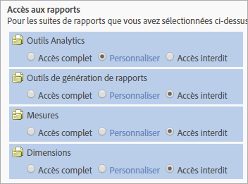
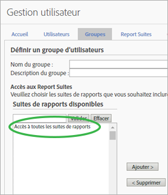

# Modifications des autorisations d’utilisateur et des droits d’accès de groupe

>[!IMPORTANT]
>
>La gestion des utilisateurs et des produits aura dorénavant lieu dans [Admin Console](https://helpx.adobe.com/enterprise/using/admin-console.html). Adobe vous avertira lorsqu’il sera temps de migrer les utilisateurs. Une fois tous les utilisateurs migrés, le contenu d’aide **[!UICONTROL Analytics]** &gt; **[!UICONTROL Outils d’administration]** &gt; **[!UICONTROL Gestion des utilisateurs]** sera retiré.

## Qu’est-ce qui a changé ? {#section_2C205DE94155441B9E9D3E4C46CCF2EE}

**[!UICONTROL Admin]** &gt; **[!UICONTROL Gestion des utilisateurs]** &gt; **[!UICONTROL Groupes]**.

> [!NOTE] En raison du nombre élevé de combinaisons d’autorisations possibles disponibles, nous ne pouvons pas fournir une documentation décrivant toutes les méthodes d’API pouvant être utilisées pour chaque combinaison d’autorisations. En général, les non-administrateurs qui se voient accorder un accès aux services web ne disposent que d’un accès en lecture seule aux méthodes d’API. Ils ne disposeront pas d’un accès en écriture aux méthodes.

Comme l’API et l’interface utilisent le même système d’autorisation, quelles que soit les autorisations qu’un administrateur de l’interface (Adobe Admin Console) a accordées à un particulier non-administrateur, il s’agira des mêmes autorisations que celles dont l’utilisateur dispose dans l’API.

<table id="table_D1DB0DE37752450BBCCA44DB760BB505"> 
 <thead> 
  <tr> 
   <th colname="col1" class="entry"> Amélioration </th> 
   <th colname="col2" class="entry"> Description </th> 
  </tr> 
 </thead>
 <tbody> 
  <tr> 
   <td colname="col1"> 
Changements apportés à l’accès aux rapports (personnalisation des groupes) 
 </td> 
   <td colname="col2"> 
  Ajouter un nouveau groupe &gt;  Accès aux rapports 
 
La section  Accès aux rapports de la page  Définir un groupe d’utilisateurs a été réduite à quatre catégories, qui vous permettent de personnaliser les droits d’accès à un niveau détaillé. 
 
 </img> 
 
Les options qui figuraient auparavant dans : 
 
    <ul id="ul_16D5EF18D57D4608AEEDEC40D90D8828"> 
     <li id="li_F29E84C6228A464C8807F09205AEAAC6"> 
 <a href="/help/admin/user-management2/c-customize-report-access/groups-analytics-tools.md"> Outils Analytics</a> : activez les autorisations d’utilisateurs pour les éléments généraux (facturation, journaux, etc.), la gestion des entreprises, l’accès au service web, le Report Builder et l’intégration des Data Connectors. 
 
 <b>Remarque :</b> les paramètres d’entreprise de la catégorie de personnalisation d’Admin Console ont été déplacés dans les outils Analytics. 
 </li> 
     <li id="li_A6EB788162A2455E94CE54B9279A854D"> 
 <a href="/help/admin/user-management2/c-customize-report-access/groups-report-suite-tools.md"> Outils de génération de rapports</a> : autorisations d’accès des utilisateurs aux services web, à la gestion des suites de rapports, aux outils et aux rapports et aux éléments de tableau de bord. 
 </li> 
     <li id="li_EDB0255E009B4F1CAFAF53966B41363C"> 
 <a href="/help/admin/user-management2/c-customize-report-access/groups-metrics.md"> Mesures</a> : activez les autorisations pour les événements personnalisés, de trafic, de conversion, de solution, la reconnaissance de contenu, etc. 
 </li> 
     <li id="li_8DAE87D1DEF54803A9C6FE31C01F0FB0"> 
 <a href="/help/admin/user-management2/c-customize-report-access/groups-dimensions.md"> Dimensions</a> : personnalisez l’accès des utilisateurs à un niveau plus détaillé, y compris les eVars, les rapports de trafic, les rapports de solution et les rapports de cheminement. 
 </li> 
    </ul> 
Vous pouvez par exemple créer un groupe ayant accès à plusieurs outils Analytics ( Analysis Workspace,  Reports &amp; Analytics et  Report Builder), avec autorisation d’accès à des mesures et dimensions spécifiques (y compris les eVars) et des fonctionnalités telles que la création de segments ou de mesures calculées. 
 </td> 
  </tr> 
  <tr> 
   <td colname="col1"> 
Changements apportés aux groupes prédéfinis 
 </td> 
   <td colname="col2"> 
 <b>Accès des administrateurs :</b> les groupes prédéfinis ne sont plus requis pour les administrateurs. Ces derniers ont maintenant accès à tous les éléments (outils, dimensions et mesures), ainsi qu’aux services web, au Report Builder, à Activity Map et aux Ad Hoc Analysis. 
 
Dorénavant, ces groupes permettent d’octroyer ou de restreindre l’accès des utilisateurs non-administrateurs. 
 
 <b>Groupes personnalisés :</b> les groupes personnalisés remplacent les groupes prédéfinis. Les groupes prédéfinis existants seront migrés dans des groupes personnalisés du même nom. Tous les groupes personnalisés que vous avez créés seront préservés avec leurs paramètres. Toutefois, les paramètres ont été déplacés. Par exemple, les paramètres de la société (sous Personnaliser l’Admin Console) se trouvent maintenant sous <a href="/help/admin/user-management2/c-customize-report-access/groups-analytics-tools.md"> Personnaliser les outils Analytics</a>. 
 
 Les utilisateurs appartenant à  Accès à tous les rapports ont été migrés dans un groupe personnalisé ayant accès aux éléments suivants : 
 
    <ul id="ul_696A9243F5FD4AF187352C2F4B1CFDC2"> 
     <li id="li_683A0A3BB7214CFFBC61D5A4CD237F48">Toutes les dimensions </li> 
     <li id="li_D8FDBF6A32224731AB706315DEA0A03E">Toutes les mesures </li> 
     <li id="li_65ABE5C95D43444D88E63EE95C9AED05">Toutes les suites de rapports </li> 
     <li id="li_7ED1505590144B38B3B9851BAA6BBB49">Rapport Canal </li> 
     <li id="li_F718FE1FCF9A4B05AB933CA3F105F3EC">Rapport Détection des anomalies </li> 
     <li id="li_527BD52007E846FE8B5F71AB3C12F695">Rapport Temps réel </li> 
     <li id="li_AFFB58C7FB644AC8A85E2D76BA7D51F5">Accès à Analysis Workspace </li> 
    </ul> 
Les administrateurs peuvent supprimer des groupes personnalisés et créer leurs propres groupes, puisque tous les paramètres qui étaient auparavant disponibles dans les groupes prédéfinis peuvent maintenant être personnalisés dans les paramètres  Accès aux rapports sur la page <a href="/help/admin/user-management2/c-user-groups/groups.md">Définition des groupes d’utilisateurs</a>. 
 </td> 
  </tr> 
  <tr> 
   <td colname="col1"> 
Autorisations au niveau des dimensions 
 </td> 
   <td colname="col2"> 
Vous pouvez personnaliser les autorisations afin d’inclure ou d’exclure l’accès aux dimensions (outre les mesures). 
 
    <ul id="ul_DA5A54223673474E9151AF979DA50659"> 
     <li id="li_C3E82F7BC07A4F2F83A85D3D511292CC"> 
Toutes les dimensions et les mesures actuelles des groupes personnalisés ont été automatiquement transférées dans les nouvelles catégories. Si un groupe comprend des mesures actives, il obtiendra par défaut toutes les dimensions (eVars et reconnaissance du contenu) et mesures nouvellement autorisables. 
 </li> 
     <li id="li_CC56F9181CC14AB59318628E72F2E8C9"> Droits d’accès de l’importateur de classifications (anciennement SAINT) : l’accès aux classifications est déterminé par l’accès à la <a href="https://marketing.adobe.com/resources/help/en_US/reference/c_classifications.html"> variable</a> sur laquelle repose la classification. </li> 
    </ul> 
Voir <a href="/help/admin/user-management2/c-customize-report-access/groups-dimensions.md"> Personnalisation des autorisations liées aux dimensions</a>. 
 </td> 
  </tr> 
  <tr> 
   <td colname="col1"> 
Admin Console 
 </td> 
   <td colname="col2"> 
Recommandé uniquement pour les nouveaux clients ou les clients dont les entreprises sont <a href="https://marketing.adobe.com/resources/help/en_US/mcloud/core_services.html">configurées dans Experience Cloud</a>. Pour les clients Analytics actuels, une migration est prévue vers le système de gestion des identités d’Experience Cloud. 
 
Pour plus d’informations, voir <a href="https://helpx.adobe.com/enterprise/using/manage-permissions-and-roles.html"> Gestion des autorisations de produit dans Admin Console</a>. 
 </td> 
  </tr> 
 </tbody> 
</table>

## Questions fréquentes à propos des changements des autorisations {#section_02809EFC95054B40A089E6C6E4FACA13}

Vous trouverez ci-dessous d’importantes nouvelles informations relatives aux mises à jour nouvelles et planifiées et à leurs répercussions sur l’environnement d’administration.

<table id="table_1E93F45C66E841E6882FB602509F30A3"> 
 <thead> 
  <tr> 
   <th colname="col1" class="entry"> Question </th> 
   <th colname="col2" class="entry"> Réponse </th> 
  </tr> 
 </thead>
 <tbody> 
  <tr> 
   <td colname="col1">Quelles modifications ont été apportées aux autorisations dans la version de <b>juillet 2016</b> ? </td> 
   <td colname="col2"> 
 <b>Accès à toutes les suites de rapports</b> 
 
Lors de l’ajout de suites de rapports dans un groupe, vous pouvez activer l’option  Accès à toutes les suites de rapports. Ce paramètre applique les autorisations du groupe à toutes les suites de rapports actuelles et futures. 
 
Pour activer cette fonction, sélectionnez  Gestion utilisateur &gt;  Groupes &gt;  Ajouter un nouveau groupe d’utilisateurs, puis  Accès à toutes les suites de rapports. 
 
 
 </td> 
  </tr> 
  <tr> 
   <td colname="col1"> 
Pour gérer les utilisateurs, dois-je utiliser Admin Console ou le module de Gestion utilisateur d’Analytics actuel ? 
 </td> 
   <td colname="col2"> 
Les modifications apportées à Analytics &gt; Admin &gt; Gestion des utilisateurs n’ont pas été reproduites dans Admin Console. Par conséquent, seuls les nouveaux clients qui utilisent déjà Admin Console pour la gestion des utilisateurs et des groupes doivent continuer à le faire. Une migration de la gestion des groupes d’Analytics vers Admin Console est prévue ultérieurement. 
 </td> 
  </tr> 
  <tr> 
   <td colname="col1"> 
Quelles modifications ont été apportées aux autorisations dans la version d’<b>octobre 2016</b> ? 
 </td> 
   <td colname="col2"> 
Les améliorations suivantes apportées à l’interface  Outils d’administration actuelle sont disponibles : 
 
 
     <ul id="ul_2A31E8DC17A94B7FABDBA9C87C3947EF"> 
      <li id="li_AE2ECCA01CC64D30B109BE74379EE474">Modifications des autorisations telles que décrites dans la section <a href="/help/admin/user-management2/c-user-management/permissions-changes.md"> Changements administratifs – Automne 2016</a>. </li> 
      <li id="li_33CB2B6A2E5F45BE97CC5E0983AF280E">Retrait des rapports sur le trafic obsolètes qui ne figuraient plus dans le menu. </li> 
      <li id="li_57234CF27E1D405987DE89312CD62C52">Autorisations d’accès aux classifications : l’accès aux classifications dépendra de l’accès à la variable correspondante. </li> 
     </ul> 
 </td> 
  </tr> 
  <tr> 
   <td colname="col1"> 
Que dois-je faire pour migrer les utilisateurs ? 
 </td> 
   <td colname="col2"> 
Vous n’avez rien à faire. Toutes les migrations d’autorisations se dérouleront de manière transparente. 
 
 
     <ul id="ul_654F85286EC04416B3E0BA725EBE10AD"> 
      <li id="li_8050B8941F794103B82A0ADF0930D216">Tous les rapports actuels sur le trafic dans un groupe personnalisé seront automatiquement migrés dans la nouvelle catégorie Dimension. </li> 
      <li id="li_B97079DB29A346B98D066F11AB7F94AF">Si des mesures sont activées pour un groupe personnalisé, celui-ci se voit automatiquement attribuer toutes les dimensions qui peuvent nouvellement faire l’objet d’autorisations (eVars et variables de solution). </li> 
      <li id="li_F1219EF490DA473BA15F2B215F2995AE"> Un groupe personnalisé accompagné d’une mesure au moins se verra automatiquement octroyer l’accès à toutes les eVars et autres dimensions reconnaissant le contenu, <b>à l’exception</b> des nouvelles dimensions de trafic disponibles (anciennement les rapports sur le trafic). </li> 
      <li id="li_F494CE6144A04A6199CFBBA1D7BEA32B">Chaque groupe prédéfini sera modifié dans une autorisation. Ces nouvelles autorisations seront ajoutées à une nouvelle catégorie intitulée  Outils Analytics. </li> 
      <li id="li_2FCD9254FC3C4FD7871EEF9453E5CE1E">Pour chaque groupe personnalisé qui comprend des mesures, tous les événements de solution Analytics sont ajoutés comme de nouvelles mesures. </li> 
      <li id="li_34C4560769B64F28A4E83BAE71065DCC">Chaque utilisateur qui était membre du groupe Accès à tous les rapports sera ajouté au nouveau groupe personnalisé. Le groupe Accès à tous les rapports n’existera plus. </li> 
     </ul> 
 </td> 
  </tr> 
  <tr> 
   <td colname="col1"> 
Qu’est-ce qui ne change pas ? 
 </td> 
   <td colname="col2"> 
Les Attributs des visiteurs ne peuvent toujours pas être autorisés. 
 </td> 
  </tr> 
 </tbody> 
</table>

## Référence rapide à propos des autorisations {#section_A3FDD8259F524B21A5489833533D1B28}

Le tableau suivant répertorie les tâches et où elles peuvent avoir lieu (selon l’état de l’entreprise).

> [!NOTE] Un *`migrated user`* et un *`Experience Cloud user`* se rapportent aux utilisateurs qui ont accepté une invitation par courrier électronique à rejoindre Experience Cloud. S’ils n’acceptent pas l’invitation par courrier électronique, ils restent des utilisateurs Analytics et il n’est pas possible de les gérer dans Admin Console (sauf si la migration utilise des [Entreprise ID ou Federated ID](https://helpx.adobe.com/enterprise/using/set-up-identity.html), auquel cas l’utilisateur est migré quand l’administrateur migre les utilisateurs au cas par cas).

<table id="table_B68FD00FC5D24823A86BB69558C0327C"> 
 <thead> 
  <tr> 
   <th colname="col1" class="entry"> Tâche </th> 
   <th colname="col2" class="entry"> Société utilisée pour la connexion qui ne migre pas </th> 
   <th colname="col3" class="entry"> Société en cours de migration </th> 
   <th colname="col4" class="entry"> Société utilisée pour la connexion pour laquelle la migration est finie </th> 
  </tr> 
 </thead>
 <tbody> 
  <tr> 
   <td colname="col1"> Créer un utilisateur </td> 
   <td colname="col2"> 
Admin Console (le fait de créer un utilisateur et de l’ajouter à une <a href="https://marketing.adobe.com/resources/help/en_US/mcloud/admin_getting_started.html"> configuration de produit</a> Analytics crée également un compte d’utilisateur dans Analytics). 
 
 <a href="/help/admin/user-management2/c-user-management/t-add-user-account.md"> Outils d’administration</a> 
 </td> 
   <td colname="col3"> 
 <a href="https://adminconsole.adobe.com/enterprise/"> Admin Console</a> 
 </td> 
   <td colname="col4"> 
 <a href="https://adminconsole.adobe.com/enterprise/"> Admin Console</a> 
 </td> 
  </tr> 
  <tr> 
   <td colname="col1"> Modifier un utilisateur </td> 
   <td colname="col2"> 
 <a href="/help/admin/user-management2/c-user-management/t-add-user-account.md"> Outils d’administration</a> 
 </td> 
   <td colname="col3"> 
 <a href="https://adminconsole.adobe.com/enterprise/"> Admin Console</a> 
 
 Outils d’administration – La modification dans les outils d’administration des utilisateurs migrés se limite à la gestion des clés API, ainsi qu’à la suppression et au transfert des ressources. 
 </td> 
   <td colname="col4"> 
 <a href="https://adminconsole.adobe.com/enterprise/"> Admin Console</a> 
 
 Outils d’administration – La modification se limite à la gestion des clés API, ainsi qu’à la suppression et au transfert des ressources. 
 </td> 
  </tr> 
  <tr> 
   <td colname="col1"> Supprimer un utilisateur </td> 
   <td colname="col2"> 
Admin Console – Pour les utilisateurs d’Experience Cloud. 
 
Outils d’administration – Pour tous les utilisateurs, sauf les utilisateurs d’Experience Cloud, supprime seulement l’utilisateur Analytics mappé et non le compte Experience Cloud. 
 </td> 
   <td colname="col3"> 
Admin Console – Pour les utilisateurs migrés. 
 
Outils d’administration – Uniquement pour les utilisateurs d’Analytics. 
 </td> 
   <td colname="col4"> 
Admin Console 
 
 Outils d’administration – Après avoir supprimé un utilisateur d’Experience Cloud ou dissocié son compte dans Admin Console, vous pouvez supprimer le compte Analytics des outils d’administration. 
 </td> 
  </tr> 
  <tr> 
   <td colname="col1"> Connexion à Analytics </td> 
   <td colname="col2"> 
 <b>Experience Cloud : </b>  marketing.adobe.com. Pour les utilisateurs d’Experience Cloud seulement. 
 
 <b>Analytics (hérité) :</b>  sc.omniture.com. Pour les utilisateurs d’Analytics seulement, ainsi que pour les utilisateurs d’Experience Cloud avec leurs informations d’identification Analytics. 
 </td> 
   <td colname="col3"> 
 marketing.adobe.com – Seulement pour les utilisateurs d’Experience Cloud. 
 
  sc.omniture.com – Pour les utilisateurs d’Analytics seulement, ainsi que pour les utilisateurs d’Experience Cloud avec leurs informations d’identification Analytics. 
 
Durant la migration, les administrateurs peuvent désactiver la capacité de connexion  omniture.com pour certains utilisateurs. 
 </td> 
   <td colname="col4"> 
Admin Console 
 </td> 
  </tr> 
  <tr> 
   <td colname="col1"> Créer un groupe </td> 
   <td colname="col2"> 
Admin Console – Quand un groupe est créé dans Admin Console, un groupe mappé dans Analytics apparaîtra dans les outils d’administration, mais il n’est pas possible de modifier son nom dans les outils d’administration ni de le supprimer. 
 
Outils d’administration. 
 </td> 
   <td colname="col3"> 
Admin Console (<a href="https://marketing.adobe.com/resources/help/en_US/mcloud/admin_getting_started.html">créer la configuration du produit </a>) 
 </td> 
   <td colname="col4"> 
Admin Console (<a href="https://marketing.adobe.com/resources/help/en_US/mcloud/admin_getting_started.html">créer la configuration du produit </a>) 
 </td> 
  </tr> 
  <tr> 
   <td colname="col1"> Modifier les utilisateurs d’un groupe </td> 
   <td colname="col2"> 
Admin Console – Uniquement pour les utilisateurs d’Experience Cloud 
 
Outils d’administration – Pour les utilisateurs d’Analytics seulement et pour les utilisateurs d’Experience Cloud, membres de groupes qui peuvent être modifiés dans les outils d’administration. Si, toutefois, un utilisateur d’Experience Cloud fait partie d’un groupe dans Admin Console, il ne peut pas être supprimé du groupe dans les outils d’administration. 
 </td> 
   <td colname="col3"> 
Admin Console – Uniquement pour les utilisateurs d’Experience Cloud 
 
 Outils d’administration – Il est toujours possible d’ajouter ou de supprimer les identifiants de connexion Analytics seulement des groupes dans les outils d’administration. 
 </td> 
   <td colname="col4"> 
Admin Console 
 </td> 
  </tr> 
  <tr> 
   <td colname="col1"> Modifier les autorisations d’un groupe </td> 
   <td colname="col2"> 
Admin Console – Vous ne pouvez modifier que les groupes créés dans Admin Console. 
 
Outils d’administration – Vous pouvez modifier les autorisations de n’importe quel groupe. 
 </td> 
   <td colname="col3"> 
Admin Console 
 </td> 
   <td colname="col4"> 
Admin Console 
 </td> 
  </tr> 
  <tr> 
   <td colname="col1"> Supprimer le groupe </td> 
   <td colname="col2"> 
Admin Console : vous ne pouvez supprimer que les groupes créés dans Admin Console. 
 
Outils d’administration – Vous pouvez supprimer uniquement les groupes créés dans les outils d’administration. 
 </td> 
   <td colname="col3"> 
Admin Console 
 </td> 
   <td colname="col4"> 
Admin Console 
 </td> 
  </tr> 
  <tr> 
   <td colname="col1"> Modifier le statut d’administrateur d’un utilisateur </td> 
   <td colname="col2"> 
Admin Console – Uniquement pour les utilisateurs d’Experience Cloud. 
 
Outils d’administration 
 </td> 
   <td colname="col3"> 
Admin Console – Uniquement pour les utilisateurs d’Experience Cloud. 
 
Outils d’administration – Uniquement pour les utilisateurs d’Analytics. 
 </td> 
   <td colname="col4"> 
Admin Console 
 </td> 
  </tr> 
 </tbody> 
</table>
