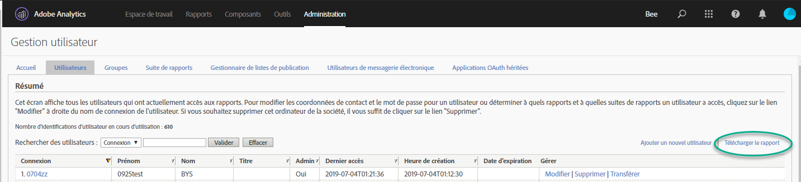
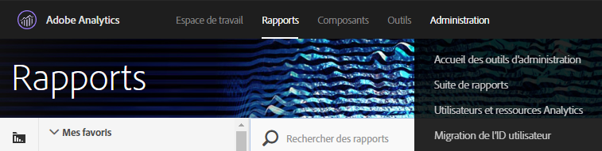
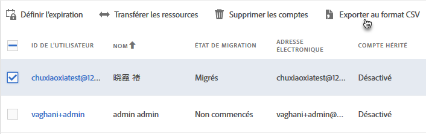
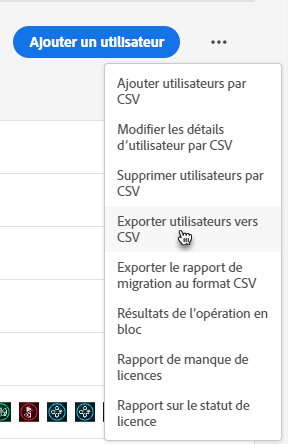
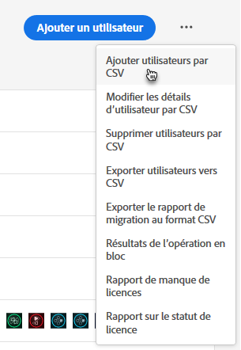
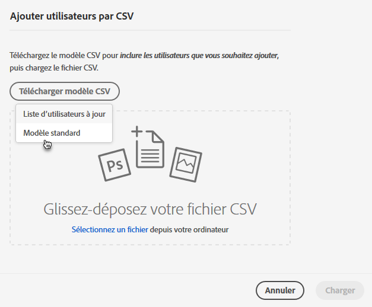
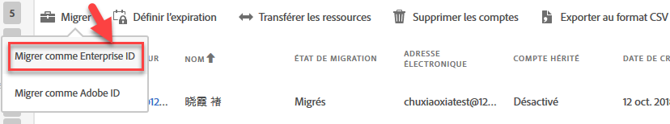

# Migration de comptes utilisateurs Analytics sous la forme d’Enterprise ID et de Federated ID{#migrate-analytics-user-accounts-for-enterprise-and-federated-ids}

Comment migrer des comptes utilisateurs Analytics sous la forme d’Enterprise ID et de Federated ID vers l’Admin Console.

## Conditions préalables {#prereqs}

Conditions préalables à la gestion des utilisateurs dans l’Admin Console.

Pour les nouveaux domaines et les nouveaux répertoires, suivez les étapes afin de :

* Configurer un répertoire
* Configurer des domaines
* Lier des domaines à des répertoires

Voir [Configurer un système d’identités](https://helpx.adobe.com/enterprise/using/set-up-identity.html) pour obtenir de l’aide.

Lorsqu’un répertoire a déjà été créé dans une autre organisation par une autre unité ou équipe commerciale, suivez les étapes décrites dans [Configuration d’identité](https://helpx.adobe.com/enterprise/using/set-up-identity.html#Directorytrusting) afin d’établir le répertoire dans l’organisation que vous utilisez pour Analytics.

## Migration de comptes utilisateurs sous la forme d’Enterprise ID et de Federated ID {#task-0cfb3e4400fd4ab58e4d9704528b05fa}

Lors de cette procédure vous serez amené à :

* Download a user login list from **[!UICONTROL Analytics]** &gt; **[!UICONTROL Analytics Users &amp; Assets]**.

* Download a current users list from the **[!UICONTROL Admin Console]** &gt; **[!UICONTROL Users]**.

* Comparer les listes (rechercher les doublons afin d’éviter d’écraser des données de compte dans l’Admin Console).
* Upload a finished [!DNL .csv] (from **[!UICONTROL Admin Console]** &gt; **[!UICONTROL Users]**) with Enterprise ID or Federated ID users to the Admin Console.

Si vous devez migrer des comptes utilisateurs Adobe ID déjà existants vers un Enterprise ID ou un Federated ID, contactez l’Assistance clientèle d’Adobe et demandez le [changement d’identité d’utilisateurs en bloc](https://helpx.adobe.com/enterprise/using/bulk-operations.html).

**Pour migrer des comptes utilisateurs**

1. Téléchargez le fichier de comptes utilisateurs Analytics ([!DNL User Logins List.tab]) dans la gestion des utilisateurs d’Analytics, en employant une des méthodes suivantes (selon si vous avez, ou pas, déjà migré certains utilisateurs). 
   1. *Avant la migration,* accédez à **[!UICONTROL Admin]** &gt; Gestion des **[!UICONTROL utilisateurs (hérité)]** &gt; **[!UICONTROL Modifier les utilisateurs]**, puis cliquez sur Télécharger le rapport.****

      

      Le lien de téléchargement du rapport n’est visible que pour les clients n’ayant pas encore migré d’utilisateurs.

   1. *Si vous avez déjà migré des utilisateurs,* accédez à **[!UICONTROL Analytics]** &gt; Utilisateurs **[!UICONTROL Analytics et Ressources]**.

      

   1. On the [!DNL Users] page, select users, then click **[!UICONTROL Export to CSV]**.

      

   1. Open the downloaded [!DNL User List.csv] file in Excel.

      Soyez prêt à copier les valeurs *`Email`*, *`First Name`* et *`Last Name`* dans un [!DNL sample.csv] fichier (décrit à l’étape suivante).

      >[!IMPORTANT]
      >
      >Les valeurs du fichier CSV doivent être délimitées par des virgules.

      **Conseil** : Lors de cette étape, Adobe recommande d’écrémer votre liste d’utilisateurs pour vous assurer que seuls ceux possédant un ID de message électronique valide soient inclus dans la migration sous la forme d’Enterprise ID ou de Federated ID.

1. Téléchargez la liste des utilisateurs dans l’Admin Console : 

   1. Navigate to [Admin Console](http://adminconsole.adobe.html/#) &gt; **[!UICONTROL Users]**, then click [Export users list to CSV](https://helpx.adobe.com/enterprise/using/users.html).

      

   1. Compare the two files: the existing Admin Console users in the exported [!DNL .csv] file ( [!DNL sample.csv], in this example) with the users in the Analytics [!DNL User Logins List.csv] file.

      >[!IMPORTANT]
      >
      >If you find duplicates, delete them from the Analytics [!DNL User Logins List.csv] file. Cette étape permet de prévenir l’écrasement d’autorisations utilisateurs d’Experience Cloud dans l’Admin Console et d’obtenir la liste des comptes à migrer.

1. Téléchargez un modèle de fichier CSV depuis l’Admin Console :
   1. On the Users tab, click **[!UICONTROL Add users by CSV]**, then **[!UICONTROL Download CSV Template]**.

      

   1. Choose **[!UICONTROL Standard Template]**.

      Lors de cette étape, un fichier modèle [!DNL sample.csv] se télécharge.

      

1. Copiez les valeurs *`Email`*, *`First Name`* et *`Last Name`* des colonnes de [!DNL User Logins List.tab] [!DNL sample.csv] dans les colonnes correspondantes du modèle.

   **Exemple de fichier modèle**

   

1. Dans le modèle ([!DNL sample.csv]), remplissez les champs requis suivants : 

<table id="table_1B5EEFDB5BD8436EB760BE5FFAB1CF02"> 
 <thead> 
  <tr> 
   <th colname="col1" class="entry"> Champ </th> 
   <th colname="col2" class="entry"> Description </th> 
  </tr>
 </thead>
 <tbody> 
  <tr> 
   <td colname="col1"> 
Courrier électronique 
 </td> 
   <td colname="col2"> 
Copié depuis User Logins List.tab. 
 </td> 
  </tr> 
  <tr> 
   <td colname="col1"> 
Prénom 
 </td> 
   <td colname="col2"> 
Copié depuis User Logins List.tab. 
 </td> 
  </tr> 
  <tr> 
   <td colname="col1"> 
Nom 
 </td> 
   <td colname="col2"> 
Copié depuis User Logins List.tab. 
 </td> 
  </tr> 
  <tr> 
   <td colname="col1"> 
Type d’identité 
 </td> 
   <td colname="col2"> 
 Federated ID ou Enterprise ID . 
 </td> 
  </tr> 
  <tr> 
   <td colname="col1"> 
Domaine 
 </td> 
   <td colname="col2"> 
Assurez-vous que les domaines dans les colonnes Les colonnes  Domaine et  Courriel correspondent au(x) domaine(s) défini(s) dans les <a href="/help/admin/user-management2/user-migration/c-migration-tool/migrate-enterprise.md#prereqs" format="dita" scope="local"> conditions préalables</a>. 
 </td> 
  </tr> 
  <tr> 
   <td colname="col1"> 
Code de pays 
 </td> 
   <td colname="col2"> </td> 
  </tr> 
 </tbody> 
</table>

For more information about the fields in the [!DNL .csv] file, see [CSV file format](https://helpx.adobe.com/enterprise/using/users.html).

>[!NOTE]
>
>D’autres colonnes, telles que *`Product Configurations`* et *`Admin Roles`* peuvent être vides.

1. On the Users tab in the Admin Console, upload the template file by clicking **[!UICONTROL Add users by CSV]** (as shown in Step 3.).
1. Dans Analytics, exécutez l’outil de migration (comme décrit dans [Migration des comptes](/help/admin/user-management2/user-migration/c-migration-tool/t-migrate-users.md)utilisateur Analytics).
1. Click **[!UICONTROL Migrate]** &gt; **[!UICONTROL Migrate as Enterprise IDs]**.

   

   When you click **[!UICONTROL Migrate]**, user are linked to the Enterprise ID/Federated ID account in Admin Console. The permissions of the legacy user account in Analytics will match the permissions granted to the Enterprise/Federated ID login in **[!UICONTROL Admin Console]** &gt; **[!UICONTROL Analytics]** &gt; **[!UICONTROL Product Profiles]**. L’ID utilisateur s’affiche dans la section Migration terminée. Désactivez l’accès à [!DNL my.omniture.com] des comptes hérités.

   After migrating users, the status under the Migration Status column changes from *`Not Initiated`* to *`Migrated`*.

   Les utilisateurs d’Adobe ID qui apparaissent dans l’outil de migration peuvent également être migrés durant ce processus. Ils devront continuer à s’identifier à l’aide de leur Adobe ID jusqu’à ce qu’un changement d’identité soit effectué. Contactez l’assistance clientèle d’Adobe pour obtenir de l’aide sur le changement d’identité.
