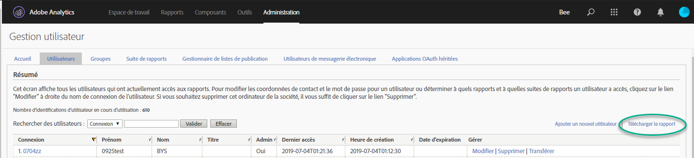
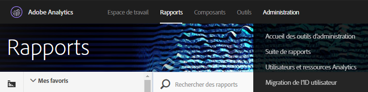
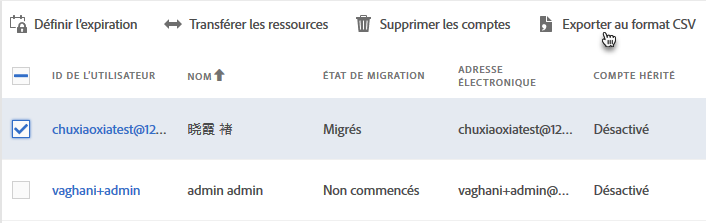
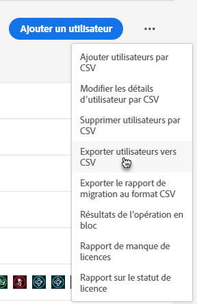
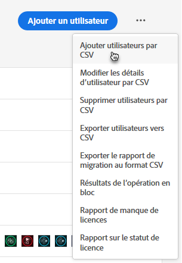
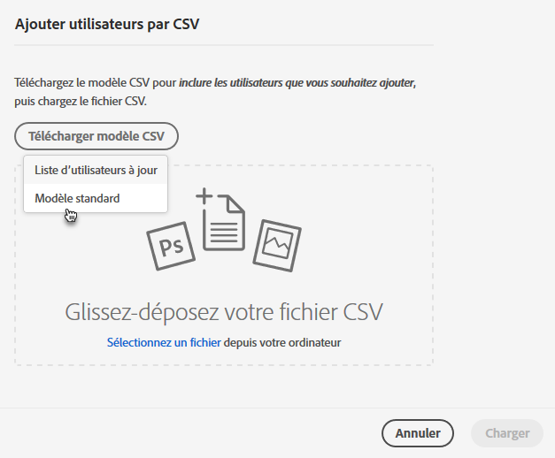
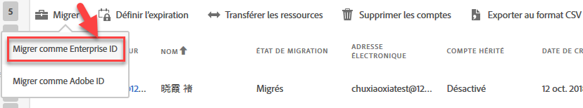

# Migration de comptes utilisateurs Analytics sous la forme d’Enterprise ID et de Federated ID {#migrate-analytics-user-accounts-for-enterprise-and-federated-ids}

Comment migrer des comptes utilisateurs Analytics sous la forme d’Enterprise ID et de Federated ID vers l’Admin Console.

## Conditions préalables {#prereqs}

Conditions préalables à la gestion des utilisateurs dans l’Admin Console.

Pour les nouveaux domaines et les nouveaux répertoires, suivez les étapes afin de :

* Configurer un répertoire
* Configurer des domaines
* Lier des domaines à des répertoires

Voir [Configurer un système d’identités](https://helpx.adobe.com/enterprise/using/set-up-identity.html) pour obtenir de l’aide.

Lorsqu’un répertoire a déjà été créé dans une autre organisation par une autre unité ou équipe commerciale, suivez les étapes décrites dans [Configuration d’identité](https://helpx.adobe.com/enterprise/using/set-up-identity.html#Directorytrusting) afin d’établir le répertoire dans l’organisation que vous utilisez pour Analytics.

## Migration de comptes utilisateurs sous la forme d’Enterprise ID et de Federated ID {#task-0cfb3e4400fd4ab58e4d9704528b05fa}

Lors de cette procédure, vous serez amené à effectuer les opérations suivantes :

* Télécharger une liste de comptes utilisateurs dans **[!UICONTROL Analytics]** &gt; **[!UICONTROL Utilisateurs et ressources Analytics]**.

* Télécharger une liste actualisée des utilisateurs dans **[!UICONTROL Admin Console]** &gt; **[!UICONTROL Utilisateurs]**.

* Comparer les listes (rechercher les doublons afin d’éviter d’écraser des données de compte dans l’Admin Console).
* Télécharger un fichier [!DNL .csv] complet (dans **[!UICONTROL Admin Console]** &gt; **[!UICONTROL Utilisateurs]**) avec les utilisateurs Enterprise ID ou Federated ID dans l’Admin Console.

Si vous devez migrer des comptes utilisateurs Adobe ID déjà existants vers un Enterprise ID ou un Federated ID, contactez l’Assistance clientèle d’Adobe et demandez le [changement d’identité d’utilisateurs en bloc](https://helpx.adobe.com/enterprise/using/bulk-operations.html).

**Pour migrer des comptes utilisateurs**

1. Téléchargez le fichier de comptes utilisateurs Analytics ([!DNL User Logins List.tab]) dans la gestion des utilisateurs d’Analytics, en employant une des méthodes suivantes (selon si vous avez, ou pas, déjà migré certains utilisateurs).
   1. *Avant de procéder à la migration,* accédez à **[!UICONTROL Admin]** &gt; **[!UICONTROL Gestion des utilisateurs (héritée)]** &gt; **[!UICONTROL Modifier les utilisateurs]**, puis cliquez sur **[!UICONTROL Télécharger le rapport]**.

      

      Le lien de téléchargement du rapport n’est visible que pour les clients n’ayant pas encore migré d’utilisateurs.

   1. *Si vous avez déjà migré des utilisateurs,* accédez à **[!UICONTROL Analytics]** &gt; **[!UICONTROL Utilisateurs et ressources Analytics]**.

      

   1. Sur la page [!DNL Users], sélectionnez Utilisateurs, puis cliquez sur **[!UICONTROL Exporter au format CSV]**.

      

   1. Ouvrez le fichier téléchargé [!DNL User List.csv] dans Excel.

      Soyez prêt à copier les valeurs *`Email`*, *`First Name`* et *`Last Name`* dans un fichier [!DNL sample.csv] (décrit à l’étape suivante).

      > [!IMPORTANT] Les valeurs du fichier CSV doivent être délimitées par des virgules.

      > [!TIP] Lors de cette étape, Adobe recommande d’écrémer votre liste d’utilisateurs pour vous assurer que seuls ceux possédant un ID de message électronique valide soient inclus dans la migration sous la forme d’Enterprise ID ou de Federated ID.

1. In the [!UICONTROL Admin Console], download a list of Admin Console users:

   1. Accédez à [!UICONTROL Admin Console] &gt; **[!UICONTROL Utilisateurs]**, puis cliquez sur [Exporter utilisateurs vers CSV](https://helpx.adobe.com/enterprise/using/users.html).

      

   1. Comparez les utilisateurs d’Admin Console du fichier [!DNL .csv] exporté ([!DNL sample.csv] dans notre exemple), aux utilisateurs du fichier Analytics [!DNL User Logins List.csv].

      > [!IMPORTANT] Si vous trouvez des doublons, supprimez-les dans le fichier Analytics [!DNL User Logins List.csv]. Cette étape permet de prévenir l’écrasement d’autorisations utilisateurs d’Experience Cloud dans l’Admin Console et d’obtenir la liste des comptes à migrer.

1. Téléchargez un modèle de fichier CSV depuis l’Admin Console :
   1. Dans l’onglet Utilisateurs, cliquez sur **[!UICONTROL Ajouter des utilisateurs par fichier CSV]**, puis sur **[!UICONTROL Télécharger un modèle de fichier CSV]**.

      

   1. Sélectionnez **[!UICONTROL Modèle standard]**.

      Lors de cette étape, un fichier modèle [!DNL sample.csv] se télécharge.

      

1. Copiez les valeurs des colonnes *`Email`*, *`First Name`* et *`Last Name`* depuis [!DNL User Logins List.tab] dans les colonnes correspondantes du modèle [!DNL sample.csv].

   **Exemple de fichier modèle**

   

1. Dans le modèle ([!DNL sample.csv]), remplissez les champs requis suivants :

<table id="table_1B5EEFDB5BD8436EB760BE5FFAB1CF02"> 
 <thead> 
  <tr> 
   <th colname="col1" class="entry"> Champ </th> 
   <th colname="col2" class="entry"> Description </th> 
  </tr>
 </thead>
 <tbody> 
  <tr> 
   <td colname="col1"> 
Courriel 
 </td> 
   <td colname="col2"> 
Copié depuis  User Logins List.tab. 
 </td> 
  </tr> 
  <tr> 
   <td colname="col1"> 
Prénom 
 </td> 
   <td colname="col2"> 
Copié depuis  User Logins List.tab. 
 </td> 
  </tr> 
  <tr> 
   <td colname="col1"> 
Nom 
 </td> 
   <td colname="col2"> 
Copié depuis  User Logins List.tab. 
 </td> 
  </tr> 
  <tr> 
   <td colname="col1"> 
Type d’identité 
 </td> 
   <td colname="col2"> 
 Federated ID ou  Enterprise ID. 
 </td> 
  </tr> 
  <tr> 
   <td colname="col1"> 
Domaine 
 </td> 
   <td colname="col2"> 
Assurez-vous que les domaines dans les colonnes Les colonnes  Domaine et  Courrier électronique correspondent au(x) domaine(s) défini(s) dans les  conditions préalables</a>. 
 </td> 
  </tr> 
  <tr> 
   <td colname="col1"> 
Code de pays 
 </td> 
   <td colname="col2"> </td> 
  </tr> 
 </tbody> 
</table>

Pour plus d’informations sur les champs du fichier [!DNL .csv], voir [Format du fichier CSV](https://helpx.adobe.com/enterprise/using/users.html)

> [!NOTE] D’autres colonnes, telles que les configurations [!UICONTROL de] produit et les rôles [!UICONTROL d’] administration, peuvent être vides.

1. Téléchargez le fichier modèle dans l’onglet Utilisateurs d’Admin Console en cliquant sur **[!UICONTROL Ajouter des utilisateurs par fichier CSV]** (comme indiqué à l’Étape 3).
1. Dans Analytics, exécutez l’outil de migration (comme décrit dans [Migration des comptes utilisateur Analytics](/help/admin/user-management2/user-migration/t-migrate-users.md)).
1. Cliquez sur **[!UICONTROL Migrer]** &gt; **[!UICONTROL Migrer comme Enterprise ID]**.

   

   Lorsque vous cliquez sur **[!UICONTROL Migrer]** les utilisateurs sont associés aux comptes Enterprise ID ou Federated ID dans Admin Console. Les autorisations du compte utilisateur hérité dans Analytics correspondent aux autorisations accordées au compte Enterprise/Federated ID dans **[!UICONTROL Admin Console]** &gt; **[!UICONTROL Analytics]** &gt; **[!UICONTROL Profils produits]**. L’ID utilisateur s’affiche dans la section Migration terminée. Désactivez l’accès à [!DNL my.omniture.com] des comptes hérités.

   After migrating users, the status under the Migration Status column changes from **[!UICONTROL Not Initiated]** to **[!UICONTROL Migrated]**.

   Les utilisateurs d’Adobe ID qui apparaissent dans l’outil de migration peuvent également être migrés durant ce processus. Ils devront continuer à s’identifier à l’aide de leur Adobe ID jusqu’à ce qu’un changement d’identité soit effectué. Contactez l’assistance clientèle d’Adobe pour obtenir de l’aide sur le changement d’identité.
