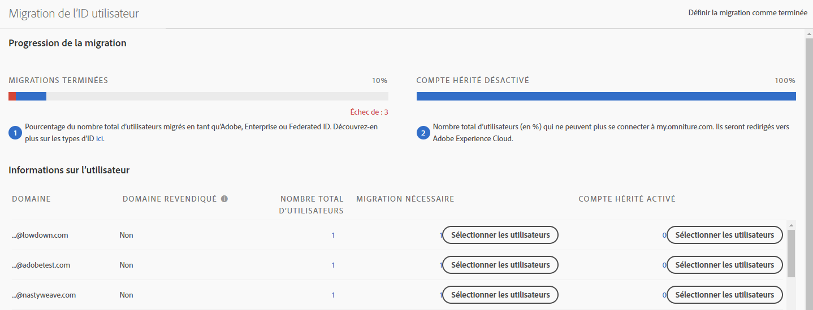
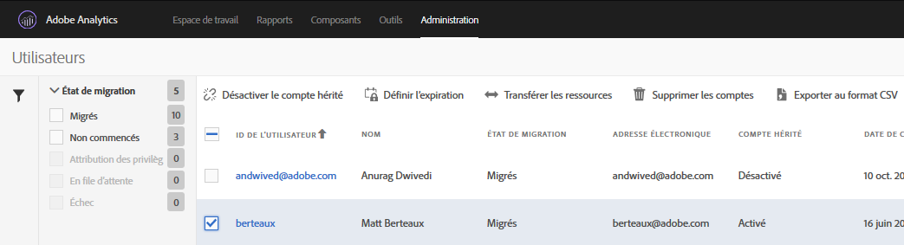

# Migration de comptes utilisateurs Analytics sous la forme d’Adobe ID {#migrate-analytics-user-accounts-for-adobe-ids}

Migration des utilisateurs du système de gestion des utilisateurs Analytics hérité vers Adobe Admin Console.

## Migration de comptes utilisateurs Analytics sous la forme d’Adobe ID {#task-f3355f3b14a340feae58cfa04c0ba1c9}

Migration des utilisateurs du système de gestion des utilisateurs Analytics hérité vers Adobe Admin Console.

> [!NOTE] Si un administrateur qui n’est pas connecté via l’environnement Experience Cloud tente d’accéder à l’outil Migration de l’ID utilisateur, il est redirigé vers la page de connexion d’Experience Cloud.

**Pour migrer des utilisateurs Analytics**

1. Accédez à **[!UICONTROL Analytics]** &gt; **[!UICONTROL Admin]** &gt; **[!UICONTROL Migration de l’ID utilisateur]**.

   

   Deux sections composent la page Migration de l’ID utilisateur : *Progression de la migration* et *Informations sur l’utilisateur*.

   **Progression de la migration**

<table id="table_F9F1CFF762C745E198CB075A02BA2DDA"> 
 <thead> 
  <tr> 
   <th colname="col1" class="entry"> Phase </th> 
   <th colname="col2" class="entry"> Description </th> 
  </tr>
 </thead>
 <tbody> 
  <tr> 
   <td colname="col1"> 
Migrations terminées 
 </td> 
   <td colname="col2"> 
Les utilisateurs acceptent l’invitation. 
 </td> 
  </tr> 
  <tr> 
   <td colname="col1"> 
Compte hérité désactivé 
 </td> 
   <td colname="col2"> 
Le compte hérité utilisant un ID d’entreprise est désactivé. Les utilisateurs accèdent désormais à Experience Cloud en utilisant leur Adobe ID ou Enterprise ID. Lorsque tous vos utilisateurs ont atteint cette phase, vous avez terminé la migration. 
 
Lors de la migration, la connexion héritée est désactivée. Les utilisateurs sont redirigés vers  experiencecloud.adobe.com et doivent se connecter à l’aide de l’Adobe ID ou de l’Enterprise ID. 
 
Voir <a href="/help/admin/user-management2/user-migration/c-migration-tool/t-disable-legacy-login.md">Désactivation des comptes hérités</a> pour plus d’informations. 
 </td> 
  </tr> 
 </tbody> 
</table>

**Informations sur l’utilisateur**

Informations sur l’utilisateur est un condensé d’informations sur les utilisateurs dans votre organisation, séparées par nom de domaine.

<table id="table_3822E27AF81E4A188562FEB5131548A5"> 
 <thead> 
  <tr> 
   <th colname="col1" class="entry"> Élément </th> 
   <th colname="col2" class="entry"> Description </th> 
  </tr>
 </thead>
 <tbody> 
  <tr> 
   <td colname="col1"> 
Domaine 
 </td> 
   <td colname="col2"> 
Les domaines sont spécifiques aux ID de message électronique de la base d’utilisateurs Analytics actuelle. Un domaine ne peut être déposé que par une seule organisation et seuls les administrateurs système peuvent déposer un domaine. Pour plus d’informations, voir <a href="https://helpx.adobe.com/enterprise/help/request-access-to-claimed-domain.html"> Demande d’accès à un domaine déposé</a>. 
 </td> 
  </tr> 
  <tr> 
   <td colname="col1"> 
Domaine déposé 
 </td> 
   <td colname="col2"> 
Vous devez être administrateur système pour migrer des utilisateurs sous la forme d’Enterprise ID ou de Federated ID, et déposer un domaine disponible par le biais de l’Admin Console avant d’effectuer la migration. En savoir plus <a href="https://helpx.adobe.com/enterprise/help/identity.html"> ici</a>. 
 
Si vous ne souhaitez pas déposer de domaine en Enterprise ID ou Federated ID, passez cette étape et migrez les utilisateurs en Adobe ID. Pour en savoir plus sur les types d’ID, cliquez <a href="https://helpx.adobe.com/enterprise/help/identity.html"> ici</a>. 
 </td> 
  </tr> 
 </tbody> 
</table>

1. Localisez le domaine contenant les ID utilisateur que vous souhaitez migrer, puis sous **[!UICONTROL Migration requise]**, cliquez sur **[!UICONTROL Sélectionner les utilisateurs]**.
1. Sur la page [!DNL Users], sélectionnez les utilisateurs que vous souhaitez migrer, puis cliquez sur **[!UICONTROL Migrer]**.

   Lorsque vous cliquez sur **[!UICONTROL Migrer]**, les utilisateurs reçoivent une invitation (Migration commencée) et doivent l’accepter. L’état de leur ID utilisateur passe alors à Migration terminée. Vous pouvez alors désactiver l’accès à [!DNL my.omniture.com] de leur compté hérité.

   

1. Indiquez le type d’ID selon lequel vous voulez migrer les utilisateurs ([Adobe ID ou Enterprise ID](https://helpx.adobe.com/enterprise/help/identity.html)).

   Après la migration des utilisateurs, l’état de la colonne État de migration passe de *`Not Initiated`* à *`Migrated`*.

   Si *`Failed`* s’affiche, pointez sur l’icône pour une description de l’échec de la migration.
