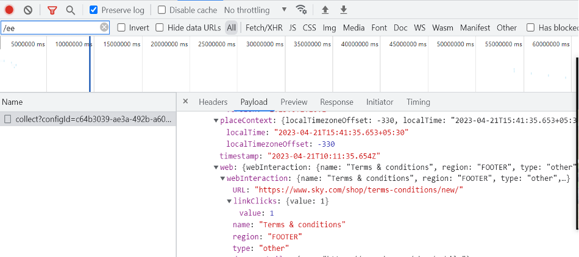
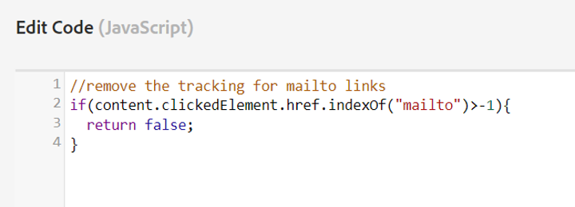

# Activation et activation du Activity Map

Décrit la procédure à suivre par l’administrateur Analytics pour activer la collecte des liens et le téléchargement par les utilisateurs d’Activity Map.

## Étape 1. Activer le Activity Map {#update_code}

Le module Activity Map fait partie de AppMeasurement.js, des balises Adobe Experience Platform et du SDK Web (alloy.js). Les données du Activity Map ne peuvent pas être collectées si vous n’effectuez pas la mise à jour vers **SDK Web version 2.15.0** ou supérieur ou **Extension des balises Adobe Analytics v1.90** ou supérieur ou **AppMeasurement version 1.6** ou supérieur.

+++SDK Web (extension des balises Adobe Experience Platform)

1. Dans les balises Adobe Experience Platform, accédez à la propriété pour laquelle vous implémentez Analytics. Sous [!UICONTROL Extensions] -> [!UICONTROL SDK Web Adobe Experience Platform], sélectionnez **[!UICONTROL Activer la collecte de données de clic]** comme indiqué ci-dessous.
1. Créez la bibliothèque avec les modifications.
1. Publiez la bibliothèque en production.

**Validation**

Interagissez avec les appels à l’aide de l’onglet Réseau de Developer Console :

1. Chargez le script de développement Launch sur le site.
1. En cas de clic sur les éléments, recherchez &quot;/ee&quot; dans l’onglet Réseau.

   

Adobe Experience Platform Debugger:

1. Téléchargez et installez le [Débogueur Adobe Experience Platform](https://chrome.google.com/webstore/detail/adobe-experience-platform/bfnnokhpnncpkdmbokanobigaccjkpo).
1. Accédez à [!UICONTROL Journaux] > [!UICONTROL Edge] > [!UICONTROL Connexion à Edge].

   

**Questions fréquentes**

* **L’appel d’interaction ne se déclenche pas dans l’onglet Réseau.**
La collecte de données de clic dans un appel de collecte. Nous devons effectuer un filtrage par &quot;/ee&quot; ou &quot;collect&quot; (Collecter).

* **Il n’existe pas d’affichage de charge utile pour l’appel de collecte.**
L’appel de collecte est conçu de manière à ce que le suivi n’affecte pas la navigation vers d’autres sites. La fonction de déchargement de document s’applique donc aux appels de collecte. Cela n’aura aucun impact sur votre collecte de données, mais si vous devez valider sur la page, ajoutez target = &quot;_blank&quot; à l’élément correspondant. Le lien s’ouvre alors dans un nouvel onglet.

* **Comment ignorer la collecte des PII ?**
Ajoutez les conditions respectives dans&quot; avant le lien cliquez sur Send callback&quot; et renvoyez false pour ignorer ces valeurs. [En savoir plus](https://experienceleague.adobe.com/docs/experience-platform/edge/fundamentals/configuring-the-sdk.html?lang=fr)

  Exemple de code:

  

+++

+++Mise en oeuvre manuelle du SDK Web

Voir [Suivi des liens](https://experienceleague.adobe.com/docs/experience-platform/edge/data-collection/track-links.html?lang=fr) pour plus d’informations sur la mise en oeuvre du suivi des liens et sur la manière d’activer Activity Map en capturant la variable `region` de l’élément de HTML sur lequel l’utilisateur a cliqué.

>[!NOTE]
>
>L’activation du suivi des liens avec le SDK Web envoie actuellement des événements de lien lorsqu’un client passe d’une page à l’autre. Cela diffère du fonctionnement d’AppMeasurement et peut potentiellement générer des accès facturables supplémentaires envoyés à Adobe.

+++

Extension +++Analytics (balises Adobe Experience Platform)

Dans les balises Adobe Experience Platform, accédez à la propriété pour laquelle vous implémentez Analytics. Dans le [!UICONTROL Installer l’extension] boîte de dialogue, sélectionnez **[!UICONTROL Utiliser le Activity Map]**.

+++

+++AppMeasurement

1. Téléchargez la dernière bibliothèque JavaScript pour AppMeasurement.
Accédez à **[!UICONTROL Analytics]** > **[!UICONTROL Administration]** > **[!UICONTROL Tous les administrateurs]** > **[!UICONTROL Gestionnaire de code]**.
1. Mettez-le en oeuvre en procédant comme suit : [ces instructions](https://experienceleague.adobe.com/docs/analytics/implementation/js/overview.html?lang=fr).

+++

## Étape 2. Activation des rapports d’Activity Map {#enable}

Vous devez activer les rapports de Activity Map au niveau de la suite de rapports.

1. Connectez-vous à Adobe Analytics et naviguez vers **[!UICONTROL Analytics]** > **[!UICONTROL Admin]** > **[!UICONTROL Suites de rapports]** > Sélectionner la suite de rapports > **[!UICONTROL Modifier les paramètres]** > **[!UICONTROL Activity Map]** > **[!UICONTROL Création de rapports Activity Map]**.

1. Activity Map collecte les données des liens dans les rapports d’Activity Map. Pour que l’activation fonctionne, vous devez d’abord activer les variables en cliquant sur **[!UICONTROL Activer les rapports d’Activity Map]**.

   Cette étape permet d’ajouter toutes les dimensions Analytics dont vous avez besoin pour collecter des données.

   

1. Après environ une heure, consultez le [rapport Page d’Activity Map](/help/analyze/activity-map/activitymap-reporting-analytics.md) qui répertorie toutes les pages sur lesquelles les utilisateurs ont cliqué sur un lien.

## Étape 3. Ajout d’utilisateurs à [!UICONTROL Accès Activity Map] profil de produits {#add_users}

1. Cliquez sur **[!UICONTROL Ajouter des utilisateurs au groupe]**.

   Vous accédez alors à la page du profil de produit dans la variable [Adobe Admin Console](https://adminconsole.adobe.com/E2F05B3B52F54D2E0A490D44@AdobeOrg/overview).

1. Si vous n’avez pas créé une [!UICONTROL Accès Activity Map] profil de produit, faites-le maintenant. Les éléments d’autorisation requis pour ce profil sont les suivants : [!UICONTROL Outils Analytics] > [!UICONTROL Activity Map] et [!UICONTROL Outils Analytics] > [!UICONTROL Publication de segments].

1. Ajoutez des utilisateurs à ce profil de produit. Cela permet à vos utilisateurs de télécharger le Activity Map depuis  **[!UICONTROL Adobe Analytics]** > **[!UICONTROL Outils]** > **[!UICONTROL Activity Map]** .

